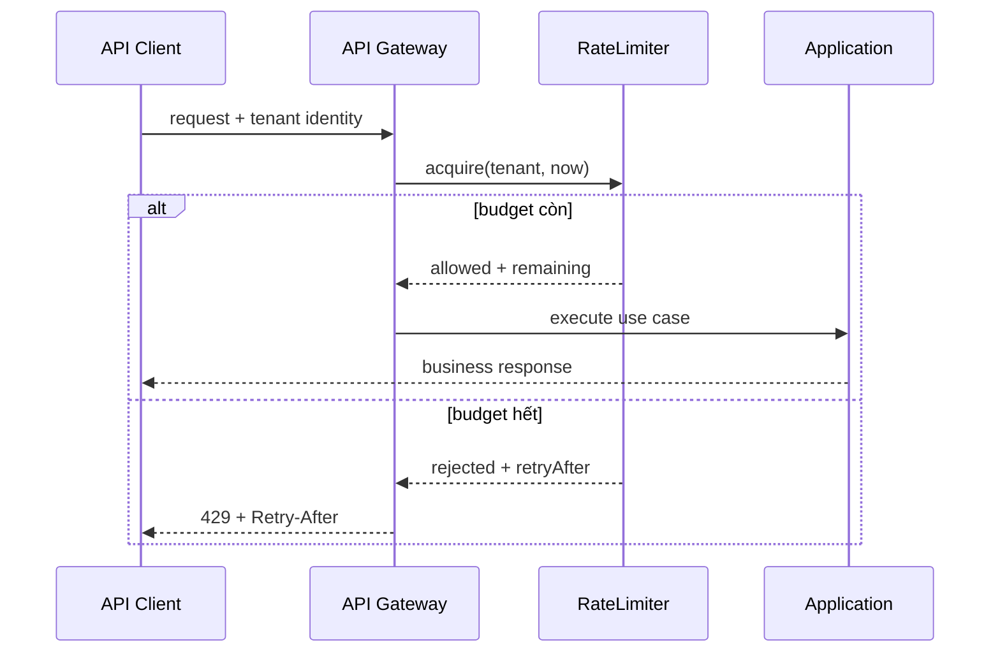

# Rate Limiting và Admission Control

Rate limiter không phải circuit breaker và cũng không thay thế bulkhead. Nó bảo vệ **ngân sách request theo identity và thời gian**, trong khi bulkhead bảo vệ số execution đồng thời và circuit breaker phản ứng với dependency đang lỗi.

## Bài toán thực tế

Một public API cho phép mỗi tenant tối đa 120 request/phút. Nếu chỉ giới hạn toàn hệ thống, tenant lớn có thể chiếm hết capacity; nếu chỉ dùng queue, backlog vẫn tăng và latency vượt SLO. Thiết kế cần trả lời rõ key, budget, thuật toán, clock, response contract và cách vận hành khi storage của limiter lỗi.

## Quyết định thiết kế

- **Key:** tenant, user, API key hoặc operation; tránh dùng IP cho nghiệp vụ đa tenant.
- **Algorithm:** fixed window dễ hiểu nhưng burst ở ranh giới; sliding window/token bucket mượt hơn nhưng phức tạp hơn.
- **Storage:** in-memory chỉ phù hợp một process; distributed adapter cần atomic increment và TTL.
- **Failure policy:** fail-open cho endpoint ít rủi ro, fail-closed cho abuse-sensitive operation; quyết định phải được ghi trong ADR.
- **Contract:** trả `allowed`, `remaining`, `retryAfter`; client không cần biết Redis/Lua hay implementation cụ thể.

## Invariant và failure matrix

| Tình huống | Invariant | Xử lý |
|---|---|---|
| Hai tenant cạnh tranh | budget không chia sẻ ngoài ý muốn | namespace key theo tenant/operation |
| Clock lệch | window không nhảy ngược | ưu tiên server-side time |
| Redis timeout | policy có chủ đích | fail-open/closed + metric |
| Retry client | không double-charge business side effect | limiter đứng trước use case, idempotency vẫn cần riêng |
| Hot key | limiter không trở thành bottleneck | sharding hoặc local pre-allocation có kiểm soát |

## Source và kiểm thử

Mã mẫu tại `src/Enterprise/Resilience/RateLimiter/` dùng fixed window và clock truyền vào để test deterministic. PHPUnit kiểm tra budget, isolation giữa key và reset window. Production adapter cần contract test dùng clock thật/server time, concurrent acquire và TTL expiry.

## Observability và runbook

Theo dõi allowed/rejected theo tenant, endpoint và reason; không gắn tenant ID trực tiếp vào metric label nếu cardinality quá lớn. Alert khi rejection tăng cùng latency hoặc storage error. Runbook phải phân biệt traffic abuse, cấu hình budget sai và limiter backend lỗi trước khi tăng limit.

## Bài tập

1. Thay fixed window bằng token bucket nhưng giữ nguyên `RateLimitDecision`.
2. Thêm shadow mode chỉ ghi “would reject” để hiệu chỉnh budget trước rollout.
3. Viết property test: số request được phép trong một window không vượt limit.
4. So sánh rate limiter với bulkhead trong trường hợp queue worker bị provider chậm.
