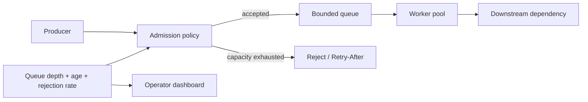

# Backpressure và Bounded Work Queue

Backpressure là cơ chế buộc producer giảm tốc hoặc nhận phản hồi từ chối khi tốc độ tạo việc vượt quá khả năng xử lý bền vững của consumer. Đây không chỉ là tối ưu hiệu năng; nó là một **boundary bảo vệ độ ổn định**. Nếu hệ thống luôn nhận thêm việc mà không giới hạn, độ trễ, bộ nhớ và thời gian khôi phục sẽ tăng cho đến khi toàn bộ service mất khả năng phục vụ.

## Bài toán thực tế

Một API import CSV đẩy từng batch vào worker. Trong giờ cao điểm, request đến nhanh hơn tốc độ ghi database. Queue không giới hạn khiến memory tăng, retry chồng retry và thời gian hoàn thành không còn dự đoán được. Mục tiêu đúng không phải “không bao giờ từ chối”, mà là:

- giới hạn lượng work đang chờ;
- từ chối có chủ đích khi capacity hết;
- cung cấp tín hiệu để client retry hợp lý;
- giữ latency và recovery time trong SLO.

## Mental model



Admission policy phải dựa trên capacity thật, không chỉ số request mỗi giây. Queue depth cho biết backlog hiện tại; **oldest item age** cho biết hệ thống có đang mất khả năng bắt kịp hay không.

## Phân biệt với các pattern gần nhau

| Cơ chế | Bảo vệ điều gì | Tín hiệu chính |
|---|---|---|
| Rate Limiter | ngân sách request theo key/thời gian | quota còn lại, retry-after |
| Bulkhead | số execution đồng thời | active permits, rejection |
| Bounded Queue | lượng work đang chờ | queue depth, oldest age |
| Circuit Breaker | dependency đang lỗi | failure ratio, open state |
| Retry | lỗi tạm thời | attempt, backoff, budget |

Có thể dùng đồng thời: rate limiter chặn abuse, bounded queue kiểm soát backlog, bulkhead giới hạn concurrency và circuit breaker ngăn tiếp tục gọi dependency đang lỗi.

## Source mẫu

```php
use DesignPatterns\Enterprise\Resilience\Backpressure\BoundedWorkQueue;

$queue = new BoundedWorkQueue(capacity: 2);

$queue->enqueue('import-batch-1');
$queue->enqueue('import-batch-2');
$decision = $queue->enqueue('import-batch-3');

assert($decision->accepted === false);
assert($decision->reason === 'capacity_exhausted');
```

Source minh họa nằm tại `src/Enterprise/Resilience/Backpressure/`. Đây là mô hình in-memory để học semantics; production cần queue broker, atomic admission hoặc partition ownership phù hợp.

## Failure matrix

| Failure | Rủi ro | Cách xử lý |
|---|---|---|
| Queue đầy | producer tiếp tục retry tức thì | retry-after + jitter + retry budget |
| Consumer chậm | oldest age tăng liên tục | giảm admission, scale có kiểm soát |
| Worker crash sau dequeue | work bị mất | visibility timeout hoặc durable ack |
| Hot partition | một tenant chiếm toàn bộ capacity | partition/fair queue theo tenant |
| Downstream outage | backlog tích tụ | circuit breaker + pause consumer + reconciliation |

## Kiểm thử cần có

1. Không nhận quá capacity.
2. Dequeue giải phóng capacity.
3. FIFO được giữ nếu business yêu cầu ordering.
4. Rejection không làm thay đổi queue hiện tại.
5. Với durable queue: crash trước/sau ack không mất hoặc nhân đôi side effect ngoài contract.
6. Load test phải đo queue depth, oldest age, rejection rate và drain time sau burst.

## Observability và runbook

Metric tối thiểu:

- `queue_depth`;
- `queue_oldest_item_seconds`;
- `admission_rejected_total`;
- `worker_processing_seconds`;
- `queue_drain_eta_seconds`.

Runbook cần phân biệt ba tình huống: burst ngắn có thể tự hồi phục, consumer regression cần rollback, và downstream outage cần pause/reconciliation. Không scale worker mù quáng nếu bottleneck nằm ở database hoặc provider.

## Khi không nên dùng

Không cần bounded queue nếu flow hoàn toàn synchronous, traffic nhỏ và caller đã nhận backpressure tự nhiên qua response latency. Cũng không nên thêm queue chỉ để “trông enterprise”; queue tạo eventual consistency, retry, deduplication và vận hành phức tạp.

## Bài tập

Mở rộng `BoundedWorkQueue` bằng policy theo tenant: mỗi tenant có capacity riêng và một global capacity. Viết test chứng minh tenant A không thể làm tenant B bị starvation. Sau đó thiết kế metric và response contract khi admission bị từ chối.

## Evidence hoàn thành

- Source và test chứng minh capacity invariant.
- Load profile có burst và recovery phase.
- Dashboard hiển thị depth, age và rejection.
- ADR nêu lý do chọn queue, capacity, fairness và rollback trigger.
- Runbook mô tả cách drain, pause và replay an toàn.
