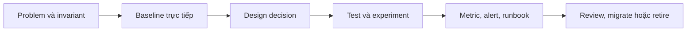

# Expert Practice — Từ Pattern đến Evidence và Operability

Thư mục này dành cho Senior Engineer, Tech Lead và Architect. Mục tiêu không phải học thêm tên pattern, mà xây năng lực chứng minh quyết định, migration an toàn, kiểm thử invariant và vận hành abstraction trong điều kiện failure.



## Tuyến nền tảng chuyên gia

1. [Evidence-based Pattern Adoption](01-evidence-based-pattern-adoption.md)
2. [Safe Pattern Migration](02-safe-pattern-migration.md)
3. [Failure-oriented Design](03-failure-oriented-design.md)
4. [Performance Methodology](04-performance-methodology.md)
5. [Security-by-design](05-security-by-design.md)
6. [Architecture Fitness Functions](06-architecture-fitness-functions.md)
7. [Pattern Evidence Dossier](07-pattern-evidence-dossier.md)
8. [Production Debugging Playbook](08-production-debugging-playbook.md)

## Kiểm thử nâng cao và compatibility

- [Property-based Testing cho Invariant](09-property-based-testing-for-invariants.md)
- [Mutation Testing cho Design Quality](10-mutation-testing-for-design-quality.md)
- [Event Schema Evolution](11-event-schema-evolution.md)
- [Pattern Failure Atlas](12-pattern-failure-atlas.md)
- [Design Evidence Review](13-design-evidence-review.md)

## Architecture review, migration và retirement

- [Architecture Review Packet](14-architecture-review-packet.md)
- [Real-world Refactoring Dossier](15-real-world-refactoring-dossier.md)
- [Abstraction Retirement](16-abstraction-retirement.md)
- [Design Decision Observability](17-design-decision-observability.md)
- [Bulkhead và Capacity Isolation](18-bulkhead-and-capacity-isolation.md)
- [Circuit Breaker Operability](19-circuit-breaker-operability.md)
- [Enterprise Pattern Operability](20-enterprise-pattern-operability.md)
- [Pattern Adoption Evidence Pack](21-pattern-adoption-evidence-pack.md)

## Workbook và lab mới

- [Property-based Testing Workbook](22-property-based-testing-workbook.md)
- [Mutation Testing với Infection](23-mutation-testing-with-infection.md)
- [Distributed Bulkhead và Bounded Waiting](24-distributed-bulkhead-and-bounded-waiting.md)
- [Deterministic Failure Injection](25-deterministic-failure-injection.md)
- [Architecture Fitness Functions trong CI](26-architecture-fitness-functions-in-ci.md)
- [Framework Source Tour Protocol](27-framework-source-tour-protocol.md)
- [Migration Rehearsal với Dual-run](28-migration-rehearsal-dual-run.md)
- [Incident Packet và Postmortem](29-incident-packet-and-postmortem.md)
- [Design Evidence Graph](30-design-evidence-graph.md)

## Artifact và lệnh chạy

```bash
composer architecture-fitness-audit
composer expert-practice-v2-audit
composer property-workbook
composer failure-injection-lab
```

Artifact liên quan: `expert-labs/`, `framework-source-tours/`, `migration-rehearsal/`, `incident-packets/` và `evidence-graph/`.

## Definition of Done

Một bài Expert Practice chỉ hoàn thành khi người học tạo được evidence cụ thể: property test có seed, mutation report, failure matrix, migration diff, incident packet, architecture rule hoặc evidence graph. Kết luận “clean hơn” hoặc “best practice” không đủ nếu thiếu baseline, trade-off và cách kiểm chứng.

## Resilience và admission control

- [Rate Limiting và Admission Control](31-rate-limiting-and-admission-control.md)
- [Backpressure và Bounded Work Queue](32-backpressure-and-bounded-queues.md)
