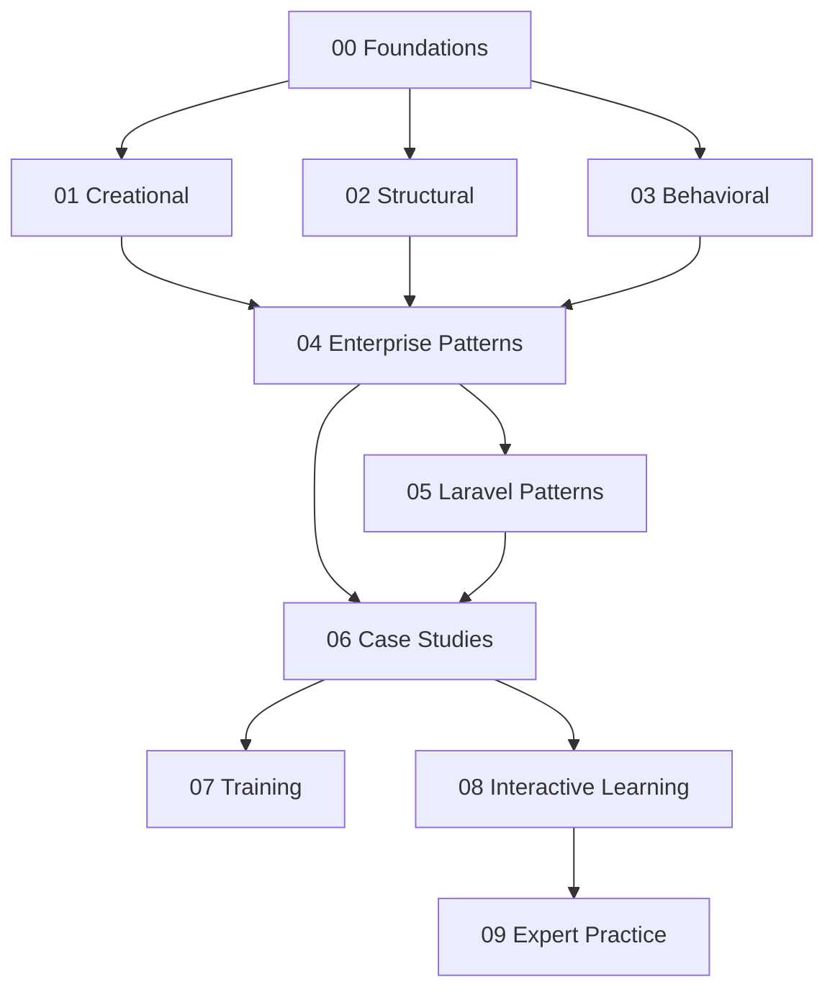

# Documentation Catalog

`docs/` là tuyến học chính của repository. Nội dung đi từ nguyên lý thiết kế, GoF, Enterprise Pattern và framework integration đến case study, interactive learning và thực hành cấp chuyên gia.

## Bản đồ nội dung

## Thứ tự đề xuất

1. [Foundations](00-foundations/README.md) — OOP, SOLID, coupling, DI và chi phí abstraction.
2. [Creational Patterns](01-creational/README.md) — ownership của object creation.
3. [Structural Patterns](02-structural/README.md) — composition, integration boundary và wrapper.
4. [Behavioral Patterns](03-behavioral/README.md) — policy, lifecycle, event và collaboration.
5. [Enterprise Patterns](04-enterprise-patterns/README.md) — persistence, transaction và application boundary.
6. [Laravel Patterns](05-laravel-patterns/README.md) — wiring pattern vào framework mà không làm rò rỉ domain.
7. [Case Studies](06-case-studies/README.md) — kết hợp pattern trong hệ thống có invariant và failure thật.
8. [Training Materials](07-training/README.md) — tổ chức workshop và đánh giá học viên.
9. [Interactive Learning](08-interactive/README.md) — luyện decision-making qua tình huống mở.
10. [Expert Practice](09-expert-practice/README.md) — evidence, migration, failure, performance và architecture fitness.

## Ba cách sử dụng

### Tự học

Đọc context và baseline, dự đoán thiết kế trước khi xem lời giải, chạy code, thêm failure test, rồi ghi lại trade-off bằng ADR ngắn.

### Onboarding đội nhóm

Chọn Foundations → 5 pattern cốt lõi → một case study gần domain công ty. Yêu cầu học viên trình bày lại dependency direction và failure ownership thay vì học thuộc định nghĩa.

### Review kiến trúc

Bắt đầu từ vấn đề và invariant; dùng [OVERVIEW](../OVERVIEW.md), [cheatsheets](../cheatsheets/README.md), [decisions](../decisions/README.md) và [production](../production/README.md) để đối chiếu lựa chọn với evidence.

## Cách đọc một bài

1. Xác định **business change axis** và phần nào phải ổn định.
2. Đọc code trước pattern, liệt kê coupling và failure bị che giấu.
3. Đọc diagram theo hướng dependency, không chỉ theo thứ tự gọi hàm.
4. Chạy ví dụ và test failure path.
5. So sánh với baseline đơn giản hơn.
6. Trả lời câu hỏi review mà không nhìn đáp án.
7. Ghi lại dấu hiệu cần revisit quyết định.

## Tiêu chuẩn một bài hoàn chỉnh

Một bài đạt chuẩn khi làm rõ:

- context, forces và invariant;
- intent và participant;
- dependency direction và ownership;
- code before/after hoặc executable example;
- test strategy và failure semantics;
- trade-off và trường hợp không nên dùng;
- bài tập có gợi ý/lời giải;
- câu hỏi phỏng vấn có đáp án;
- link sang source, exercise, ADR hoặc case study liên quan.

## Definition of Done

Người học hoàn thành một chủ đề khi có thể:

- giải thích vấn đề mà không nhắc tên pattern trước;
- vẽ collaboration/dependency diagram từ trí nhớ;
- triển khai phiên bản tối thiểu có test;
- nêu ít nhất một lựa chọn thay thế;
- mô tả failure production và cách quan sát;
- chỉ ra điều kiện cần loại bỏ hoặc thay pattern.
