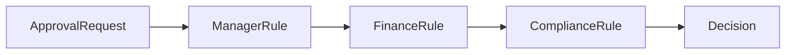

# Approval chain theo hạn mức

## Câu chuyện nghiệp vụ

Yêu cầu chi tiêu cần quản lý, giám đốc hoặc CFO duyệt tùy số tiền và phòng ban.

## Phiên bản ban đầu đang vướng gì?

`before.php` mã hóa cấp duyệt bằng nhánh điều kiện trong service.

## Ý tưởng refactor

`after.php` tạo approver chain với quyết định approve, reject hoặc escalate.

## Cách đọc ví dụ

1. Đọc câu chuyện **Approval chain theo hạn mức** và viết lại invariant nghiệp vụ bằng một câu; đừng bắt đầu từ tên pattern.
2. Chạy `before.php`, đối chiếu output với pain point: `before.php` mã hóa cấp duyệt bằng nhánh điều kiện trong service.
3. Vẽ dependency/flow hiện tại và đánh dấu nơi thay đổi hoặc failure lan sang client.
4. Chạy `after.php`, kiểm tra trọng tâm: Approve, reject và pass/escalate là ba kết quả khác nhau.
5. Mô phỏng tình huống phản chứng: Không approver phù hợp phải thành trạng thái rõ, không mất request. Sau đó giải thích vì sao refactor giảm blast radius và chi phí abstraction nào được thêm vào.

## Điều cần quan sát riêng của bài

- Approve, reject và pass/escalate là ba kết quả khác nhau.
- Không approver phù hợp phải thành trạng thái rõ, không mất request.
- Thay đổi hạn mức cần cấu hình/version và audit.

## Thực hành mở rộng

1. Thêm rule procurement cho vendor mới.
2. Lưu lịch sử từng bước duyệt.
3. Test boundary đúng tại các mức tiền sát ngưỡng.

## Khi giải pháp trước vẫn hợp lý

Bảng quyết định đơn giản có thể tốt hơn nếu rule chỉ là dữ liệu và không có hành vi riêng.

## Cách chạy

```bash
php before.php
php after.php
```

## Tài liệu liên quan

- [01 Chain Of Responsibility](../../../docs/03-behavioral/01-chain-of-responsibility.md)
- [Readme](../../../production/order-management-system/README.md)

## Tệp trong ví dụ

- [`before.php`](before.php): hiện thực baseline của **Approval chain theo hạn mức**; dùng file này để tái hiện vấn đề “`before.php` mã hóa cấp duyệt bằng nhánh điều kiện trong service.”.
- [`after.php`](after.php): hiện thực hướng refactor “`after.php` tạo approver chain với quyết định approve, reject hoặc escalate.”; so sánh bằng output, invariant và failure behavior.
- `test.php` (nếu có): chạy contract/failure scenario được nêu trong “Điều cần quan sát”; test không nên chỉ assert concrete class được gọi.

## Sơ đồ tương tác của ví dụ



## Kiểm thử tối thiểu

- Test request dừng đúng handler và lưu reason code.
- Test happy path không được thay thế failure test.
- Assertion cần kiểm tra state/side effect, không chỉ chuỗi output.
