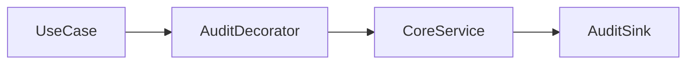

# Decorator ghi audit cho application service

## Câu chuyện nghiệp vụ

Một số command cần log actor, action, outcome và duration mà không trộn logic audit vào handler.

## Phiên bản ban đầu đang vướng gì?

`before.php` copy audit code vào từng handler.

## Ý tưởng refactor

`after.php` bọc handler bằng decorator giữ cùng contract và ghi audit quanh lời gọi.

## Cách đọc ví dụ

1. Đọc câu chuyện **Decorator ghi audit cho application service** và viết lại invariant nghiệp vụ bằng một câu; đừng bắt đầu từ tên pattern.
2. Chạy `before.php`, đối chiếu output với pain point: `before.php` copy audit code vào từng handler.
3. Vẽ dependency/flow hiện tại và đánh dấu nơi thay đổi hoặc failure lan sang client.
4. Chạy `after.php`, kiểm tra trọng tâm: Audit decorator không thay đổi business result.
5. Mô phỏng tình huống phản chứng: Phải ghi cả success và failure nhưng không làm mất exception gốc. Sau đó giải thích vì sao refactor giảm blast radius và chi phí abstraction nào được thêm vào.

## Điều cần quan sát riêng của bài

- Audit decorator không thay đổi business result.
- Phải ghi cả success và failure nhưng không làm mất exception gốc.
- Dữ liệu nhạy cảm cần redaction trước khi log.

## Thực hành mở rộng

1. Thêm correlation id và thời gian thực thi.
2. Bảo đảm audit failure không che business failure.
3. So sánh decorator với middleware command bus.

## Khi giải pháp trước vẫn hợp lý

Ghi trực tiếp có thể rõ hơn khi chỉ có một use case và không có cross-cutting concern khác.

## Cách chạy

```bash
php before.php
php after.php
```

## Tài liệu liên quan

- [04 Decorator](../../../docs/02-structural/04-decorator.md)
- [Engineering Playbook](../../../handbook/engineering-playbook/README.md)

## Tệp trong ví dụ

- [`before.php`](before.php): hiện thực baseline của **Decorator ghi audit cho application service**; dùng file này để tái hiện vấn đề “`before.php` copy audit code vào từng handler.”.
- [`after.php`](after.php): hiện thực hướng refactor “`after.php` bọc handler bằng decorator giữ cùng contract và ghi audit quanh lời gọi.”; so sánh bằng output, invariant và failure behavior.
- `test.php` (nếu có): chạy contract/failure scenario được nêu trong “Điều cần quan sát”; test không nên chỉ assert concrete class được gọi.

## Sơ đồ tương tác của ví dụ



## Kiểm thử tối thiểu

- Test audit vẫn ghi failure mà không che exception gốc.
- Test happy path không được thay thế failure test.
- Assertion cần kiểm tra state/side effect, không chỉ chuỗi output.
