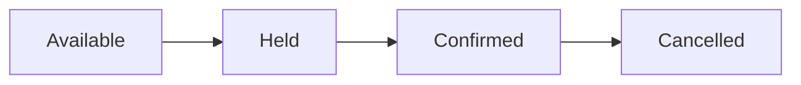

# State machine cho đặt chỗ

## Câu chuyện nghiệp vụ

Booking đi qua Pending, Confirmed, Cancelled, Expired; thanh toán và thời hạn giữ chỗ ảnh hưởng transition.

## Phiên bản ban đầu đang vướng gì?

`before.php` cập nhật status tự do từ nhiều service.

## Ý tưởng refactor

`after.php` tập trung transition, guard và side effect request trong state machine.

## Cách đọc ví dụ

1. Đọc câu chuyện **State machine cho đặt chỗ** và viết lại invariant nghiệp vụ bằng một câu; đừng bắt đầu từ tên pattern.
2. Chạy `before.php`, đối chiếu output với pain point: `before.php` cập nhật status tự do từ nhiều service.
3. Vẽ dependency/flow hiện tại và đánh dấu nơi thay đổi hoặc failure lan sang client.
4. Chạy `after.php`, kiểm tra trọng tâm: State transition phải atomic với version/concurrency check.
5. Mô phỏng tình huống phản chứng: Guard giải thích vì sao transition bị từ chối. Sau đó giải thích vì sao refactor giảm blast radius và chi phí abstraction nào được thêm vào.

## Điều cần quan sát riêng của bài

- State transition phải atomic với version/concurrency check.
- Guard giải thích vì sao transition bị từ chối.
- Side effect ngoài nên phát command/event sau transition, không nhúng trực tiếp tùy tiện.

## Thực hành mở rộng

1. Thêm `NoShow` chỉ sau thời gian bắt đầu.
2. Mô phỏng confirm và expire cạnh tranh.
3. Sinh audit trail từ transition.

## Khi giải pháp trước vẫn hợp lý

Enum + service duy nhất đủ nếu lifecycle nhỏ và không có concurrency đáng kể.

## Cách chạy

```bash
php before.php
php after.php
```

## Tài liệu liên quan

- [08 State](../../../docs/03-behavioral/08-state.md)
- [Readme](../../../production/booking-platform/README.md)

## Tệp trong ví dụ

- [`before.php`](before.php): hiện thực baseline của **State machine cho đặt chỗ**; dùng file này để tái hiện vấn đề “`before.php` cập nhật status tự do từ nhiều service.”.
- [`after.php`](after.php): hiện thực hướng refactor “`after.php` tập trung transition, guard và side effect request trong state machine.”; so sánh bằng output, invariant và failure behavior.
- `test.php` (nếu có): chạy contract/failure scenario được nêu trong “Điều cần quan sát”; test không nên chỉ assert concrete class được gọi.

## Sơ đồ tương tác của ví dụ



## Kiểm thử tối thiểu

- Test illegal transition và TTL expiry với clock giả.
- Test happy path không được thay thế failure test.
- Assertion cần kiểm tra state/side effect, không chỉ chuỗi output.
