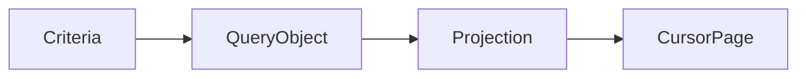

# Query Object cho tìm kiếm CRM

## Câu chuyện nghiệp vụ

Màn hình CRM lọc theo owner, stage, tag, ngày tương tác và phân trang; query ngày càng khó tái sử dụng và test.

## Phiên bản ban đầu đang vướng gì?

`before.php` xây query động ngay trong controller.

## Ý tưởng refactor

`after.php` đóng gói criteria và projection vào query object dành cho read model.

## Cách đọc ví dụ

1. Đọc câu chuyện **Query Object cho tìm kiếm CRM** và viết lại invariant nghiệp vụ bằng một câu; đừng bắt đầu từ tên pattern.
2. Chạy `before.php`, đối chiếu output với pain point: `before.php` xây query động ngay trong controller.
3. Vẽ dependency/flow hiện tại và đánh dấu nơi thay đổi hoặc failure lan sang client.
4. Chạy `after.php`, kiểm tra trọng tâm: Query Object phục vụ use case đọc, không giả vờ là repository aggregate.
5. Mô phỏng tình huống phản chứng: Criteria phải phân biệt giá trị chưa truyền với giá trị rỗng hợp lệ. Sau đó giải thích vì sao refactor giảm blast radius và chi phí abstraction nào được thêm vào.

## Điều cần quan sát riêng của bài

- Query Object phục vụ use case đọc, không giả vờ là repository aggregate.
- Criteria phải phân biệt giá trị chưa truyền với giá trị rỗng hợp lệ.
- Pagination, sort whitelist và projection là phần contract.

## Thực hành mở rộng

1. Thêm cursor pagination ổn định.
2. Chặn sort theo field không được phép.
3. Viết integration test trên database thật cho kế hoạch query.

## Khi giải pháp trước vẫn hợp lý

Local scope đơn giản đủ dùng khi query nhỏ và chỉ có một consumer.

## Cách chạy

```bash
php before.php
php after.php
```

## Tài liệu liên quan

- [07 Query Object](../../../docs/04-enterprise-patterns/03-query-object.md)
- [Examples](../../../decisions/examples/006-query-object-for-complex-read-models.md)

## Tệp trong ví dụ

- [`before.php`](before.php): hiện thực baseline của **Query Object cho tìm kiếm CRM**; dùng file này để tái hiện vấn đề “`before.php` xây query động ngay trong controller.”.
- [`after.php`](after.php): hiện thực hướng refactor “`after.php` đóng gói criteria và projection vào query object dành cho read model.”; so sánh bằng output, invariant và failure behavior.
- `test.php` (nếu có): chạy contract/failure scenario được nêu trong “Điều cần quan sát”; test không nên chỉ assert concrete class được gọi.

## Sơ đồ tương tác của ví dụ



## Kiểm thử tối thiểu

- Test sort ổn định, cursor và tenant isolation.
- Test happy path không được thay thế failure test.
- Assertion cần kiểm tra state/side effect, không chỉ chuỗi output.
