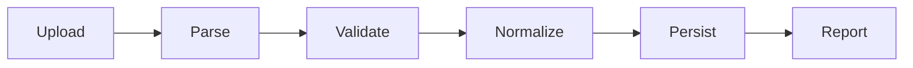

# Pipeline nhập CSV

## Câu chuyện nghiệp vụ

File CSV lớn cần parse, normalize, validate, deduplicate và persist; lỗi từng dòng phải được báo cáo rõ.

## Phiên bản ban đầu đang vướng gì?

`before.php` gom mọi bước vào vòng lặp dài và dừng cả file khi một dòng lỗi.

## Ý tưởng refactor

`after.php` tách stage với row context và error collector.

## Cách đọc ví dụ

1. Đọc câu chuyện **Pipeline nhập CSV** và viết lại invariant nghiệp vụ bằng một câu; đừng bắt đầu từ tên pattern.
2. Chạy `before.php`, đối chiếu output với pain point: `before.php` gom mọi bước vào vòng lặp dài và dừng cả file khi một dòng lỗi.
3. Vẽ dependency/flow hiện tại và đánh dấu nơi thay đổi hoặc failure lan sang client.
4. Chạy `after.php`, kiểm tra trọng tâm: Stage contract phải làm rõ dữ liệu đầu vào/đầu ra.
5. Mô phỏng tình huống phản chứng: Validation nghiệp vụ khác lỗi parse và lỗi persistence. Sau đó giải thích vì sao refactor giảm blast radius và chi phí abstraction nào được thêm vào.

## Điều cần quan sát riêng của bài

- Stage contract phải làm rõ dữ liệu đầu vào/đầu ra.
- Validation nghiệp vụ khác lỗi parse và lỗi persistence.
- Streaming giúp giới hạn memory; transaction toàn file có thể không phù hợp.

## Thực hành mở rộng

1. Thêm chế độ dry-run.
2. Báo cáo lỗi theo số dòng và field.
3. Đo throughput và peak memory với file lớn.

## Khi giải pháp trước vẫn hợp lý

Một parser ngắn đủ cho file nhỏ, schema cố định và không cần báo cáo lỗi phức tạp.

## Cách chạy

```bash
php before.php
php after.php
```

## Tài liệu liên quan

- [01 Chain Of Responsibility](../../../docs/03-behavioral/01-chain-of-responsibility.md)
- [Software Design](../../../handbook/software-design/README.md)

## Tệp trong ví dụ

- [`before.php`](before.php): hiện thực baseline của **Pipeline nhập CSV**; dùng file này để tái hiện vấn đề “`before.php` gom mọi bước vào vòng lặp dài và dừng cả file khi một dòng lỗi.”.
- [`after.php`](after.php): hiện thực hướng refactor “`after.php` tách stage với row context và error collector.”; so sánh bằng output, invariant và failure behavior.
- `test.php` (nếu có): chạy contract/failure scenario được nêu trong “Điều cần quan sát”; test không nên chỉ assert concrete class được gọi.

## Sơ đồ tương tác của ví dụ



## Kiểm thử tối thiểu

- Test partial failure, row number và idempotent re-import.
- Test happy path không được thay thế failure test.
- Assertion cần kiểm tra state/side effect, không chỉ chuỗi output.
