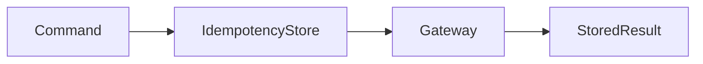

# Thanh toán idempotent

## Câu chuyện nghiệp vụ

Client có thể gửi lại yêu cầu do timeout; hệ thống phải tránh charge hai lần nhưng vẫn trả cùng kết quả cho cùng key.

## Phiên bản ban đầu đang vướng gì?

`before.php` gọi gateway trực tiếp và tạo payment mỗi request.

## Ý tưởng refactor

`after.php` lưu idempotency record với fingerprint request và kết quả operation.

## Cách đọc ví dụ

1. Đọc câu chuyện **Thanh toán idempotent** và viết lại invariant nghiệp vụ bằng một câu; đừng bắt đầu từ tên pattern.
2. Chạy `before.php`, đối chiếu output với pain point: `before.php` gọi gateway trực tiếp và tạo payment mỗi request.
3. Vẽ dependency/flow hiện tại và đánh dấu nơi thay đổi hoặc failure lan sang client.
4. Chạy `after.php`, kiểm tra trọng tâm: Cùng key nhưng payload khác phải bị từ chối.
5. Mô phỏng tình huống phản chứng: Record cần phân biệt processing, succeeded và failed-retryable. Sau đó giải thích vì sao refactor giảm blast radius và chi phí abstraction nào được thêm vào.

## Điều cần quan sát riêng của bài

- Cùng key nhưng payload khác phải bị từ chối.
- Record cần phân biệt processing, succeeded và failed-retryable.
- Transaction boundary giữa record và side effect ngoài cần được thiết kế rõ.

## Thực hành mở rộng

1. Mô phỏng hai request đồng thời cùng key.
2. Thêm TTL và chính sách replay response.
3. Thiết kế reconciliation khi gateway thành công nhưng process chết trước khi lưu kết quả.

## Khi giải pháp trước vẫn hợp lý

Không cần idempotency cho operation thuần đọc hoặc side effect vốn đã idempotent.

## Cách chạy

```bash
php before.php
php after.php
```

## Tài liệu liên quan

- [04 Idempotency](../../../handbook/microservices/05-idempotency.md)
- [Readme](../../../production/payment-platform/README.md)

## Tệp trong ví dụ

- [`before.php`](before.php): hiện thực baseline của **Thanh toán idempotent**; dùng file này để tái hiện vấn đề “`before.php` gọi gateway trực tiếp và tạo payment mỗi request.”.
- [`after.php`](after.php): hiện thực hướng refactor “`after.php` lưu idempotency record với fingerprint request và kết quả operation.”; so sánh bằng output, invariant và failure behavior.
- `test.php` (nếu có): chạy contract/failure scenario được nêu trong “Điều cần quan sát”; test không nên chỉ assert concrete class được gọi.

## Sơ đồ tương tác của ví dụ



## Kiểm thử tối thiểu

- Test cùng key/cùng payload và cùng key/khác payload.
- Test happy path không được thay thế failure test.
- Assertion cần kiểm tra state/side effect, không chỉ chuỗi output.
