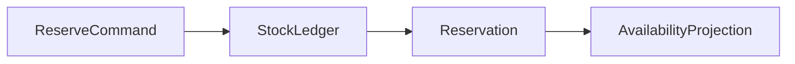

# Inventory reservation chống oversell

## Câu chuyện nghiệp vụ

Nhiều checkout cùng giữ tồn kho; reservation có TTL và có thể commit hoặc release.

## Phiên bản ban đầu đang vướng gì?

`before.php` đọc stock rồi trừ mà không khóa/version.

## Ý tưởng refactor

`after.php` dùng reservation aggregate và optimistic concurrency.

## Cách đọc ví dụ

1. Đọc câu chuyện **Inventory reservation chống oversell** và viết lại invariant nghiệp vụ bằng một câu; đừng bắt đầu từ tên pattern.
2. Chạy `before.php`, đối chiếu output với pain point: `before.php` đọc stock rồi trừ mà không khóa/version.
3. Vẽ dependency/flow hiện tại và đánh dấu nơi thay đổi hoặc failure lan sang client.
4. Chạy `after.php`, kiểm tra trọng tâm: Available, reserved và on-hand là các khái niệm khác nhau.
5. Mô phỏng tình huống phản chứng: Reserve phải atomic và không làm stock âm. Sau đó giải thích vì sao refactor giảm blast radius và chi phí abstraction nào được thêm vào.

## Điều cần quan sát riêng của bài

- Available, reserved và on-hand là các khái niệm khác nhau.
- Reserve phải atomic và không làm stock âm.
- Expire/release cần idempotent vì job có thể chạy lại.

## Thực hành mở rộng

1. Mô phỏng hai request giữ cùng SKU.
2. Thêm partial reservation cho nhiều line item.
3. Thiết kế reconciliation với warehouse.

## Khi giải pháp trước vẫn hợp lý

Không cần reservation nếu hàng không giới hạn hoặc bán theo backorder.

## Cách chạy

```bash
php before.php
php after.php
```

## Tài liệu liên quan

- [Readme](../../../production/inventory-platform/README.md)
- [Software Design](../../../handbook/software-design/README.md)

## Tệp trong ví dụ

- [`before.php`](before.php): hiện thực baseline của **Inventory reservation chống oversell**; dùng file này để tái hiện vấn đề “`before.php` đọc stock rồi trừ mà không khóa/version.”.
- [`after.php`](after.php): hiện thực hướng refactor “`after.php` dùng reservation aggregate và optimistic concurrency.”; so sánh bằng output, invariant và failure behavior.
- `test.php` (nếu có): chạy contract/failure scenario được nêu trong “Điều cần quan sát”; test không nên chỉ assert concrete class được gọi.

## Sơ đồ tương tác của ví dụ



## Kiểm thử tối thiểu

- Test concurrent reserve không làm available âm.
- Test happy path không được thay thế failure test.
- Assertion cần kiểm tra state/side effect, không chỉ chuỗi output.
