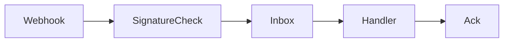

# Webhook Inbox chống xử lý trùng

## Câu chuyện nghiệp vụ

Nhà cung cấp gửi webhook ít nhất một lần và có thể đảo thứ tự; consumer cần xác thực, lưu và xử lý an toàn.

## Phiên bản ban đầu đang vướng gì?

`before.php` xử lý payload ngay trong HTTP request và không lưu event id.

## Ý tưởng refactor

`after.php` xác thực chữ ký, lưu inbox record duy nhất rồi worker xử lý idempotent.

## Cách đọc ví dụ

1. Đọc câu chuyện **Webhook Inbox chống xử lý trùng** và viết lại invariant nghiệp vụ bằng một câu; đừng bắt đầu từ tên pattern.
2. Chạy `before.php`, đối chiếu output với pain point: `before.php` xử lý payload ngay trong HTTP request và không lưu event id.
3. Vẽ dependency/flow hiện tại và đánh dấu nơi thay đổi hoặc failure lan sang client.
4. Chạy `after.php`, kiểm tra trọng tâm: Acknowledge HTTP và xử lý nghiệp vụ là hai giai đoạn khác nhau.
5. Mô phỏng tình huống phản chứng: Unique key phải dựa trên event id của provider hoặc fingerprint đáng tin. Sau đó giải thích vì sao refactor giảm blast radius và chi phí abstraction nào được thêm vào.

## Điều cần quan sát riêng của bài

- Acknowledge HTTP và xử lý nghiệp vụ là hai giai đoạn khác nhau.
- Unique key phải dựa trên event id của provider hoặc fingerprint đáng tin.
- Replay, ordering và poison message cần metric/runbook.

## Thực hành mở rộng

1. Thêm dead-letter cho event lỗi nhiều lần.
2. Xử lý event đến trước entity tương ứng.
3. Viết test chữ ký sai không tạo inbox record.

## Khi giải pháp trước vẫn hợp lý

Xử lý trực tiếp phù hợp cho webhook nội bộ đáng tin, side effect idempotent và tải thấp.

## Cách chạy

```bash
php before.php
php after.php
```

## Tài liệu liên quan

- [03 Outbox Inbox](../../../handbook/microservices/04-outbox-inbox.md)
- [Platform](../../../production/README.md)

## Tệp trong ví dụ

- [`before.php`](before.php): hiện thực baseline của **Webhook Inbox chống xử lý trùng**; dùng file này để tái hiện vấn đề “`before.php` xử lý payload ngay trong HTTP request và không lưu event id.”.
- [`after.php`](after.php): hiện thực hướng refactor “`after.php` xác thực chữ ký, lưu inbox record duy nhất rồi worker xử lý idempotent.”; so sánh bằng output, invariant và failure behavior.
- `test.php` (nếu có): chạy contract/failure scenario được nêu trong “Điều cần quan sát”; test không nên chỉ assert concrete class được gọi.

## Sơ đồ tương tác của ví dụ



## Kiểm thử tối thiểu

- Test duplicate delivery, invalid signature và replay.
- Test happy path không được thay thế failure test.
- Assertion cần kiểm tra state/side effect, không chỉ chuỗi output.
