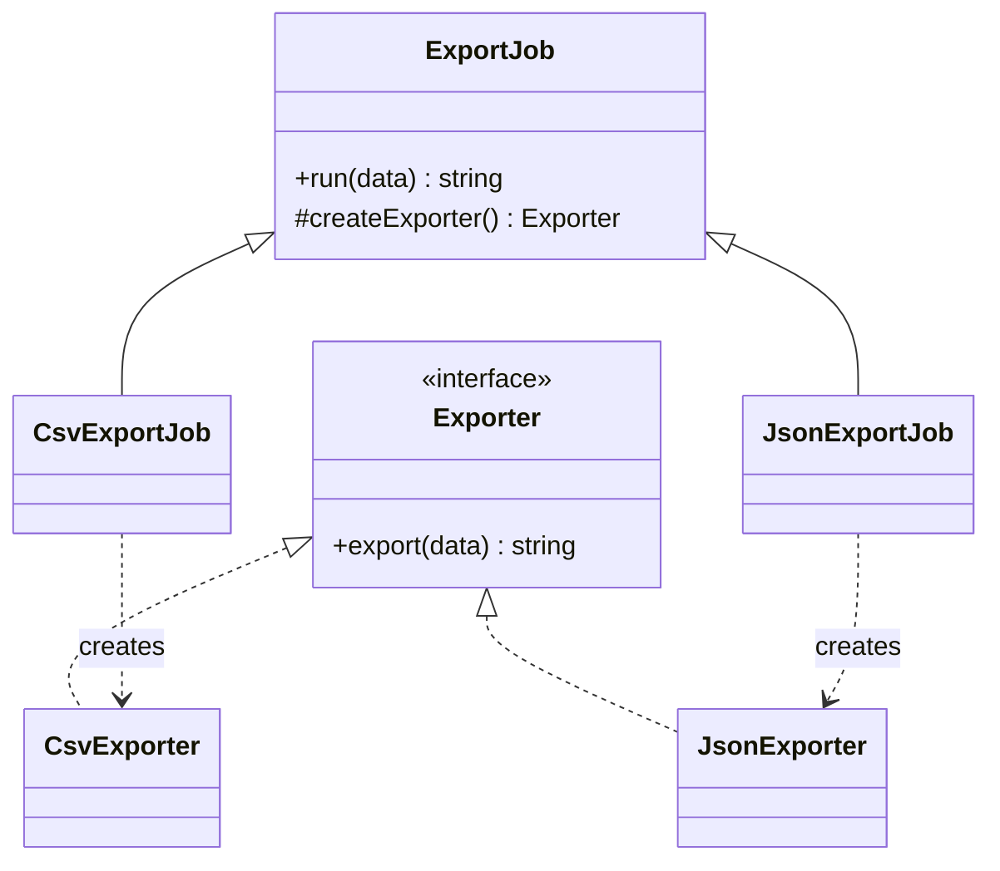

# Factory Method cho exporter

## Câu chuyện nghiệp vụ

Ứng dụng xuất báo cáo CSV, JSON và XML. Mỗi định dạng có cách tạo writer và workflow ghi file giống nhau.

## Phiên bản ban đầu đang vướng gì?

`before.php` để controller tự `new` concrete exporter và biết constructor từng loại.

## Sơ đồ collaboration



Creator sở hữu workflow `run`; subclass chỉ quyết định product. Nếu một object `ExporterFactory` dùng `match` để trả product, đó là Simple Factory chứ không phải Factory Method.

## Ý tưởng refactor

`after.php` dùng creator sở hữu workflow export; subclass quyết định product qua factory method.

## Cách đọc ví dụ

1. Đọc câu chuyện **Factory Method cho exporter** và viết lại invariant nghiệp vụ bằng một câu; đừng bắt đầu từ tên pattern.
2. Chạy `before.php`, đối chiếu output với pain point: `before.php` để controller tự `new` concrete exporter và biết constructor từng loại.
3. Vẽ dependency/flow hiện tại và đánh dấu nơi thay đổi hoặc failure lan sang client.
4. Chạy `after.php`, kiểm tra trọng tâm: Factory Method nằm ở phương thức tạo product được subclass override, không phải mọi class tên Factory.
5. Mô phỏng tình huống phản chứng: Workflow chung nên ở creator; logic định dạng ở concrete product. Sau đó giải thích vì sao refactor giảm blast radius và chi phí abstraction nào được thêm vào.

## Điều cần quan sát riêng của bài

- Factory Method nằm ở phương thức tạo product được subclass override, không phải mọi class tên Factory.
- Workflow chung nên ở creator; logic định dạng ở concrete product.
- Unsupported format phải thất bại rõ, không trả `null`.

## Thực hành mở rộng

1. Thêm XML exporter mà không sửa workflow export.
2. Bổ sung checksum sau khi ghi file trong creator.
3. So sánh với Simple Factory dùng `match` và ghi trade-off.

## Khi giải pháp trước vẫn hợp lý

Dùng `new` trực tiếp khi chỉ có một product và quá trình tạo không thay đổi.

## Cách chạy

```bash
php before.php
php after.php
```

## Tài liệu liên quan

- [02 Factory Method](../../../docs/01-creational/01-factory-method.md)
- [Pattern Comparison](../../../cheatsheets/pattern-comparison.md)

## Tệp trong ví dụ

- [`before.php`](before.php): hiện thực baseline của **Factory Method cho exporter**; dùng file này để tái hiện vấn đề “`before.php` để controller tự `new` concrete exporter và biết constructor từng loại.”.
- [`after.php`](after.php): hiện thực hướng refactor “`after.php` dùng creator sở hữu workflow export; subclass quyết định product qua factory method.”; so sánh bằng output, invariant và failure behavior.
- `test.php` (nếu có): chạy contract/failure scenario được nêu trong “Điều cần quan sát”; test không nên chỉ assert concrete class được gọi.
