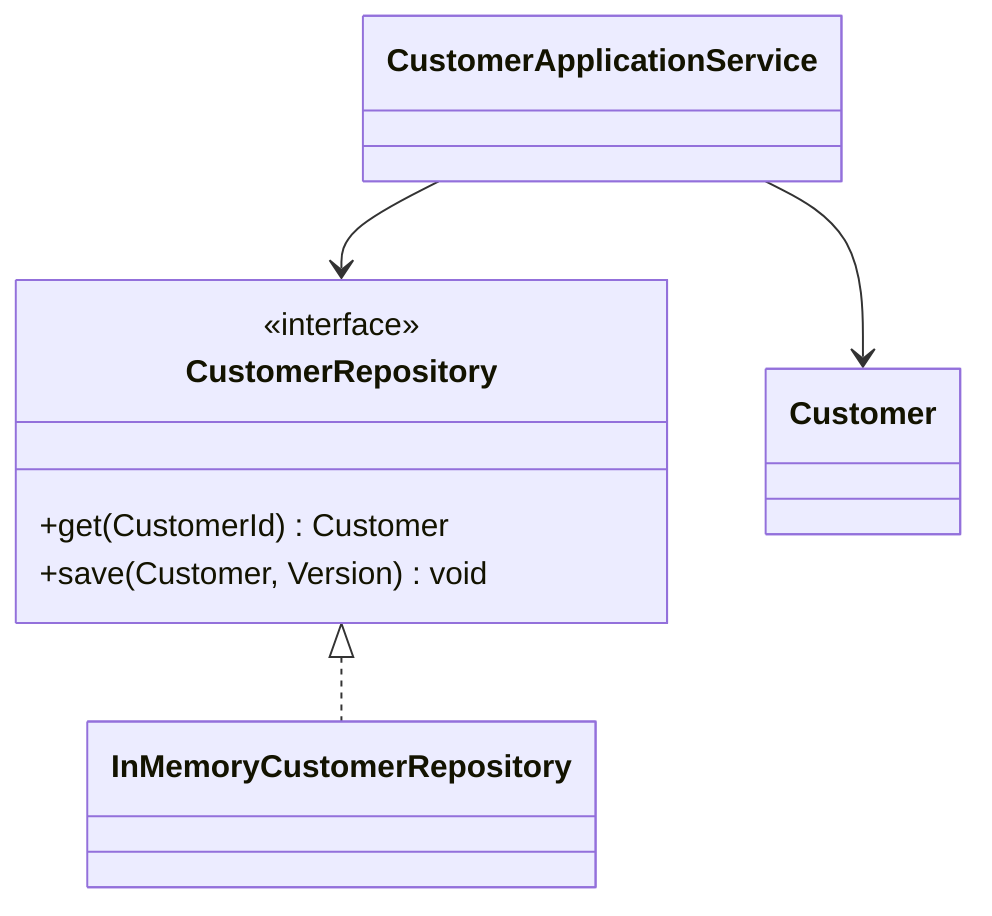

# Repository cho tập hợp Customer

## Câu chuyện nghiệp vụ

Use case cần tìm và lưu customer theo ngôn ngữ domain, trong khi persistence có thể là SQL hoặc memory khi test.

## Phiên bản ban đầu đang vướng gì?

`before.php` để service xây query và thao tác record trực tiếp.

## Ý tưởng refactor

`after.php` dùng `CustomerRepository` tập trung semantics truy xuất aggregate và ẩn chi tiết lưu trữ.

## Cách đọc ví dụ

1. Đọc câu chuyện **Repository cho tập hợp Customer** và viết lại invariant nghiệp vụ bằng một câu; đừng bắt đầu từ tên pattern.
2. Chạy `before.php`, đối chiếu output với pain point: `before.php` để service xây query và thao tác record trực tiếp.
3. Vẽ dependency/flow hiện tại và đánh dấu nơi thay đổi hoặc failure lan sang client.
4. Chạy `after.php`, kiểm tra trọng tâm: Repository mô phỏng collection của aggregate, không phải wrapper CRUD cho mọi table.
5. Mô phỏng tình huống phản chứng: Contract nên dùng domain type và lỗi domain, không trả query builder. Sau đó giải thích vì sao refactor giảm blast radius và chi phí abstraction nào được thêm vào.

## Điều cần quan sát riêng của bài

- Repository mô phỏng collection của aggregate, không phải wrapper CRUD cho mọi table.
- Contract nên dùng domain type và lỗi domain, không trả query builder.
- In-memory implementation phải giữ semantics đủ gần production để test đáng tin.

## Thực hành mở rộng

1. Thêm tìm customer theo email duy nhất.
2. Mô phỏng optimistic locking khi save version cũ.
3. So sánh repository với Query Object cho màn hình báo cáo.

## Khi giải pháp trước vẫn hợp lý

Eloquent trực tiếp thường tốt hơn cho CRUD đơn giản không có domain boundary.

## Cách chạy

```bash
php before.php
php after.php
```

## Tài liệu liên quan

- [01 Repository](../../../docs/04-enterprise-patterns/01-repository.md)
- [Examples](../../../decisions/examples/003-repository-usage-policy.md)

## Tệp trong ví dụ

- [`before.php`](before.php): hiện thực baseline của **Repository cho tập hợp Customer**; dùng file này để tái hiện vấn đề “`before.php` để service xây query và thao tác record trực tiếp.”.
- [`after.php`](after.php): hiện thực hướng refactor “`after.php` dùng `CustomerRepository` tập trung semantics truy xuất aggregate và ẩn chi tiết lưu trữ.”; so sánh bằng output, invariant và failure behavior.
- `test.php` (nếu có): chạy contract/failure scenario được nêu trong “Điều cần quan sát”; test không nên chỉ assert concrete class được gọi.

## Sơ đồ tương tác



Repository biểu diễn collection semantics của aggregate, không chỉ bọc `find()`/`save()`. Version phải được kiểm tra tại save boundary để tránh lost update.
