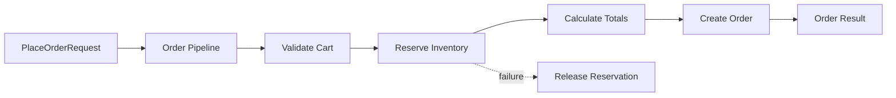

# Laravel Pipeline cho xử lý đơn hàng

## Câu chuyện nghiệp vụ

Đơn hàng qua validate, price, reserve stock và fraud check; một số kênh bán cần thêm/bớt bước.

## Phiên bản ban đầu đang vướng gì?

`before.php` gom toàn workflow vào một service và dùng cờ để bỏ qua bước.

## Ý tưởng refactor

`after.php` mô hình hóa từng pipe, wiring thứ tự tại application boundary.

## Cách đọc ví dụ

1. Đọc câu chuyện **Laravel Pipeline cho xử lý đơn hàng** và viết lại invariant nghiệp vụ bằng một câu; đừng bắt đầu từ tên pattern.
2. Chạy `before.php`, đối chiếu output với pain point: `before.php` gom toàn workflow vào một service và dùng cờ để bỏ qua bước.
3. Vẽ dependency/flow hiện tại và đánh dấu nơi thay đổi hoặc failure lan sang client.
4. Chạy `after.php`, kiểm tra trọng tâm: Mỗi pipe phải có input/output contract nhất quán.
5. Mô phỏng tình huống phản chứng: Thứ tự pipe là behavior và phải được đọc thấy trong cấu hình. Sau đó giải thích vì sao refactor giảm blast radius và chi phí abstraction nào được thêm vào.

## Điều cần quan sát riêng của bài

- Mỗi pipe phải có input/output contract nhất quán.
- Thứ tự pipe là behavior và phải được đọc thấy trong cấu hình.
- Phân biệt dừng sớm do validation với lỗi hạ tầng cần retry.

## Thực hành mở rộng

1. Thêm pipe tính loyalty cho kênh web.
2. Đo duration từng pipe mà không sửa business pipe.
3. Test payload không bị mất field qua pipeline.

## Khi giải pháp trước vẫn hợp lý

Application service tuyến tính rõ hơn khi workflow ngắn, cố định và không tái sử dụng bước.

## Cách chạy

```bash
php before.php
php after.php
```

## Tài liệu liên quan

- [07 Pipeline](../../../docs/05-laravel-patterns/06-pipeline.md)
- [04 Pipeline](../../../framework-integration/laravel/04-pipeline.md)

## Tệp trong ví dụ

- [`before.php`](before.php): hiện thực baseline của **Laravel Pipeline cho xử lý đơn hàng**; dùng file này để tái hiện vấn đề “`before.php` gom toàn workflow vào một service và dùng cờ để bỏ qua bước.”.
- [`after.php`](after.php): hiện thực hướng refactor “`after.php` mô hình hóa từng pipe, wiring thứ tự tại application boundary.”; so sánh bằng output, invariant và failure behavior.
- `test.php` (nếu có): chạy contract/failure scenario được nêu trong “Điều cần quan sát”; test không nên chỉ assert concrete class được gọi.

## Sơ đồ tương tác



Pipeline làm rõ thứ tự và short-circuit. Compensation không nên ẩn trong middleware chung; bước reserve phải cung cấp token để release khi bước sau thất bại.
