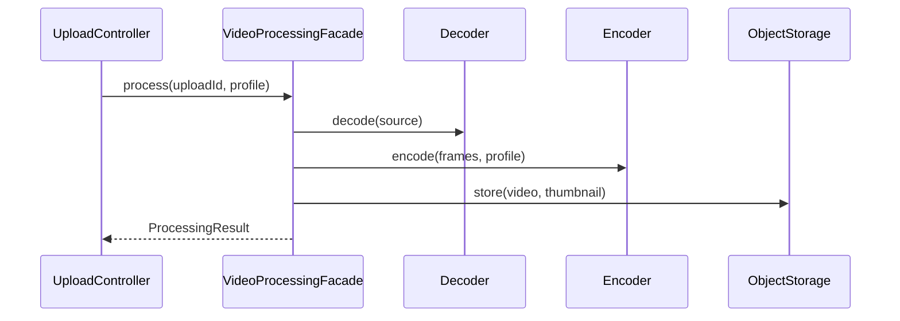

# Facade cho xử lý video

## Câu chuyện nghiệp vụ

Upload video cần decode, resize, encode, lưu object storage và tạo thumbnail qua nhiều subsystem.

## Phiên bản ban đầu đang vướng gì?

`before.php` để controller điều phối từng thư viện và biết thứ tự chi tiết.

## Ý tưởng refactor

`after.php` cung cấp `VideoProcessingFacade` với use case mức cao, che orchestration ổn định.

## Cách đọc ví dụ

1. Đọc câu chuyện **Facade cho xử lý video** và viết lại invariant nghiệp vụ bằng một câu; đừng bắt đầu từ tên pattern.
2. Chạy `before.php`, đối chiếu output với pain point: `before.php` để controller điều phối từng thư viện và biết thứ tự chi tiết.
3. Vẽ dependency/flow hiện tại và đánh dấu nơi thay đổi hoặc failure lan sang client.
4. Chạy `after.php`, kiểm tra trọng tâm: Facade đơn giản hóa API nhưng không nhất thiết thay thế subsystem interface.
5. Mô phỏng tình huống phản chứng: Facade phải giữ lỗi có ý nghĩa thay vì nuốt exception. Sau đó giải thích vì sao refactor giảm blast radius và chi phí abstraction nào được thêm vào.

## Điều cần quan sát riêng của bài

- Facade đơn giản hóa API nhưng không nhất thiết thay thế subsystem interface.
- Facade phải giữ lỗi có ý nghĩa thay vì nuốt exception.
- Không để facade biến thành God Service chứa mọi business rule.

## Thực hành mở rộng

1. Thêm profile mobile mà client không biết codec cụ thể.
2. Bổ sung progress callback hoặc job async.
3. Test orchestration bằng fake subsystem và kiểm tra thứ tự quan trọng.

## Khi giải pháp trước vẫn hợp lý

Gọi trực tiếp rõ hơn khi chỉ có một subsystem và orchestration rất nhỏ.

## Cách chạy

```bash
php before.php
php after.php
```

## Tài liệu liên quan

- [05 Facade](../../../docs/02-structural/05-facade.md)
- [Pattern Comparison](../../../cheatsheets/pattern-comparison.md)

## Tệp trong ví dụ

- [`before.php`](before.php): hiện thực baseline của **Facade cho xử lý video**; dùng file này để tái hiện vấn đề “`before.php` để controller điều phối từng thư viện và biết thứ tự chi tiết.”.
- [`after.php`](after.php): hiện thực hướng refactor “`after.php` cung cấp `VideoProcessingFacade` với use case mức cao, che orchestration ổn định.”; so sánh bằng output, invariant và failure behavior.
- `test.php` (nếu có): chạy contract/failure scenario được nêu trong “Điều cần quan sát”; test không nên chỉ assert concrete class được gọi.

## Sơ đồ tương tác



Sơ đồ nhấn mạnh Facade sở hữu orchestration ổn định, còn codec và storage vẫn là subsystem có contract độc lập. Nếu encode thất bại sau khi file tạm đã được tạo, Facade phải trả lỗi có reason và thực hiện cleanup có thể kiểm chứng.
