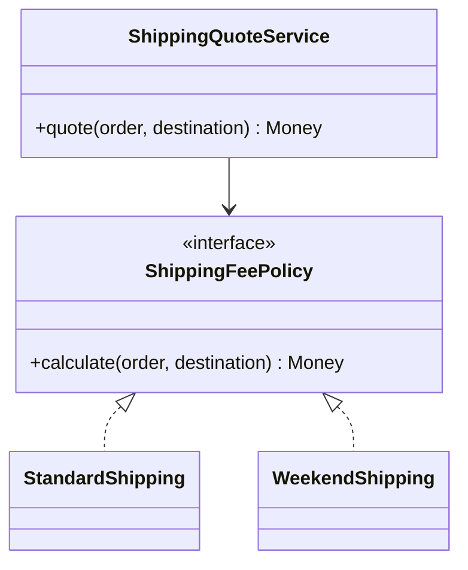

# Module 01 — Foundation: Strategy

## Vì sao bài này tồn tại?

**Báo giá vận chuyển** là tình huống độc lập được xây dựng riêng cho Strategy. Bài không lấy từ một source ẩn: bạn tự tạo phiên bản `before` tối thiểu dựa trên mô tả dưới đây, sau đó dùng test để chứng minh refactor không đổi behavior. Bài Foundation tập trung vào việc nhận diện đúng lực thay đổi và refactor tối thiểu. Không thêm queue, cache hoặc framework nếu chúng không cần để chứng minh pattern.

## Câu chuyện nghiệp vụ

Hệ thống cần xử lý **Báo giá vận chuyển**. `ShippingQuoteService` đang chứa `if/elseif` cho từng loại giao hàng, nên mỗi chính sách giá mới buộc sửa cùng một method và dễ làm sai quy tắc tiền tệ.

Invariant trung tâm của bài **Strategy** là:

> **phí không âm và cùng currency.**

Ở cấp Foundation, **Strategy** chỉ đạt mục tiêu khi người học giải thích được change axis, giữ nguyên observable behavior và chứng minh baseline trực tiếp bắt đầu khó mở rộng hoặc khó test ở điểm nào.

Failure bắt buộc phải được mô hình hóa:

> **policy trả phí âm hoặc thiếu dữ liệu.**

## Trạng thái code ban đầu

```php
final class ShippingQuoteService
{
    public function handle(array $input): mixed
    {
        // validation chung, lựa chọn biến thể và side effect
        // đang bị trộn trong một method.
        throw new RuntimeException('Hãy dựng phiên bản before phù hợp đề bài.');
    }
}
```

Đây là skeleton định hướng, không phải lời giải. Hãy thêm dữ liệu và behavior nhỏ nhất đủ tái hiện pain point của **Báo giá vận chuyển**.

## Mô hình thiết kế cần hướng tới



`ShippingQuoteService` chỉ điều phối use case và kiểm tra kết quả. Quy tắc tính phí nằm trong từng policy; việc chọn policy diễn ra ở composition root hoặc một registry nhỏ, không nằm trong phép tính.

## Nhiệm vụ

1. Dựng code `before` nhỏ tái hiện **Báo giá vận chuyển** và ít nhất một nhánh lỗi.
2. Viết characterization test khóa invariant **phí không âm và cùng currency**.
3. Vẽ dependency trước/sau và đặt `ShippingFeePolicy` tại đúng trục thay đổi.
4. Refactor một biến thể đầu tiên, giữ API của `ShippingQuoteService` ổn định.
5. Thêm biến thể chứng minh: **thêm loại giao hàng cuối tuần** mà client không phải sửa logic cũ.
6. Mô phỏng **policy trả phí âm hoặc thiếu dữ liệu** và trả lỗi bằng ngôn ngữ application/domain.

## Dữ liệu thử tối thiểu

- Hai scenario hợp lệ đại diện cho hai biến thể khác nhau.
- Một boundary value liên quan trực tiếp tới **phí không âm và cùng currency**.
- Một scenario tạo ra **policy trả phí âm hoặc thiếu dữ liệu**.
- Một biến thể mới để chứng minh extension point.

## Gợi ý triển khai

- Bắt đầu bằng behavior và invariant; chỉ tạo abstraction sau khi xác định đúng trục thay đổi.
- Đặt tên method theo domain của **Báo giá vận chuyển**, tránh `execute(mixed $data)` hoặc `handleAnything()`.
- Tách selection/wiring khỏi business calculation; composition root có thể biết concrete class nhưng use case không nên biết.
- Đừng nuốt exception. Map lỗi kỹ thuật thành error có ý nghĩa và giữ nguyên cause để điều tra.
- Nếu **switch nhỏ với hai nhánh ổn định** vẫn rõ ràng hơn và thay đổi chưa có thật, hãy ghi kết luận “chưa cần pattern” trong ADR.

## Test bắt buộc

- Happy path và boundary value của **phí không âm và cùng currency**.
- Failure test cho **policy trả phí âm hoặc thiếu dữ liệu**.
- Contract test dùng chung cho mọi implementation của `ShippingFeePolicy`.
- Extension test chứng minh **thêm loại giao hàng cuối tuần** không sửa client.

## Deliverable

```text
solution/
├── before.php
├── after.php
├── tests/
│   ├── CharacterizationTest.php
│   ├── ContractOrBehaviorTest.php
│   └── FailurePathTest.php
└── ADR.md
```

Ghi một decision note ngắn cho **Strategy**: baseline trực tiếp, change axis quan sát được, trade-off mới và điều kiện inline/xóa abstraction nếu biến thể không còn tăng.

## Tiêu chí tự chấm

- [ ] Tên class/method phản ánh đúng **Báo giá vận chuyển**.
- [ ] Invariant **phí không âm và cùng currency** có test tự động.
- [ ] Failure **policy trả phí âm hoặc thiếu dữ liệu** có outcome xác định.
- [ ] Client biết ít concrete detail hơn sau refactor.
- [ ] Diagram, code và test mô tả cùng một boundary.
- [ ] Có giải thích khi nào **switch nhỏ với hai nhánh ổn định** tốt hơn.
- [ ] Biến thể mới được thêm mà không sửa logic client.

## Câu hỏi design review

1. Trục thay đổi thật sự của **Báo giá vận chuyển** là gì, và `ShippingFeePolicy` cô lập nó ở đâu?
2. Invariant **phí không âm và cùng currency** được enforce ở layer nào? Có đường đi nào bypass không?
3. Khi **policy trả phí âm hoặc thiếu dữ liệu** xảy ra, client nhận error gì và operator nhìn thấy evidence nào?
4. Pattern này làm dependency graph tốt hơn ở điểm nào, và tạo thêm chi phí gì?
5. Dấu hiệu nào cho biết nên quay lại phương án **switch nhỏ với hai nhánh ổn định**?

## Lời giải tham khảo

Với **Báo giá vận chuyển**, hãy hoàn thành test và tự vẽ dependency trước/sau rồi mới mở [`SOLUTION.md`](SOLUTION.md). Khi đối chiếu, ưu tiên invariant, failure semantics và khả năng mở rộng của Strategy thay vì đếm class.
