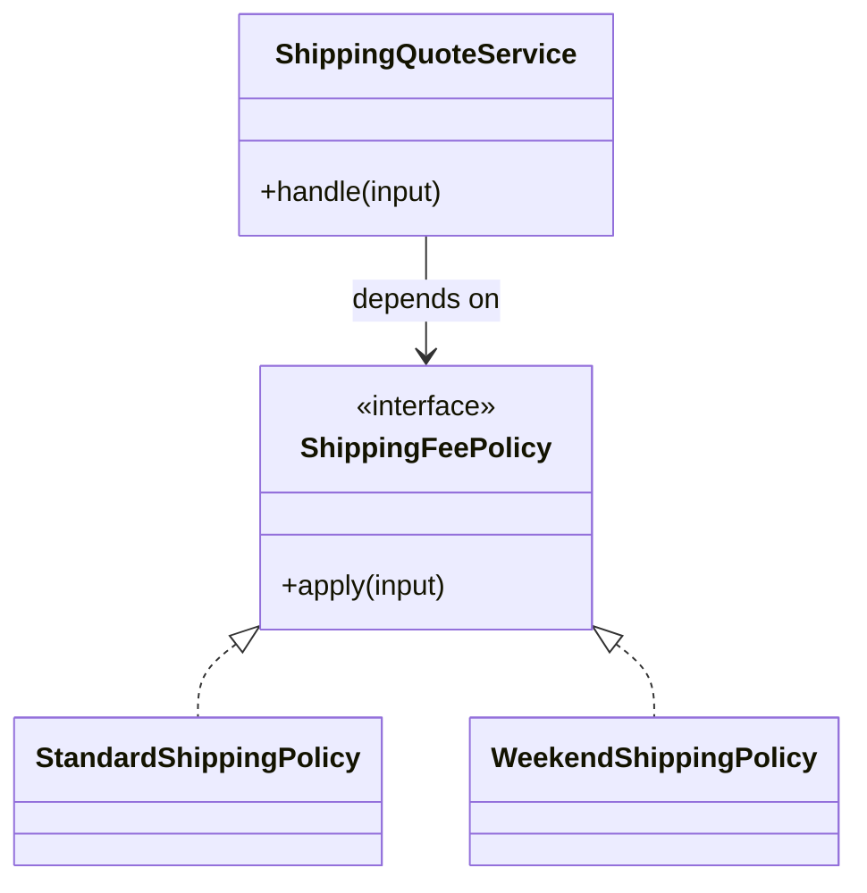

# Lời giải tham khảo — Strategy (Foundation)

## Kết luận thiết kế

Lời giải chọn `ShippingFeePolicy` làm boundary vì nó bao quanh phần thay đổi của **Báo giá vận chuyển** nhưng không kéo validation, transaction hoặc orchestration ổn định vào abstraction. Mục tiêu là bảo vệ **phí không âm và cùng currency**, không phải chứng minh rằng mọi bài toán đều cần Strategy.

## Sơ đồ lời giải



## Các bước refactor

1. Viết test cho `ShippingQuoteService` trước khi tách; test mô tả outcome chứ không khóa internal call.
2. Tách phần thay đổi thành `ShippingFeePolicy` với input/output cụ thể của **Báo giá vận chuyển**.
3. Di chuyển một nhánh sang implementation đầu tiên; giữ validation dùng chung tại nơi ổn định.
4. Thay branch selection bằng dependency injection/composition root nhỏ.
5. Thêm biến thể **thêm loại giao hàng cuối tuần** và chạy cùng contract test.
6. So sánh với phương án đơn giản hơn: **switch nhỏ với hai nhánh ổn định**; ghi khi nào nên xóa abstraction.

## Phác thảo contract

```php
interface ShippingFeePolicy
{
    /** Trả về kết quả domain hoặc ném lỗi application có nghĩa. */
    public function apply(array $input): mixed;
}
```

Trong implementation hoàn chỉnh của **Báo giá vận chuyển**, thay `array`/`mixed` bằng input và result có tên theo domain. Contract của Strategy phải làm rõ precondition, postcondition và lỗi có thể quan sát; đoạn trên chỉ minh họa hướng dependency.

## Test suite tối thiểu

- `BaoGiaVanChuyenBehaviorTest`: dựng fixture nhỏ nhất và assert trực tiếp invariant **phí không âm và cùng currency.** trên output/state, không assert tên concrete class.
- `BaoGiaVanChuyenFailureTest`: tạo **policy trả phí âm hoặc thiếu dữ liệu.**, kiểm tra error taxonomy và xác nhận state/side effect không ở trạng thái nửa vời.
- `Foundation:StrategyContractTest`: chạy cùng bộ contract cho mọi implementation hoặc variant được bài yêu cầu.
- `ExtensionTest`: thêm một biến thể hợp lệ của Foundation: Strategy mà không sửa client/use case; nếu phải sửa, boundary chưa cô lập đúng change axis.
- Một test phản chứng cho phương án đơn giản hơn để chứng minh pattern mang giá trị, không chỉ tăng số type.
## Failure walkthrough

Khi **policy trả phí âm hoặc thiếu dữ liệu**, implementation không được trả `null`/`false` mơ hồ. Nó phải tạo error có taxonomy rõ, giữ correlation/operation data cần thiết và không phá invariant **phí không âm và cùng currency**. Client test error theo semantics, không phụ thuộc message của SDK hoặc exception hạ tầng.

## Trade-off và phương án thay thế

Foundation: Strategy làm change axis của **Báo giá vận chuyển** rõ hơn, đổi lại người học phải hiểu thêm contract, wiring và cách chọn implementation. Giá trị phải được chứng minh bằng việc thêm biến thể hoặc test failure mà client không đổi.

Hãy ưu tiên **switch nhỏ với hai nhánh ổn định** nếu bài toán chỉ có một behavior ổn định, chưa có boundary ngoài hoặc test trực tiếp đã đủ rõ. Pattern không phải mục tiêu; mục tiêu là giữ invariant **phí không âm và cùng currency.** với thiết kế dễ đọc nhất.
## Dấu hiệu lời giải chưa đạt

- Boundary của Strategy không dùng ngôn ngữ **Báo giá vận chuyển**, khiến người đọc vẫn phải biết concrete detail.
- Test không chứng minh invariant **phí không âm và cùng currency** hoặc chỉ xác nhận method được gọi.
- Selection, transaction hay error mapping vẫn nằm rải rác ở client nên blast radius không giảm.
- Diagram không khớp dependency thực trong code hoặc bỏ qua failure path quan trọng.
- Thêm biến thể mới vẫn phải sửa logic trung tâm, chứng tỏ extension point đặt sai.

## Câu hỏi mở rộng

- Với **Báo giá vận chuyển**, metric nào chứng minh Strategy giảm rủi ro thay đổi thay vì chỉ tăng số type?
- Khi số biến thể tăng, ai sở hữu selection, versioning và compatibility của boundary?
- Failure nào buộc thiết kế phải đổi, và failure nào nên được xử lý bên ngoài pattern?
- Điều kiện cleanup nào cho phép hợp nhất implementation hoặc xóa abstraction này?

## Ghi chú triển khai chuyên biệt cho Strategy

Ở **Lời giải tham khảo — Strategy (Foundation)** cấp Foundation, selection tách khỏi calculation; registry chỉ ánh xạ context/key sang policy. Production cần version/cohort/fallback và telemetry cho unknown policy.

### Test focus

Ở cấp **Foundation**, dùng truth table và property test cho postcondition chung giữa các policy. Giữ test tại process boundary nhỏ nhất và ưu tiên semantics dễ đọc.

### Bằng chứng nên lưu

Với **Báo giá vận chuyển**, lưu sơ đồ dependency trước/sau, fixture tái hiện lỗi, test chứng minh invariant, commit chuyển đổi và ADR của Strategy. Reviewer cần nhìn được bằng chứng rằng boundary mới giảm blast radius hoặc làm failure dễ kiểm soát hơn, không chỉ thấy nhiều class hơn.
