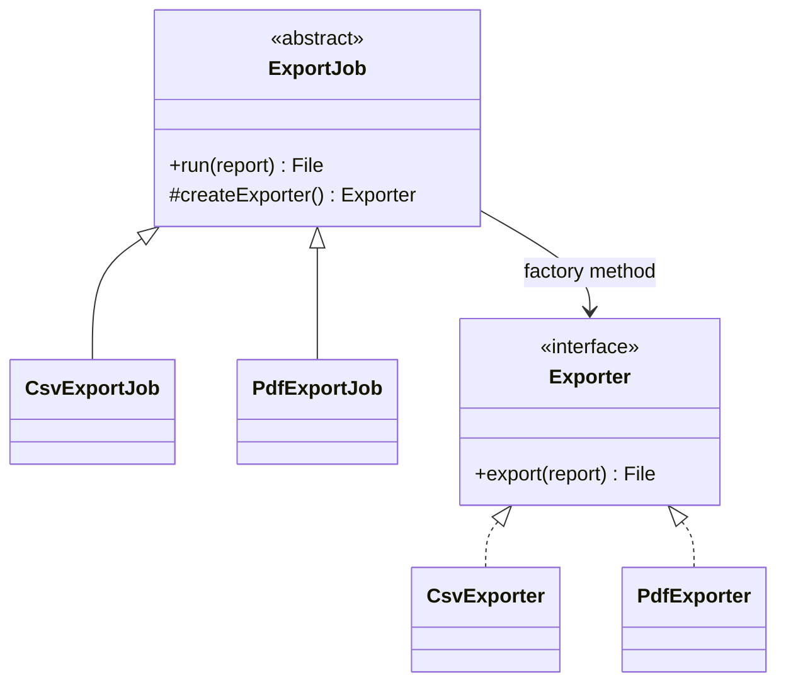

# Module 02 — Foundation: Factory Method

## Vì sao bài này tồn tại?

**Xuất báo cáo định kỳ** là tình huống độc lập được xây dựng riêng cho Factory Method. Bài không lấy từ một source ẩn: bạn tự tạo phiên bản `before` tối thiểu dựa trên mô tả dưới đây, sau đó dùng test để chứng minh refactor không đổi behavior. Bài Foundation tập trung vào việc nhận diện đúng lực thay đổi và refactor tối thiểu. Không thêm queue, cache hoặc framework nếu chúng không cần để chứng minh pattern.

## Câu chuyện nghiệp vụ

Hệ thống cần xử lý **Xuất báo cáo định kỳ**. `ExportJob` đang tự `new` từng exporter trong workflow, khiến creation rule và quy trình export bị dính chặt.

Invariant trung tâm của bài **Factory Method** là:

> **file đúng định dạng và không ghi đè ngoài ý muốn.**

Ở cấp Foundation, **Factory Method** chỉ đạt mục tiêu khi người học giải thích được change axis, giữ nguyên observable behavior và chứng minh baseline trực tiếp bắt đầu khó mở rộng hoặc khó test ở điểm nào.

Failure bắt buộc phải được mô hình hóa:

> **không hỗ trợ format hoặc writer lỗi.**

## Trạng thái code ban đầu

```php
final class ExportJob
{
    public function handle(array $input): mixed
    {
        // validation chung, lựa chọn biến thể và side effect
        // đang bị trộn trong một method.
        throw new RuntimeException('Hãy dựng phiên bản before phù hợp đề bài.');
    }
}
```

Đây là skeleton định hướng, không phải lời giải. Hãy thêm dữ liệu và behavior nhỏ nhất đủ tái hiện pain point của **Xuất báo cáo định kỳ**.

## Mô hình thiết kế cần hướng tới



Workflow `run()` được giữ ổn định trong creator. Mỗi subclass chỉ quyết định product qua `createExporter()`, nhờ đó không nhầm Factory Method với một `switch` đặt trong Simple Factory.

## Nhiệm vụ

1. Dựng code `before` nhỏ tái hiện **Xuất báo cáo định kỳ** và ít nhất một nhánh lỗi.
2. Viết characterization test khóa invariant **file đúng định dạng và không ghi đè ngoài ý muốn**.
3. Vẽ dependency trước/sau và đặt `Exporter` tại đúng trục thay đổi.
4. Refactor một biến thể đầu tiên, giữ API của `ExportJob` ổn định.
5. Thêm biến thể chứng minh: **thêm JSON exporter mà workflow không đổi** mà client không phải sửa logic cũ.
6. Mô phỏng **không hỗ trợ format hoặc writer lỗi** và trả lỗi bằng ngôn ngữ application/domain.

## Dữ liệu thử tối thiểu

- Hai scenario hợp lệ đại diện cho hai biến thể khác nhau.
- Một boundary value liên quan trực tiếp tới **file đúng định dạng và không ghi đè ngoài ý muốn**.
- Một scenario tạo ra **không hỗ trợ format hoặc writer lỗi**.
- Một biến thể mới để chứng minh extension point.

## Gợi ý triển khai

- Bắt đầu bằng behavior và invariant; chỉ tạo abstraction sau khi xác định đúng trục thay đổi.
- Đặt tên method theo domain của **Xuất báo cáo định kỳ**, tránh `execute(mixed $data)` hoặc `handleAnything()`.
- Tách selection/wiring khỏi business calculation; composition root có thể biết concrete class nhưng use case không nên biết.
- Đừng nuốt exception. Map lỗi kỹ thuật thành error có ý nghĩa và giữ nguyên cause để điều tra.
- Nếu **khởi tạo trực tiếp khi chỉ có một product** vẫn rõ ràng hơn và thay đổi chưa có thật, hãy ghi kết luận “chưa cần pattern” trong ADR.

## Test bắt buộc

- Happy path và boundary value của **file đúng định dạng và không ghi đè ngoài ý muốn**.
- Failure test cho **không hỗ trợ format hoặc writer lỗi**.
- Contract test dùng chung cho mọi implementation của `Exporter`.
- Extension test chứng minh **thêm JSON exporter mà workflow không đổi** không sửa client.

## Deliverable

```text
solution/
├── before.php
├── after.php
├── tests/
│   ├── CharacterizationTest.php
│   ├── ContractOrBehaviorTest.php
│   └── FailurePathTest.php
└── ADR.md
```

Ghi một decision note ngắn cho **Factory Method**: baseline trực tiếp, change axis quan sát được, trade-off mới và điều kiện inline/xóa abstraction nếu biến thể không còn tăng.

## Tiêu chí tự chấm

- [ ] Tên class/method phản ánh đúng **Xuất báo cáo định kỳ**.
- [ ] Invariant **file đúng định dạng và không ghi đè ngoài ý muốn** có test tự động.
- [ ] Failure **không hỗ trợ format hoặc writer lỗi** có outcome xác định.
- [ ] Client biết ít concrete detail hơn sau refactor.
- [ ] Diagram, code và test mô tả cùng một boundary.
- [ ] Có giải thích khi nào **khởi tạo trực tiếp khi chỉ có một product** tốt hơn.
- [ ] Biến thể mới được thêm mà không sửa logic client.

## Câu hỏi design review

1. Trục thay đổi thật sự của **Xuất báo cáo định kỳ** là gì, và `Exporter` cô lập nó ở đâu?
2. Invariant **file đúng định dạng và không ghi đè ngoài ý muốn** được enforce ở layer nào? Có đường đi nào bypass không?
3. Khi **không hỗ trợ format hoặc writer lỗi** xảy ra, client nhận error gì và operator nhìn thấy evidence nào?
4. Pattern này làm dependency graph tốt hơn ở điểm nào, và tạo thêm chi phí gì?
5. Dấu hiệu nào cho biết nên quay lại phương án **khởi tạo trực tiếp khi chỉ có một product**?

## Lời giải tham khảo

Với **Xuất báo cáo định kỳ**, hãy hoàn thành test và tự vẽ dependency trước/sau rồi mới mở [`SOLUTION.md`](SOLUTION.md). Khi đối chiếu, ưu tiên invariant, failure semantics và khả năng mở rộng của Factory Method thay vì đếm class.
