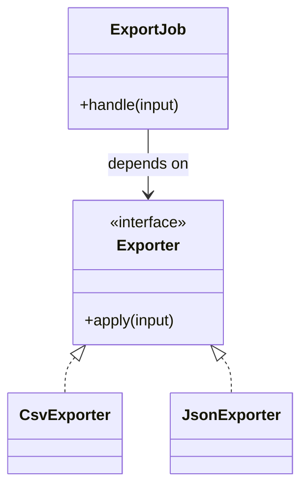

# Lời giải tham khảo — Factory Method (Foundation)

## Kết luận thiết kế

Lời giải chọn `Exporter` làm boundary vì nó bao quanh phần thay đổi của **Xuất báo cáo định kỳ** nhưng không kéo validation, transaction hoặc orchestration ổn định vào abstraction. Mục tiêu là bảo vệ **file đúng định dạng và không ghi đè ngoài ý muốn**, không phải chứng minh rằng mọi bài toán đều cần Factory Method.

## Sơ đồ lời giải



## Các bước refactor

1. Viết test cho `ExportJob` trước khi tách; test mô tả outcome chứ không khóa internal call.
2. Tách phần thay đổi thành `Exporter` với input/output cụ thể của **Xuất báo cáo định kỳ**.
3. Di chuyển một nhánh sang implementation đầu tiên; giữ validation dùng chung tại nơi ổn định.
4. Thay branch selection bằng dependency injection/composition root nhỏ.
5. Thêm biến thể **thêm JSON exporter mà workflow không đổi** và chạy cùng contract test.
6. So sánh với phương án đơn giản hơn: **khởi tạo trực tiếp khi chỉ có một product**; ghi khi nào nên xóa abstraction.

## Phác thảo contract

```php
interface Exporter
{
    /** Trả về kết quả domain hoặc ném lỗi application có nghĩa. */
    public function apply(array $input): mixed;
}
```

Trong implementation hoàn chỉnh của **Xuất báo cáo định kỳ**, thay `array`/`mixed` bằng input và result có tên theo domain. Contract của Factory Method phải làm rõ precondition, postcondition và lỗi có thể quan sát; đoạn trên chỉ minh họa hướng dependency.

## Test suite tối thiểu

- `XuatBaoCaoInhKyBehaviorTest`: dựng fixture nhỏ nhất và assert trực tiếp invariant **file đúng định dạng và không ghi đè ngoài ý muốn.** trên output/state, không assert tên concrete class.
- `XuatBaoCaoInhKyFailureTest`: tạo **không hỗ trợ format hoặc writer lỗi.**, kiểm tra error taxonomy và xác nhận state/side effect không ở trạng thái nửa vời.
- `Foundation:FactoryMethodContractTest`: chạy cùng bộ contract cho mọi implementation hoặc variant được bài yêu cầu.
- `ExtensionTest`: thêm một biến thể hợp lệ của Foundation: Factory Method mà không sửa client/use case; nếu phải sửa, boundary chưa cô lập đúng change axis.
- Một test phản chứng cho phương án đơn giản hơn để chứng minh pattern mang giá trị, không chỉ tăng số type.
## Failure walkthrough

Khi **không hỗ trợ format hoặc writer lỗi**, implementation không được trả `null`/`false` mơ hồ. Nó phải tạo error có taxonomy rõ, giữ correlation/operation data cần thiết và không phá invariant **file đúng định dạng và không ghi đè ngoài ý muốn**. Client test error theo semantics, không phụ thuộc message của SDK hoặc exception hạ tầng.

## Trade-off và phương án thay thế

Foundation: Factory Method làm change axis của **Xuất báo cáo định kỳ** rõ hơn, đổi lại người học phải hiểu thêm contract, wiring và cách chọn implementation. Giá trị phải được chứng minh bằng việc thêm biến thể hoặc test failure mà client không đổi.

Hãy ưu tiên **khởi tạo trực tiếp khi chỉ có một product** nếu bài toán chỉ có một behavior ổn định, chưa có boundary ngoài hoặc test trực tiếp đã đủ rõ. Pattern không phải mục tiêu; mục tiêu là giữ invariant **file đúng định dạng và không ghi đè ngoài ý muốn.** với thiết kế dễ đọc nhất.
## Dấu hiệu lời giải chưa đạt

- Boundary của Factory Method không dùng ngôn ngữ **Xuất báo cáo định kỳ**, khiến người đọc vẫn phải biết concrete detail.
- Test không chứng minh invariant **file đúng định dạng và không ghi đè ngoài ý muốn** hoặc chỉ xác nhận method được gọi.
- Selection, transaction hay error mapping vẫn nằm rải rác ở client nên blast radius không giảm.
- Diagram không khớp dependency thực trong code hoặc bỏ qua failure path quan trọng.
- Thêm biến thể mới vẫn phải sửa logic trung tâm, chứng tỏ extension point đặt sai.

## Câu hỏi mở rộng

- Với **Xuất báo cáo định kỳ**, metric nào chứng minh Factory Method giảm rủi ro thay đổi thay vì chỉ tăng số type?
- Khi số biến thể tăng, ai sở hữu selection, versioning và compatibility của boundary?
- Failure nào buộc thiết kế phải đổi, và failure nào nên được xử lý bên ngoài pattern?
- Điều kiện cleanup nào cho phép hợp nhất implementation hoặc xóa abstraction này?

## Ghi chú triển khai chuyên biệt cho Factory Method

Với **Lời giải tham khảo — Factory Method (Foundation)** cấp Foundation, creator giữ workflow ổn định và gọi factory method tại extension point; nếu mọi creation vẫn dồn vào một `match`, bài chưa chứng minh Factory Method.

### Test focus

Ở cấp **Foundation**, với **Lời giải tham khảo — Factory Method (Foundation)** cấp Foundation, test workflow chung ở creator base, contract của product và selection/construction của từng concrete creator; Production cần thêm config rollout và unknown-key behavior. Giữ test tại process boundary nhỏ nhất và ưu tiên semantics dễ đọc.

### Bằng chứng nên lưu

Với **Xuất báo cáo định kỳ**, lưu sơ đồ dependency trước/sau, fixture tái hiện lỗi, test chứng minh invariant, commit chuyển đổi và ADR của Factory Method. Reviewer cần nhìn được bằng chứng rằng boundary mới giảm blast radius hoặc làm failure dễ kiểm soát hơn, không chỉ thấy nhiều class hơn.
