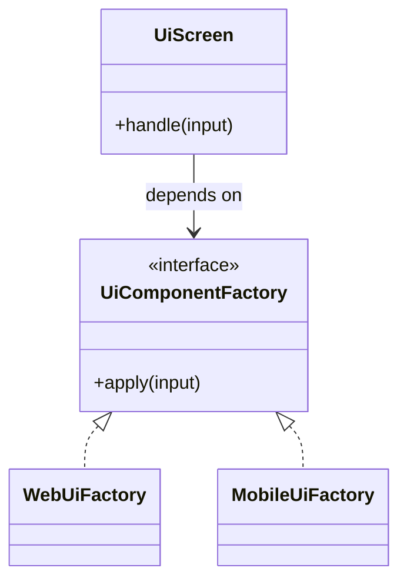

# Lời giải tham khảo — Abstract Factory (Foundation)

## Kết luận thiết kế

Lời giải chọn `UiComponentFactory` làm boundary vì nó bao quanh phần thay đổi của **Bộ giao diện theo nền tảng** nhưng không kéo validation, transaction hoặc orchestration ổn định vào abstraction. Mục tiêu là bảo vệ **button và dialog phải cùng product family**, không phải chứng minh rằng mọi bài toán đều cần Abstract Factory.

## Sơ đồ lời giải



## Các bước refactor

1. Viết test cho `UiScreen` trước khi tách; test mô tả outcome chứ không khóa internal call.
2. Tách phần thay đổi thành `UiComponentFactory` với input/output cụ thể của **Bộ giao diện theo nền tảng**.
3. Di chuyển một nhánh sang implementation đầu tiên; giữ validation dùng chung tại nơi ổn định.
4. Thay branch selection bằng dependency injection/composition root nhỏ.
5. Thêm biến thể **thêm Web family hoàn chỉnh** và chạy cùng contract test.
6. So sánh với phương án đơn giản hơn: **tạo object trực tiếp khi không có family invariant**; ghi khi nào nên xóa abstraction.

## Phác thảo contract

```php
interface UiComponentFactory
{
    /** Trả về kết quả domain hoặc ném lỗi application có nghĩa. */
    public function apply(array $input): mixed;
}
```

Trong implementation hoàn chỉnh của **Bộ giao diện theo nền tảng**, thay `array`/`mixed` bằng input và result có tên theo domain. Contract của Abstract Factory phải làm rõ precondition, postcondition và lỗi có thể quan sát; đoạn trên chỉ minh họa hướng dependency.

## Test suite tối thiểu

- `BoGiaoDienTheoNenTangBehaviorTest`: dựng fixture nhỏ nhất và assert trực tiếp invariant **button và dialog phải cùng product family.** trên output/state, không assert tên concrete class.
- `BoGiaoDienTheoNenTangFailureTest`: tạo **trộn component từ hai family.**, kiểm tra error taxonomy và xác nhận state/side effect không ở trạng thái nửa vời.
- `Foundation:AbstractFactoryContractTest`: chạy cùng bộ contract cho mọi implementation hoặc variant được bài yêu cầu.
- `ExtensionTest`: thêm một biến thể hợp lệ của Foundation: Abstract Factory mà không sửa client/use case; nếu phải sửa, boundary chưa cô lập đúng change axis.
- Một test phản chứng cho phương án đơn giản hơn để chứng minh pattern mang giá trị, không chỉ tăng số type.
## Failure walkthrough

Khi **trộn component từ hai family**, implementation không được trả `null`/`false` mơ hồ. Nó phải tạo error có taxonomy rõ, giữ correlation/operation data cần thiết và không phá invariant **button và dialog phải cùng product family**. Client test error theo semantics, không phụ thuộc message của SDK hoặc exception hạ tầng.

## Trade-off và phương án thay thế

Foundation: Abstract Factory làm change axis của **Bộ giao diện theo nền tảng** rõ hơn, đổi lại người học phải hiểu thêm contract, wiring và cách chọn implementation. Giá trị phải được chứng minh bằng việc thêm biến thể hoặc test failure mà client không đổi.

Hãy ưu tiên **tạo object trực tiếp khi không có family invariant** nếu bài toán chỉ có một behavior ổn định, chưa có boundary ngoài hoặc test trực tiếp đã đủ rõ. Pattern không phải mục tiêu; mục tiêu là giữ invariant **button và dialog phải cùng product family.** với thiết kế dễ đọc nhất.
## Dấu hiệu lời giải chưa đạt

- Boundary của Abstract Factory không dùng ngôn ngữ **Bộ giao diện theo nền tảng**, khiến người đọc vẫn phải biết concrete detail.
- Test không chứng minh invariant **button và dialog phải cùng product family** hoặc chỉ xác nhận method được gọi.
- Selection, transaction hay error mapping vẫn nằm rải rác ở client nên blast radius không giảm.
- Diagram không khớp dependency thực trong code hoặc bỏ qua failure path quan trọng.
- Thêm biến thể mới vẫn phải sửa logic trung tâm, chứng tỏ extension point đặt sai.

## Câu hỏi mở rộng

- Với **Bộ giao diện theo nền tảng**, metric nào chứng minh Abstract Factory giảm rủi ro thay đổi thay vì chỉ tăng số type?
- Khi số biến thể tăng, ai sở hữu selection, versioning và compatibility của boundary?
- Failure nào buộc thiết kế phải đổi, và failure nào nên được xử lý bên ngoài pattern?
- Điều kiện cleanup nào cho phép hợp nhất implementation hoặc xóa abstraction này?

## Ghi chú triển khai chuyên biệt cho Abstract Factory

Trong **Lời giải tham khảo — Abstract Factory (Foundation)** cấp Foundation, product family cần compatibility invariant và test theo family; nếu client vẫn trộn concrete products tùy ý thì chưa chứng minh được Abstract Factory.

### Test focus

Ở cấp **Foundation**, test một family hoàn chỉnh và test ngăn trộn product giữa hai family. Giữ test tại process boundary nhỏ nhất và ưu tiên semantics dễ đọc.

### Bằng chứng nên lưu

Với **Bộ giao diện theo nền tảng**, lưu sơ đồ dependency trước/sau, fixture tái hiện lỗi, test chứng minh invariant, commit chuyển đổi và ADR của Abstract Factory. Reviewer cần nhìn được bằng chứng rằng boundary mới giảm blast radius hoặc làm failure dễ kiểm soát hơn, không chỉ thấy nhiều class hơn.
