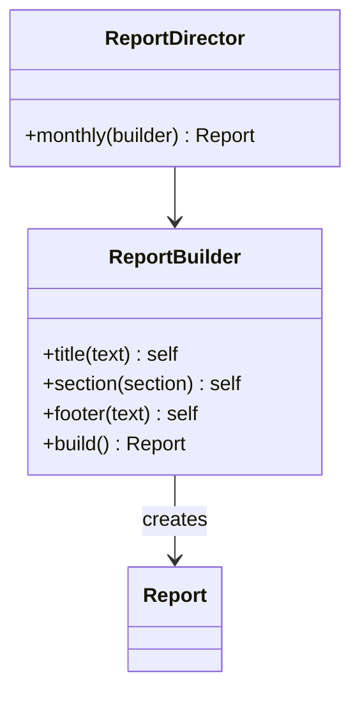

# Module 04 — Foundation: Builder

## Vì sao bài này tồn tại?

**Tạo báo cáo nhiều phần** là tình huống độc lập được xây dựng riêng cho Builder. Bài không lấy từ một source ẩn: bạn tự tạo phiên bản `before` tối thiểu dựa trên mô tả dưới đây, sau đó dùng test để chứng minh refactor không đổi behavior. Bài Foundation tập trung vào việc nhận diện đúng lực thay đổi và refactor tối thiểu. Không thêm queue, cache hoặc framework nếu chúng không cần để chứng minh pattern.

## Câu chuyện nghiệp vụ

Hệ thống cần xử lý **Tạo báo cáo nhiều phần**. `ReportDirector` đang nhận quá nhiều tham số tùy chọn và có thể tạo báo cáo thiếu section bắt buộc.

Invariant trung tâm của bài **Builder** là:

> **report hoàn chỉnh mới được xuất.**

Ở cấp Foundation, **Builder** chỉ đạt mục tiêu khi người học giải thích được change axis, giữ nguyên observable behavior và chứng minh baseline trực tiếp bắt đầu khó mở rộng hoặc khó test ở điểm nào.

Failure bắt buộc phải được mô hình hóa:

> **thiếu section bắt buộc hoặc sai thứ tự.**

## Trạng thái code ban đầu

```php
final class ReportDirector
{
    public function handle(array $input): mixed
    {
        // validation chung, lựa chọn biến thể và side effect
        // đang bị trộn trong một method.
        throw new RuntimeException('Hãy dựng phiên bản before phù hợp đề bài.');
    }
}
```

Đây là skeleton định hướng, không phải lời giải. Hãy thêm dữ liệu và behavior nhỏ nhất đủ tái hiện pain point của **Tạo báo cáo nhiều phần**.

## Mô hình thiết kế cần hướng tới



Builder gom quá trình tạo object nhiều bước và chỉ cho xuất `Report` sau khi các invariant bắt buộc đã đủ. Director là tùy chọn; domain rule vẫn nằm trong builder/report, không nằm trong controller.

## Nhiệm vụ

1. Dựng code `before` nhỏ tái hiện **Tạo báo cáo nhiều phần** và ít nhất một nhánh lỗi.
2. Viết characterization test khóa invariant **report hoàn chỉnh mới được xuất**.
3. Vẽ dependency trước/sau và đặt `ReportBuilder` tại đúng trục thay đổi.
4. Refactor một biến thể đầu tiên, giữ API của `ReportDirector` ổn định.
5. Thêm biến thể chứng minh: **thêm preset báo cáo kiểm toán** mà client không phải sửa logic cũ.
6. Mô phỏng **thiếu section bắt buộc hoặc sai thứ tự** và trả lỗi bằng ngôn ngữ application/domain.

## Dữ liệu thử tối thiểu

- Hai scenario hợp lệ đại diện cho hai biến thể khác nhau.
- Một boundary value liên quan trực tiếp tới **report hoàn chỉnh mới được xuất**.
- Một scenario tạo ra **thiếu section bắt buộc hoặc sai thứ tự**.
- Một biến thể mới để chứng minh extension point.

## Gợi ý triển khai

- Bắt đầu bằng behavior và invariant; chỉ tạo abstraction sau khi xác định đúng trục thay đổi.
- Đặt tên method theo domain của **Tạo báo cáo nhiều phần**, tránh `execute(mixed $data)` hoặc `handleAnything()`.
- Tách selection/wiring khỏi business calculation; composition root có thể biết concrete class nhưng use case không nên biết.
- Đừng nuốt exception. Map lỗi kỹ thuật thành error có ý nghĩa và giữ nguyên cause để điều tra.
- Nếu **constructor named arguments khi object đơn giản** vẫn rõ ràng hơn và thay đổi chưa có thật, hãy ghi kết luận “chưa cần pattern” trong ADR.

## Test bắt buộc

- Happy path và boundary value của **report hoàn chỉnh mới được xuất**.
- Failure test cho **thiếu section bắt buộc hoặc sai thứ tự**.
- Contract test dùng chung cho mọi implementation của `ReportBuilder`.
- Extension test chứng minh **thêm preset báo cáo kiểm toán** không sửa client.

## Deliverable

```text
solution/
├── before.php
├── after.php
├── tests/
│   ├── CharacterizationTest.php
│   ├── ContractOrBehaviorTest.php
│   └── FailurePathTest.php
└── ADR.md
```

Ghi một decision note ngắn cho **Builder**: baseline trực tiếp, change axis quan sát được, trade-off mới và điều kiện inline/xóa abstraction nếu biến thể không còn tăng.

## Tiêu chí tự chấm

- [ ] Tên class/method phản ánh đúng **Tạo báo cáo nhiều phần**.
- [ ] Invariant **report hoàn chỉnh mới được xuất** có test tự động.
- [ ] Failure **thiếu section bắt buộc hoặc sai thứ tự** có outcome xác định.
- [ ] Client biết ít concrete detail hơn sau refactor.
- [ ] Diagram, code và test mô tả cùng một boundary.
- [ ] Có giải thích khi nào **constructor named arguments khi object đơn giản** tốt hơn.
- [ ] Biến thể mới được thêm mà không sửa logic client.

## Câu hỏi design review

1. Trục thay đổi thật sự của **Tạo báo cáo nhiều phần** là gì, và `ReportBuilder` cô lập nó ở đâu?
2. Invariant **report hoàn chỉnh mới được xuất** được enforce ở layer nào? Có đường đi nào bypass không?
3. Khi **thiếu section bắt buộc hoặc sai thứ tự** xảy ra, client nhận error gì và operator nhìn thấy evidence nào?
4. Pattern này làm dependency graph tốt hơn ở điểm nào, và tạo thêm chi phí gì?
5. Dấu hiệu nào cho biết nên quay lại phương án **constructor named arguments khi object đơn giản**?

## Lời giải tham khảo

Với **Tạo báo cáo nhiều phần**, hãy hoàn thành test và tự vẽ dependency trước/sau rồi mới mở [`SOLUTION.md`](SOLUTION.md). Khi đối chiếu, ưu tiên invariant, failure semantics và khả năng mở rộng của Builder thay vì đếm class.
