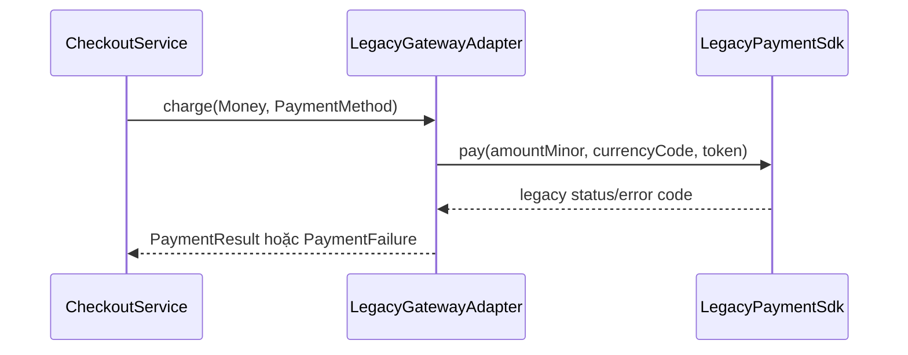

# Module 05 — Foundation: Adapter

## Vì sao bài này tồn tại?

**Tích hợp cổng thanh toán cũ** là tình huống độc lập được xây dựng riêng cho Adapter. Bài không lấy từ một source ẩn: bạn tự tạo phiên bản `before` tối thiểu dựa trên mô tả dưới đây, sau đó dùng test để chứng minh refactor không đổi behavior. Bài Foundation tập trung vào việc nhận diện đúng lực thay đổi và refactor tối thiểu. Không thêm queue, cache hoặc framework nếu chúng không cần để chứng minh pattern.

## Câu chuyện nghiệp vụ

Hệ thống cần xử lý **Tích hợp cổng thanh toán cũ**. `CheckoutService` đang biết trực tiếp tên field, đơn vị tiền và mã lỗi của SDK legacy.

Invariant trung tâm của bài **Adapter** là:

> **kết quả thanh toán dùng contract nội bộ ổn định.**

Ở cấp Foundation, **Adapter** chỉ đạt mục tiêu khi người học giải thích được change axis, giữ nguyên observable behavior và chứng minh baseline trực tiếp bắt đầu khó mở rộng hoặc khó test ở điểm nào.

Failure bắt buộc phải được mô hình hóa:

> **SDK timeout hoặc mã lỗi lạ.**

## Trạng thái code ban đầu

```php
final class CheckoutService
{
    public function handle(array $input): mixed
    {
        // validation chung, lựa chọn biến thể và side effect
        // đang bị trộn trong một method.
        throw new RuntimeException('Hãy dựng phiên bản before phù hợp đề bài.');
    }
}
```

Đây là skeleton định hướng, không phải lời giải. Hãy thêm dữ liệu và behavior nhỏ nhất đủ tái hiện pain point của **Tích hợp cổng thanh toán cũ**.

## Mô hình thiết kế cần hướng tới



Adapter dịch cả shape dữ liệu lẫn error semantics tại boundary. `CheckoutService` không biết mã lỗi, naming hoặc unit tiền của SDK cũ.

## Nhiệm vụ

1. Dựng code `before` nhỏ tái hiện **Tích hợp cổng thanh toán cũ** và ít nhất một nhánh lỗi.
2. Viết characterization test khóa invariant **kết quả thanh toán dùng contract nội bộ ổn định**.
3. Vẽ dependency trước/sau và đặt `PaymentGateway` tại đúng trục thay đổi.
4. Refactor một biến thể đầu tiên, giữ API của `CheckoutService` ổn định.
5. Thêm biến thể chứng minh: **thêm adapter cho SDK mới** mà client không phải sửa logic cũ.
6. Mô phỏng **SDK timeout hoặc mã lỗi lạ** và trả lỗi bằng ngôn ngữ application/domain.

## Dữ liệu thử tối thiểu

- Hai scenario hợp lệ đại diện cho hai biến thể khác nhau.
- Một boundary value liên quan trực tiếp tới **kết quả thanh toán dùng contract nội bộ ổn định**.
- Một scenario tạo ra **SDK timeout hoặc mã lỗi lạ**.
- Một biến thể mới để chứng minh extension point.

## Gợi ý triển khai

- Bắt đầu bằng behavior và invariant; chỉ tạo abstraction sau khi xác định đúng trục thay đổi.
- Đặt tên method theo domain của **Tích hợp cổng thanh toán cũ**, tránh `execute(mixed $data)` hoặc `handleAnything()`.
- Tách selection/wiring khỏi business calculation; composition root có thể biết concrete class nhưng use case không nên biết.
- Đừng nuốt exception. Map lỗi kỹ thuật thành error có ý nghĩa và giữ nguyên cause để điều tra.
- Nếu **gọi SDK trực tiếp khi integration dùng một lần** vẫn rõ ràng hơn và thay đổi chưa có thật, hãy ghi kết luận “chưa cần pattern” trong ADR.

## Test bắt buộc

- Happy path và boundary value của **kết quả thanh toán dùng contract nội bộ ổn định**.
- Failure test cho **SDK timeout hoặc mã lỗi lạ**.
- Contract test dùng chung cho mọi implementation của `PaymentGateway`.
- Extension test chứng minh **thêm adapter cho SDK mới** không sửa client.

## Deliverable

```text
solution/
├── before.php
├── after.php
├── tests/
│   ├── CharacterizationTest.php
│   ├── ContractOrBehaviorTest.php
│   └── FailurePathTest.php
└── ADR.md
```

Ghi một decision note ngắn cho **Adapter**: baseline trực tiếp, change axis quan sát được, trade-off mới và điều kiện inline/xóa abstraction nếu biến thể không còn tăng.

## Tiêu chí tự chấm

- [ ] Tên class/method phản ánh đúng **Tích hợp cổng thanh toán cũ**.
- [ ] Invariant **kết quả thanh toán dùng contract nội bộ ổn định** có test tự động.
- [ ] Failure **SDK timeout hoặc mã lỗi lạ** có outcome xác định.
- [ ] Client biết ít concrete detail hơn sau refactor.
- [ ] Diagram, code và test mô tả cùng một boundary.
- [ ] Có giải thích khi nào **gọi SDK trực tiếp khi integration dùng một lần** tốt hơn.
- [ ] Biến thể mới được thêm mà không sửa logic client.

## Câu hỏi design review

1. Trục thay đổi thật sự của **Tích hợp cổng thanh toán cũ** là gì, và `PaymentGateway` cô lập nó ở đâu?
2. Invariant **kết quả thanh toán dùng contract nội bộ ổn định** được enforce ở layer nào? Có đường đi nào bypass không?
3. Khi **SDK timeout hoặc mã lỗi lạ** xảy ra, client nhận error gì và operator nhìn thấy evidence nào?
4. Pattern này làm dependency graph tốt hơn ở điểm nào, và tạo thêm chi phí gì?
5. Dấu hiệu nào cho biết nên quay lại phương án **gọi SDK trực tiếp khi integration dùng một lần**?

## Lời giải tham khảo

Với **Tích hợp cổng thanh toán cũ**, hãy hoàn thành test và tự vẽ dependency trước/sau rồi mới mở [`SOLUTION.md`](SOLUTION.md). Khi đối chiếu, ưu tiên invariant, failure semantics và khả năng mở rộng của Adapter thay vì đếm class.
