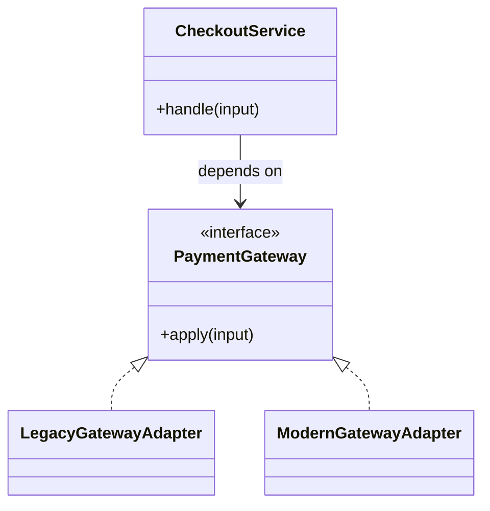

# Lời giải tham khảo — Adapter (Foundation)

## Kết luận thiết kế

Lời giải chọn `PaymentGateway` làm boundary vì nó bao quanh phần thay đổi của **Tích hợp cổng thanh toán cũ** nhưng không kéo validation, transaction hoặc orchestration ổn định vào abstraction. Mục tiêu là bảo vệ **kết quả thanh toán dùng contract nội bộ ổn định**, không phải chứng minh rằng mọi bài toán đều cần Adapter.

## Sơ đồ lời giải



## Các bước refactor

1. Viết test cho `CheckoutService` trước khi tách; test mô tả outcome chứ không khóa internal call.
2. Tách phần thay đổi thành `PaymentGateway` với input/output cụ thể của **Tích hợp cổng thanh toán cũ**.
3. Di chuyển một nhánh sang implementation đầu tiên; giữ validation dùng chung tại nơi ổn định.
4. Thay branch selection bằng dependency injection/composition root nhỏ.
5. Thêm biến thể **thêm adapter cho SDK mới** và chạy cùng contract test.
6. So sánh với phương án đơn giản hơn: **gọi SDK trực tiếp khi integration dùng một lần**; ghi khi nào nên xóa abstraction.

## Phác thảo contract

```php
interface PaymentGateway
{
    /** Trả về kết quả domain hoặc ném lỗi application có nghĩa. */
    public function apply(array $input): mixed;
}
```

Trong implementation hoàn chỉnh của **Tích hợp cổng thanh toán cũ**, thay `array`/`mixed` bằng input và result có tên theo domain. Contract của Adapter phải làm rõ precondition, postcondition và lỗi có thể quan sát; đoạn trên chỉ minh họa hướng dependency.

## Test suite tối thiểu

- `TichHopCongThanhToanCuBehaviorTest`: dựng fixture nhỏ nhất và assert trực tiếp invariant **kết quả thanh toán dùng contract nội bộ ổn định.** trên output/state, không assert tên concrete class.
- `TichHopCongThanhToanCuFailureTest`: tạo **SDK timeout hoặc mã lỗi lạ.**, kiểm tra error taxonomy và xác nhận state/side effect không ở trạng thái nửa vời.
- `Foundation:AdapterContractTest`: chạy cùng bộ contract cho mọi implementation hoặc variant được bài yêu cầu.
- `ExtensionTest`: thêm một biến thể hợp lệ của Foundation: Adapter mà không sửa client/use case; nếu phải sửa, boundary chưa cô lập đúng change axis.
- Một test phản chứng cho phương án đơn giản hơn để chứng minh pattern mang giá trị, không chỉ tăng số type.
## Failure walkthrough

Khi **SDK timeout hoặc mã lỗi lạ**, implementation không được trả `null`/`false` mơ hồ. Nó phải tạo error có taxonomy rõ, giữ correlation/operation data cần thiết và không phá invariant **kết quả thanh toán dùng contract nội bộ ổn định**. Client test error theo semantics, không phụ thuộc message của SDK hoặc exception hạ tầng.

## Trade-off và phương án thay thế

Foundation: Adapter làm change axis của **Tích hợp cổng thanh toán cũ** rõ hơn, đổi lại người học phải hiểu thêm contract, wiring và cách chọn implementation. Giá trị phải được chứng minh bằng việc thêm biến thể hoặc test failure mà client không đổi.

Hãy ưu tiên **gọi SDK trực tiếp khi integration dùng một lần** nếu bài toán chỉ có một behavior ổn định, chưa có boundary ngoài hoặc test trực tiếp đã đủ rõ. Pattern không phải mục tiêu; mục tiêu là giữ invariant **kết quả thanh toán dùng contract nội bộ ổn định.** với thiết kế dễ đọc nhất.
## Dấu hiệu lời giải chưa đạt

- Boundary của Adapter không dùng ngôn ngữ **Tích hợp cổng thanh toán cũ**, khiến người đọc vẫn phải biết concrete detail.
- Test không chứng minh invariant **kết quả thanh toán dùng contract nội bộ ổn định** hoặc chỉ xác nhận method được gọi.
- Selection, transaction hay error mapping vẫn nằm rải rác ở client nên blast radius không giảm.
- Diagram không khớp dependency thực trong code hoặc bỏ qua failure path quan trọng.
- Thêm biến thể mới vẫn phải sửa logic trung tâm, chứng tỏ extension point đặt sai.

## Câu hỏi mở rộng

- Với **Tích hợp cổng thanh toán cũ**, metric nào chứng minh Adapter giảm rủi ro thay đổi thay vì chỉ tăng số type?
- Khi số biến thể tăng, ai sở hữu selection, versioning và compatibility của boundary?
- Failure nào buộc thiết kế phải đổi, và failure nào nên được xử lý bên ngoài pattern?
- Điều kiện cleanup nào cho phép hợp nhất implementation hoặc xóa abstraction này?

## Ghi chú triển khai chuyên biệt cho Adapter

Trong **Lời giải tham khảo — Adapter (Foundation)** cấp Foundation, Adapter chỉ chuyển request/response/error taxonomy tại integration boundary; business policy, retry decision và invariant vẫn thuộc application/domain layer để adapter có thể thay thế bằng contract test.

### Test focus

Ở cấp **Foundation**, contract test dùng fixture của provider và kiểm tra mapping timeout, decline, malformed response. Giữ test tại process boundary nhỏ nhất và ưu tiên semantics dễ đọc.

### Bằng chứng nên lưu

Với **Tích hợp cổng thanh toán cũ**, lưu sơ đồ dependency trước/sau, fixture tái hiện lỗi, test chứng minh invariant, commit chuyển đổi và ADR của Adapter. Reviewer cần nhìn được bằng chứng rằng boundary mới giảm blast radius hoặc làm failure dễ kiểm soát hơn, không chỉ thấy nhiều class hơn.
