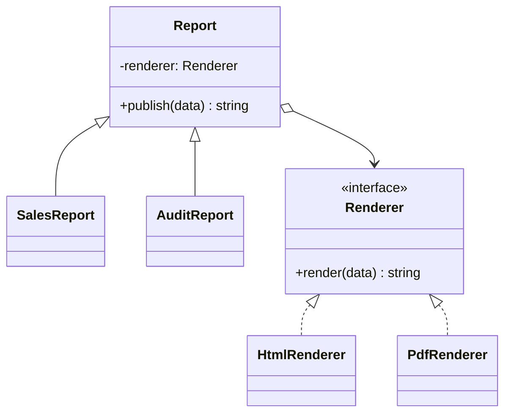

# Module 06 — Foundation: Bridge

## Vì sao bài này tồn tại?

**Render báo cáo nhiều kênh** là tình huống độc lập được xây dựng riêng cho Bridge. Bài không lấy từ một source ẩn: bạn tự tạo phiên bản `before` tối thiểu dựa trên mô tả dưới đây, sau đó dùng test để chứng minh refactor không đổi behavior. Bài Foundation tập trung vào việc nhận diện đúng lực thay đổi và refactor tối thiểu. Không thêm queue, cache hoặc framework nếu chúng không cần để chứng minh pattern.

## Câu chuyện nghiệp vụ

Hệ thống cần xử lý **Render báo cáo nhiều kênh**. `Report` đang nhân class theo cả loại báo cáo lẫn định dạng render, làm số class tăng theo tích hai trục thay đổi.

Invariant trung tâm của bài **Bridge** là:

> **nội dung báo cáo độc lập định dạng render.**

Ở cấp Foundation, **Bridge** chỉ đạt mục tiêu khi người học giải thích được change axis, giữ nguyên observable behavior và chứng minh baseline trực tiếp bắt đầu khó mở rộng hoặc khó test ở điểm nào.

Failure bắt buộc phải được mô hình hóa:

> **renderer thiếu capability hoặc encode lỗi.**

## Trạng thái code ban đầu

```php
final class Report
{
    public function handle(array $input): mixed
    {
        // validation chung, lựa chọn biến thể và side effect
        // đang bị trộn trong một method.
        throw new RuntimeException('Hãy dựng phiên bản before phù hợp đề bài.');
    }
}
```

Đây là skeleton định hướng, không phải lời giải. Hãy thêm dữ liệu và behavior nhỏ nhất đủ tái hiện pain point của **Render báo cáo nhiều kênh**.

## Mô hình thiết kế cần hướng tới



Hai trục thay đổi—loại báo cáo và kênh render—được tách độc lập. Bridge tránh tạo tích Descartes như `SalesHtmlReport`, `SalesPdfReport`, `AuditHtmlReport`...

## Nhiệm vụ

1. Dựng code `before` nhỏ tái hiện **Render báo cáo nhiều kênh** và ít nhất một nhánh lỗi.
2. Viết characterization test khóa invariant **nội dung báo cáo độc lập định dạng render**.
3. Vẽ dependency trước/sau và đặt `Renderer` tại đúng trục thay đổi.
4. Refactor một biến thể đầu tiên, giữ API của `Report` ổn định.
5. Thêm biến thể chứng minh: **thêm MobileReport và JsonRenderer độc lập** mà client không phải sửa logic cũ.
6. Mô phỏng **renderer thiếu capability hoặc encode lỗi** và trả lỗi bằng ngôn ngữ application/domain.

## Dữ liệu thử tối thiểu

- Hai scenario hợp lệ đại diện cho hai biến thể khác nhau.
- Một boundary value liên quan trực tiếp tới **nội dung báo cáo độc lập định dạng render**.
- Một scenario tạo ra **renderer thiếu capability hoặc encode lỗi**.
- Một biến thể mới để chứng minh extension point.

## Gợi ý triển khai

- Bắt đầu bằng behavior và invariant; chỉ tạo abstraction sau khi xác định đúng trục thay đổi.
- Đặt tên method theo domain của **Render báo cáo nhiều kênh**, tránh `execute(mixed $data)` hoặc `handleAnything()`.
- Tách selection/wiring khỏi business calculation; composition root có thể biết concrete class nhưng use case không nên biết.
- Đừng nuốt exception. Map lỗi kỹ thuật thành error có ý nghĩa và giữ nguyên cause để điều tra.
- Nếu **kế thừa khi chỉ có một trục thay đổi** vẫn rõ ràng hơn và thay đổi chưa có thật, hãy ghi kết luận “chưa cần pattern” trong ADR.

## Test bắt buộc

- Happy path và boundary value của **nội dung báo cáo độc lập định dạng render**.
- Failure test cho **renderer thiếu capability hoặc encode lỗi**.
- Contract test dùng chung cho mọi implementation của `Renderer`.
- Extension test chứng minh **thêm MobileReport và JsonRenderer độc lập** không sửa client.

## Deliverable

```text
solution/
├── before.php
├── after.php
├── tests/
│   ├── CharacterizationTest.php
│   ├── ContractOrBehaviorTest.php
│   └── FailurePathTest.php
└── ADR.md
```

Ghi một decision note ngắn cho **Bridge**: baseline trực tiếp, change axis quan sát được, trade-off mới và điều kiện inline/xóa abstraction nếu biến thể không còn tăng.

## Tiêu chí tự chấm

- [ ] Tên class/method phản ánh đúng **Render báo cáo nhiều kênh**.
- [ ] Invariant **nội dung báo cáo độc lập định dạng render** có test tự động.
- [ ] Failure **renderer thiếu capability hoặc encode lỗi** có outcome xác định.
- [ ] Client biết ít concrete detail hơn sau refactor.
- [ ] Diagram, code và test mô tả cùng một boundary.
- [ ] Có giải thích khi nào **kế thừa khi chỉ có một trục thay đổi** tốt hơn.
- [ ] Biến thể mới được thêm mà không sửa logic client.

## Câu hỏi design review

1. Trục thay đổi thật sự của **Render báo cáo nhiều kênh** là gì, và `Renderer` cô lập nó ở đâu?
2. Invariant **nội dung báo cáo độc lập định dạng render** được enforce ở layer nào? Có đường đi nào bypass không?
3. Khi **renderer thiếu capability hoặc encode lỗi** xảy ra, client nhận error gì và operator nhìn thấy evidence nào?
4. Pattern này làm dependency graph tốt hơn ở điểm nào, và tạo thêm chi phí gì?
5. Dấu hiệu nào cho biết nên quay lại phương án **kế thừa khi chỉ có một trục thay đổi**?

## Lời giải tham khảo

Với **Render báo cáo nhiều kênh**, hãy hoàn thành test và tự vẽ dependency trước/sau rồi mới mở [`SOLUTION.md`](SOLUTION.md). Khi đối chiếu, ưu tiên invariant, failure semantics và khả năng mở rộng của Bridge thay vì đếm class.
