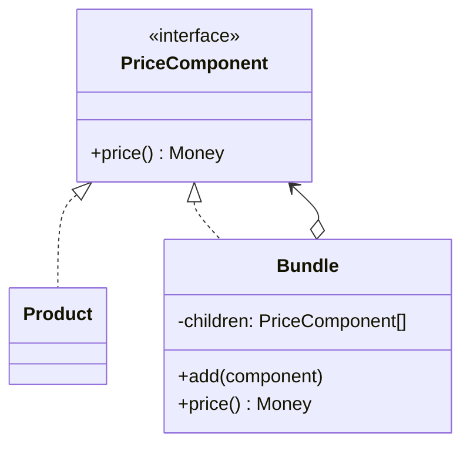

# Module 07 — Foundation: Composite

## Vì sao bài này tồn tại?

**Tính giá giỏ hàng dạng bundle** là tình huống độc lập được xây dựng riêng cho Composite. Bài không lấy từ một source ẩn: bạn tự tạo phiên bản `before` tối thiểu dựa trên mô tả dưới đây, sau đó dùng test để chứng minh refactor không đổi behavior. Bài Foundation tập trung vào việc nhận diện đúng lực thay đổi và refactor tối thiểu. Không thêm queue, cache hoặc framework nếu chúng không cần để chứng minh pattern.

## Câu chuyện nghiệp vụ

Hệ thống cần xử lý **Tính giá giỏ hàng dạng bundle**. `PriceComponent` đang xử lý product và bundle bằng hai nhánh khác nhau, khiến thuật toán tổng hợp lặp lại ở nhiều nơi.

Invariant trung tâm của bài **Composite** là:

> **tổng bundle bằng tổng leaf sau discount rule.**

Ở cấp Foundation, **Composite** chỉ đạt mục tiêu khi người học giải thích được change axis, giữ nguyên observable behavior và chứng minh baseline trực tiếp bắt đầu khó mở rộng hoặc khó test ở điểm nào.

Failure bắt buộc phải được mô hình hóa:

> **cycle trong cây hoặc quantity âm.**

## Trạng thái code ban đầu

```php
final class PriceComponent
{
    public function handle(array $input): mixed
    {
        // validation chung, lựa chọn biến thể và side effect
        // đang bị trộn trong một method.
        throw new RuntimeException('Hãy dựng phiên bản before phù hợp đề bài.');
    }
}
```

Đây là skeleton định hướng, không phải lời giải. Hãy thêm dữ liệu và behavior nhỏ nhất đủ tái hiện pain point của **Tính giá giỏ hàng dạng bundle**.

## Mô hình thiết kế cần hướng tới



Leaf và composite chia sẻ cùng contract nhưng `Bundle` tổng hợp giá đệ quy. Hãy xác định rõ operation nào thực sự có nghĩa cho cả sản phẩm đơn và nhóm sản phẩm.

## Nhiệm vụ

1. Dựng code `before` nhỏ tái hiện **Tính giá giỏ hàng dạng bundle** và ít nhất một nhánh lỗi.
2. Viết characterization test khóa invariant **tổng bundle bằng tổng leaf sau discount rule**.
3. Vẽ dependency trước/sau và đặt `PriceComponent` tại đúng trục thay đổi.
4. Refactor một biến thể đầu tiên, giữ API của `PriceComponent` ổn định.
5. Thêm biến thể chứng minh: **thêm bundle lồng nhau** mà client không phải sửa logic cũ.
6. Mô phỏng **cycle trong cây hoặc quantity âm** và trả lỗi bằng ngôn ngữ application/domain.

## Dữ liệu thử tối thiểu

- Hai scenario hợp lệ đại diện cho hai biến thể khác nhau.
- Một boundary value liên quan trực tiếp tới **tổng bundle bằng tổng leaf sau discount rule**.
- Một scenario tạo ra **cycle trong cây hoặc quantity âm**.
- Một biến thể mới để chứng minh extension point.

## Gợi ý triển khai

- Bắt đầu bằng behavior và invariant; chỉ tạo abstraction sau khi xác định đúng trục thay đổi.
- Đặt tên method theo domain của **Tính giá giỏ hàng dạng bundle**, tránh `execute(mixed $data)` hoặc `handleAnything()`.
- Tách selection/wiring khỏi business calculation; composition root có thể biết concrete class nhưng use case không nên biết.
- Đừng nuốt exception. Map lỗi kỹ thuật thành error có ý nghĩa và giữ nguyên cause để điều tra.
- Nếu **mảng phẳng khi không có tree behavior** vẫn rõ ràng hơn và thay đổi chưa có thật, hãy ghi kết luận “chưa cần pattern” trong ADR.

## Test bắt buộc

- Happy path và boundary value của **tổng bundle bằng tổng leaf sau discount rule**.
- Failure test cho **cycle trong cây hoặc quantity âm**.
- Contract test dùng chung cho mọi implementation của `PriceComponent`.
- Extension test chứng minh **thêm bundle lồng nhau** không sửa client.

## Deliverable

```text
solution/
├── before.php
├── after.php
├── tests/
│   ├── CharacterizationTest.php
│   ├── ContractOrBehaviorTest.php
│   └── FailurePathTest.php
└── ADR.md
```

Ghi một decision note ngắn cho **Composite**: baseline trực tiếp, change axis quan sát được, trade-off mới và điều kiện inline/xóa abstraction nếu biến thể không còn tăng.

## Tiêu chí tự chấm

- [ ] Tên class/method phản ánh đúng **Tính giá giỏ hàng dạng bundle**.
- [ ] Invariant **tổng bundle bằng tổng leaf sau discount rule** có test tự động.
- [ ] Failure **cycle trong cây hoặc quantity âm** có outcome xác định.
- [ ] Client biết ít concrete detail hơn sau refactor.
- [ ] Diagram, code và test mô tả cùng một boundary.
- [ ] Có giải thích khi nào **mảng phẳng khi không có tree behavior** tốt hơn.
- [ ] Biến thể mới được thêm mà không sửa logic client.

## Câu hỏi design review

1. Trục thay đổi thật sự của **Tính giá giỏ hàng dạng bundle** là gì, và `PriceComponent` cô lập nó ở đâu?
2. Invariant **tổng bundle bằng tổng leaf sau discount rule** được enforce ở layer nào? Có đường đi nào bypass không?
3. Khi **cycle trong cây hoặc quantity âm** xảy ra, client nhận error gì và operator nhìn thấy evidence nào?
4. Pattern này làm dependency graph tốt hơn ở điểm nào, và tạo thêm chi phí gì?
5. Dấu hiệu nào cho biết nên quay lại phương án **mảng phẳng khi không có tree behavior**?

## Lời giải tham khảo

Với **Tính giá giỏ hàng dạng bundle**, hãy hoàn thành test và tự vẽ dependency trước/sau rồi mới mở [`SOLUTION.md`](SOLUTION.md). Khi đối chiếu, ưu tiên invariant, failure semantics và khả năng mở rộng của Composite thay vì đếm class.
