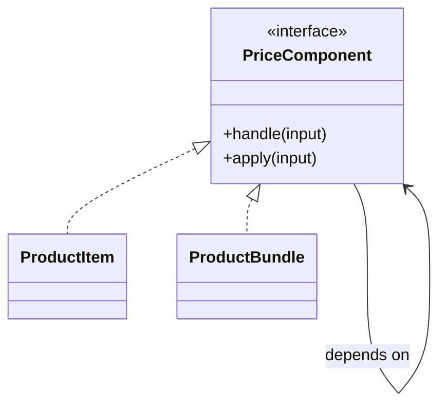

# Lời giải tham khảo — Composite (Foundation)

## Kết luận thiết kế

Lời giải chọn `PriceComponent` làm boundary vì nó bao quanh phần thay đổi của **Tính giá giỏ hàng dạng bundle** nhưng không kéo validation, transaction hoặc orchestration ổn định vào abstraction. Mục tiêu là bảo vệ **tổng bundle bằng tổng leaf sau discount rule**, không phải chứng minh rằng mọi bài toán đều cần Composite.

## Sơ đồ lời giải



## Các bước refactor

1. Viết test cho `PriceComponent` trước khi tách; test mô tả outcome chứ không khóa internal call.
2. Tách phần thay đổi thành `PriceComponent` với input/output cụ thể của **Tính giá giỏ hàng dạng bundle**.
3. Di chuyển một nhánh sang implementation đầu tiên; giữ validation dùng chung tại nơi ổn định.
4. Thay branch selection bằng dependency injection/composition root nhỏ.
5. Thêm biến thể **thêm bundle lồng nhau** và chạy cùng contract test.
6. So sánh với phương án đơn giản hơn: **mảng phẳng khi không có tree behavior**; ghi khi nào nên xóa abstraction.

## Phác thảo contract

```php
interface PriceComponent
{
    /** Trả về kết quả domain hoặc ném lỗi application có nghĩa. */
    public function apply(array $input): mixed;
}
```

Trong implementation hoàn chỉnh của **Tính giá giỏ hàng dạng bundle**, thay `array`/`mixed` bằng input và result có tên theo domain. Contract của Composite phải làm rõ precondition, postcondition và lỗi có thể quan sát; đoạn trên chỉ minh họa hướng dependency.

## Test suite tối thiểu

- `TinhGiaGioHangDangBundleBehaviorTest`: dựng fixture nhỏ nhất và assert trực tiếp invariant **tổng bundle bằng tổng leaf sau discount rule.** trên output/state, không assert tên concrete class.
- `TinhGiaGioHangDangBundleFailureTest`: tạo **cycle trong cây hoặc quantity âm.**, kiểm tra error taxonomy và xác nhận state/side effect không ở trạng thái nửa vời.
- `Foundation:CompositeContractTest`: chạy cùng bộ contract cho mọi implementation hoặc variant được bài yêu cầu.
- `ExtensionTest`: thêm một biến thể hợp lệ của Foundation: Composite mà không sửa client/use case; nếu phải sửa, boundary chưa cô lập đúng change axis.
- Một test phản chứng cho phương án đơn giản hơn để chứng minh pattern mang giá trị, không chỉ tăng số type.
## Failure walkthrough

Khi **cycle trong cây hoặc quantity âm**, implementation không được trả `null`/`false` mơ hồ. Nó phải tạo error có taxonomy rõ, giữ correlation/operation data cần thiết và không phá invariant **tổng bundle bằng tổng leaf sau discount rule**. Client test error theo semantics, không phụ thuộc message của SDK hoặc exception hạ tầng.

## Trade-off và phương án thay thế

Foundation: Composite làm change axis của **Tính giá giỏ hàng dạng bundle** rõ hơn, đổi lại người học phải hiểu thêm contract, wiring và cách chọn implementation. Giá trị phải được chứng minh bằng việc thêm biến thể hoặc test failure mà client không đổi.

Hãy ưu tiên **mảng phẳng khi không có tree behavior** nếu bài toán chỉ có một behavior ổn định, chưa có boundary ngoài hoặc test trực tiếp đã đủ rõ. Pattern không phải mục tiêu; mục tiêu là giữ invariant **tổng bundle bằng tổng leaf sau discount rule.** với thiết kế dễ đọc nhất.
## Dấu hiệu lời giải chưa đạt

- Boundary của Composite không dùng ngôn ngữ **Tính giá giỏ hàng dạng bundle**, khiến người đọc vẫn phải biết concrete detail.
- Test không chứng minh invariant **tổng bundle bằng tổng leaf sau discount rule** hoặc chỉ xác nhận method được gọi.
- Selection, transaction hay error mapping vẫn nằm rải rác ở client nên blast radius không giảm.
- Diagram không khớp dependency thực trong code hoặc bỏ qua failure path quan trọng.
- Thêm biến thể mới vẫn phải sửa logic trung tâm, chứng tỏ extension point đặt sai.

## Câu hỏi mở rộng

- Với **Tính giá giỏ hàng dạng bundle**, metric nào chứng minh Composite giảm rủi ro thay đổi thay vì chỉ tăng số type?
- Khi số biến thể tăng, ai sở hữu selection, versioning và compatibility của boundary?
- Failure nào buộc thiết kế phải đổi, và failure nào nên được xử lý bên ngoài pattern?
- Điều kiện cleanup nào cho phép hợp nhất implementation hoặc xóa abstraction này?

## Ghi chú triển khai chuyên biệt cho Composite

Trong **Lời giải tham khảo — Composite (Foundation)** (Foundation), leaf và composite cùng hỗ trợ operation có ý nghĩa; thiết kế phải có cycle guard, traversal limit và phương án tránh N+1 khi cây được hydrate từ persistence.

### Test focus

Ở cấp **Foundation**, test recursive total, nested group, empty group, cycle và depth limit. Giữ test tại process boundary nhỏ nhất và ưu tiên semantics dễ đọc.

### Bằng chứng nên lưu

Với **Tính giá giỏ hàng dạng bundle**, lưu sơ đồ dependency trước/sau, fixture tái hiện lỗi, test chứng minh invariant, commit chuyển đổi và ADR của Composite. Reviewer cần nhìn được bằng chứng rằng boundary mới giảm blast radius hoặc làm failure dễ kiểm soát hơn, không chỉ thấy nhiều class hơn.
