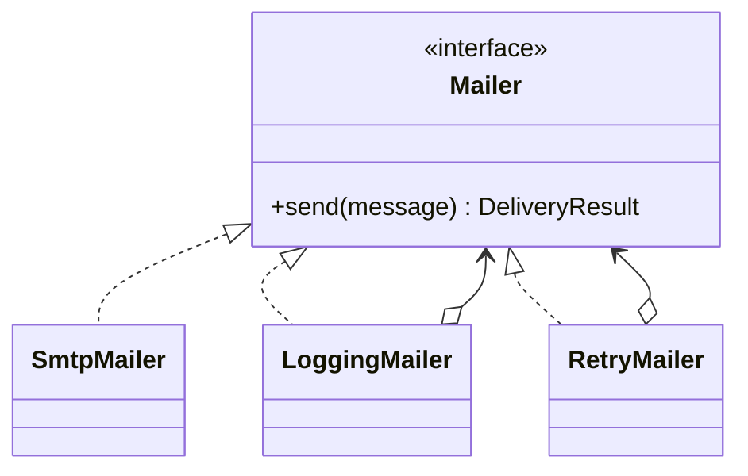

# Module 08 — Foundation: Decorator

## Vì sao bài này tồn tại?

**Gửi email có log và retry** là tình huống độc lập được xây dựng riêng cho Decorator. Bài không lấy từ một source ẩn: bạn tự tạo phiên bản `before` tối thiểu dựa trên mô tả dưới đây, sau đó dùng test để chứng minh refactor không đổi behavior. Bài Foundation tập trung vào việc nhận diện đúng lực thay đổi và refactor tối thiểu. Không thêm queue, cache hoặc framework nếu chúng không cần để chứng minh pattern.

## Câu chuyện nghiệp vụ

Hệ thống cần xử lý **Gửi email có log và retry**. `OrderMailer` đang kế thừa nhiều lớp tổ hợp logging/retry, khiến thứ tự concern khó thấy và khó test.

Invariant trung tâm của bài **Decorator** là:

> **mỗi message chỉ được gửi một lần quan sát được.**

Ở cấp Foundation, **Decorator** chỉ đạt mục tiêu khi người học giải thích được change axis, giữ nguyên observable behavior và chứng minh baseline trực tiếp bắt đầu khó mở rộng hoặc khó test ở điểm nào.

Failure bắt buộc phải được mô hình hóa:

> **thứ tự wrapper gây gửi lặp.**

## Trạng thái code ban đầu

```php
final class OrderMailer
{
    public function handle(array $input): mixed
    {
        // validation chung, lựa chọn biến thể và side effect
        // đang bị trộn trong một method.
        throw new RuntimeException('Hãy dựng phiên bản before phù hợp đề bài.');
    }
}
```

Đây là skeleton định hướng, không phải lời giải. Hãy thêm dữ liệu và behavior nhỏ nhất đủ tái hiện pain point của **Gửi email có log và retry**.

## Mô hình thiết kế cần hướng tới



Mỗi decorator thêm đúng một concern và tiếp tục giữ contract `Mailer`. Thứ tự bọc phải được test vì `Retry(Logging(Smtp))` có semantics khác `Logging(Retry(Smtp))`.

## Nhiệm vụ

1. Dựng code `before` nhỏ tái hiện **Gửi email có log và retry** và ít nhất một nhánh lỗi.
2. Viết characterization test khóa invariant **mỗi message chỉ được gửi một lần quan sát được**.
3. Vẽ dependency trước/sau và đặt `Mailer` tại đúng trục thay đổi.
4. Refactor một biến thể đầu tiên, giữ API của `OrderMailer` ổn định.
5. Thêm biến thể chứng minh: **thêm metrics decorator** mà client không phải sửa logic cũ.
6. Mô phỏng **thứ tự wrapper gây gửi lặp** và trả lỗi bằng ngôn ngữ application/domain.

## Dữ liệu thử tối thiểu

- Hai scenario hợp lệ đại diện cho hai biến thể khác nhau.
- Một boundary value liên quan trực tiếp tới **mỗi message chỉ được gửi một lần quan sát được**.
- Một scenario tạo ra **thứ tự wrapper gây gửi lặp**.
- Một biến thể mới để chứng minh extension point.

## Gợi ý triển khai

- Bắt đầu bằng behavior và invariant; chỉ tạo abstraction sau khi xác định đúng trục thay đổi.
- Đặt tên method theo domain của **Gửi email có log và retry**, tránh `execute(mixed $data)` hoặc `handleAnything()`.
- Tách selection/wiring khỏi business calculation; composition root có thể biết concrete class nhưng use case không nên biết.
- Đừng nuốt exception. Map lỗi kỹ thuật thành error có ý nghĩa và giữ nguyên cause để điều tra.
- Nếu **một service duy nhất khi behavior không composable** vẫn rõ ràng hơn và thay đổi chưa có thật, hãy ghi kết luận “chưa cần pattern” trong ADR.

## Test bắt buộc

- Happy path và boundary value của **mỗi message chỉ được gửi một lần quan sát được**.
- Failure test cho **thứ tự wrapper gây gửi lặp**.
- Contract test dùng chung cho mọi implementation của `Mailer`.
- Extension test chứng minh **thêm metrics decorator** không sửa client.

## Deliverable

```text
solution/
├── before.php
├── after.php
├── tests/
│   ├── CharacterizationTest.php
│   ├── ContractOrBehaviorTest.php
│   └── FailurePathTest.php
└── ADR.md
```

Ghi một decision note ngắn cho **Decorator**: baseline trực tiếp, change axis quan sát được, trade-off mới và điều kiện inline/xóa abstraction nếu biến thể không còn tăng.

## Tiêu chí tự chấm

- [ ] Tên class/method phản ánh đúng **Gửi email có log và retry**.
- [ ] Invariant **mỗi message chỉ được gửi một lần quan sát được** có test tự động.
- [ ] Failure **thứ tự wrapper gây gửi lặp** có outcome xác định.
- [ ] Client biết ít concrete detail hơn sau refactor.
- [ ] Diagram, code và test mô tả cùng một boundary.
- [ ] Có giải thích khi nào **một service duy nhất khi behavior không composable** tốt hơn.
- [ ] Biến thể mới được thêm mà không sửa logic client.

## Câu hỏi design review

1. Trục thay đổi thật sự của **Gửi email có log và retry** là gì, và `Mailer` cô lập nó ở đâu?
2. Invariant **mỗi message chỉ được gửi một lần quan sát được** được enforce ở layer nào? Có đường đi nào bypass không?
3. Khi **thứ tự wrapper gây gửi lặp** xảy ra, client nhận error gì và operator nhìn thấy evidence nào?
4. Pattern này làm dependency graph tốt hơn ở điểm nào, và tạo thêm chi phí gì?
5. Dấu hiệu nào cho biết nên quay lại phương án **một service duy nhất khi behavior không composable**?

## Lời giải tham khảo

Với **Gửi email có log và retry**, hãy hoàn thành test và tự vẽ dependency trước/sau rồi mới mở [`SOLUTION.md`](SOLUTION.md). Khi đối chiếu, ưu tiên invariant, failure semantics và khả năng mở rộng của Decorator thay vì đếm class.
