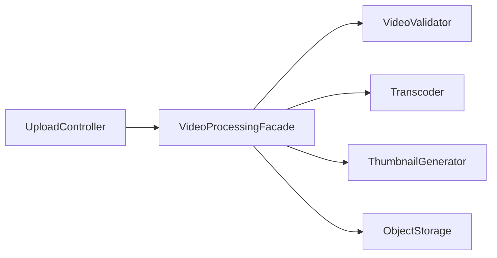

# Module 09 — Foundation: Facade

## Vì sao bài này tồn tại?

**Xử lý video upload** là tình huống độc lập được xây dựng riêng cho Facade. Bài không lấy từ một source ẩn: bạn tự tạo phiên bản `before` tối thiểu dựa trên mô tả dưới đây, sau đó dùng test để chứng minh refactor không đổi behavior. Bài Foundation tập trung vào việc nhận diện đúng lực thay đổi và refactor tối thiểu. Không thêm queue, cache hoặc framework nếu chúng không cần để chứng minh pattern.

## Câu chuyện nghiệp vụ

Hệ thống cần xử lý **Xử lý video upload**. `VideoFacade` đang buộc controller gọi trực tiếp validator, transcoder, thumbnail và storage theo đúng thứ tự.

Invariant trung tâm của bài **Facade** là:

> **upload chỉ complete khi encode và persist thành công.**

Ở cấp Foundation, **Facade** chỉ đạt mục tiêu khi người học giải thích được change axis, giữ nguyên observable behavior và chứng minh baseline trực tiếp bắt đầu khó mở rộng hoặc khó test ở điểm nào.

Failure bắt buộc phải được mô hình hóa:

> **một subsystem fail giữa workflow.**

## Trạng thái code ban đầu

```php
final class VideoFacade
{
    public function handle(array $input): mixed
    {
        // validation chung, lựa chọn biến thể và side effect
        // đang bị trộn trong một method.
        throw new RuntimeException('Hãy dựng phiên bản before phù hợp đề bài.');
    }
}
```

Đây là skeleton định hướng, không phải lời giải. Hãy thêm dữ liệu và behavior nhỏ nhất đủ tái hiện pain point của **Xử lý video upload**.

## Mô hình thiết kế cần hướng tới



Facade cung cấp một use-case API ổn định cho subsystem nhiều bước. Nó điều phối nhưng không che giấu lỗi quan trọng hoặc biến mọi capability thành một god service.

## Nhiệm vụ

1. Dựng code `before` nhỏ tái hiện **Xử lý video upload** và ít nhất một nhánh lỗi.
2. Viết characterization test khóa invariant **upload chỉ complete khi encode và persist thành công**.
3. Vẽ dependency trước/sau và đặt `VideoPipelineFacade` tại đúng trục thay đổi.
4. Refactor một biến thể đầu tiên, giữ API của `VideoFacade` ổn định.
5. Thêm biến thể chứng minh: **thêm thumbnail subsystem nhưng client không đổi** mà client không phải sửa logic cũ.
6. Mô phỏng **một subsystem fail giữa workflow** và trả lỗi bằng ngôn ngữ application/domain.

## Dữ liệu thử tối thiểu

- Hai scenario hợp lệ đại diện cho hai biến thể khác nhau.
- Một boundary value liên quan trực tiếp tới **upload chỉ complete khi encode và persist thành công**.
- Một scenario tạo ra **một subsystem fail giữa workflow**.
- Một biến thể mới để chứng minh extension point.

## Gợi ý triển khai

- Bắt đầu bằng behavior và invariant; chỉ tạo abstraction sau khi xác định đúng trục thay đổi.
- Đặt tên method theo domain của **Xử lý video upload**, tránh `execute(mixed $data)` hoặc `handleAnything()`.
- Tách selection/wiring khỏi business calculation; composition root có thể biết concrete class nhưng use case không nên biết.
- Đừng nuốt exception. Map lỗi kỹ thuật thành error có ý nghĩa và giữ nguyên cause để điều tra.
- Nếu **gọi trực tiếp khi workflow chỉ có một bước** vẫn rõ ràng hơn và thay đổi chưa có thật, hãy ghi kết luận “chưa cần pattern” trong ADR.

## Test bắt buộc

- Happy path và boundary value của **upload chỉ complete khi encode và persist thành công**.
- Failure test cho **một subsystem fail giữa workflow**.
- Contract test dùng chung cho mọi implementation của `VideoPipelineFacade`.
- Extension test chứng minh **thêm thumbnail subsystem nhưng client không đổi** không sửa client.

## Deliverable

```text
solution/
├── before.php
├── after.php
├── tests/
│   ├── CharacterizationTest.php
│   ├── ContractOrBehaviorTest.php
│   └── FailurePathTest.php
└── ADR.md
```

Ghi một decision note ngắn cho **Facade**: baseline trực tiếp, change axis quan sát được, trade-off mới và điều kiện inline/xóa abstraction nếu biến thể không còn tăng.

## Tiêu chí tự chấm

- [ ] Tên class/method phản ánh đúng **Xử lý video upload**.
- [ ] Invariant **upload chỉ complete khi encode và persist thành công** có test tự động.
- [ ] Failure **một subsystem fail giữa workflow** có outcome xác định.
- [ ] Client biết ít concrete detail hơn sau refactor.
- [ ] Diagram, code và test mô tả cùng một boundary.
- [ ] Có giải thích khi nào **gọi trực tiếp khi workflow chỉ có một bước** tốt hơn.
- [ ] Biến thể mới được thêm mà không sửa logic client.

## Câu hỏi design review

1. Trục thay đổi thật sự của **Xử lý video upload** là gì, và `VideoPipelineFacade` cô lập nó ở đâu?
2. Invariant **upload chỉ complete khi encode và persist thành công** được enforce ở layer nào? Có đường đi nào bypass không?
3. Khi **một subsystem fail giữa workflow** xảy ra, client nhận error gì và operator nhìn thấy evidence nào?
4. Pattern này làm dependency graph tốt hơn ở điểm nào, và tạo thêm chi phí gì?
5. Dấu hiệu nào cho biết nên quay lại phương án **gọi trực tiếp khi workflow chỉ có một bước**?

## Lời giải tham khảo

Với **Xử lý video upload**, hãy hoàn thành test và tự vẽ dependency trước/sau rồi mới mở [`SOLUTION.md`](SOLUTION.md). Khi đối chiếu, ưu tiên invariant, failure semantics và khả năng mở rộng của Facade thay vì đếm class.
