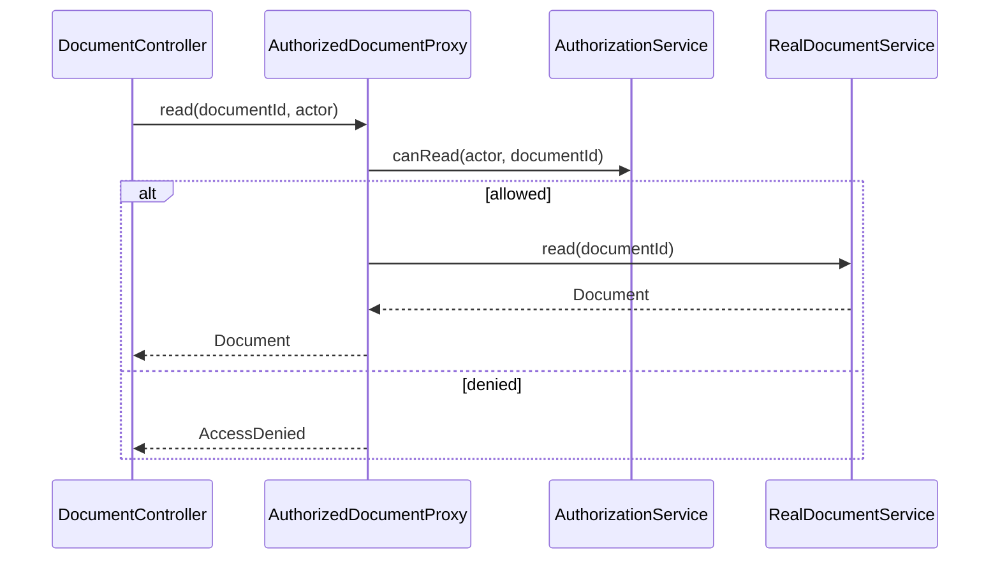

# Module 10 — Foundation: Proxy

## Vì sao bài này tồn tại?

**Bảo vệ tài liệu theo quyền** là tình huống độc lập được xây dựng riêng cho Proxy. Bài không lấy từ một source ẩn: bạn tự tạo phiên bản `before` tối thiểu dựa trên mô tả dưới đây, sau đó dùng test để chứng minh refactor không đổi behavior. Bài Foundation tập trung vào việc nhận diện đúng lực thay đổi và refactor tối thiểu. Không thêm queue, cache hoặc framework nếu chúng không cần để chứng minh pattern.

## Câu chuyện nghiệp vụ

Hệ thống cần xử lý **Bảo vệ tài liệu theo quyền**. `DocumentService` đang để mỗi caller tự kiểm tra quyền trước khi gọi service thật, tạo đường bypass authorization.

Invariant trung tâm của bài **Proxy** là:

> **chỉ principal hợp lệ đọc được tài liệu.**

Ở cấp Foundation, **Proxy** chỉ đạt mục tiêu khi người học giải thích được change axis, giữ nguyên observable behavior và chứng minh baseline trực tiếp bắt đầu khó mở rộng hoặc khó test ở điểm nào.

Failure bắt buộc phải được mô hình hóa:

> **proxy cache nhầm tenant hoặc bypass authorization.**

## Trạng thái code ban đầu

```php
final class DocumentService
{
    public function handle(array $input): mixed
    {
        // validation chung, lựa chọn biến thể và side effect
        // đang bị trộn trong một method.
        throw new RuntimeException('Hãy dựng phiên bản before phù hợp đề bài.');
    }
}
```

Đây là skeleton định hướng, không phải lời giải. Hãy thêm dữ liệu và behavior nhỏ nhất đủ tái hiện pain point của **Bảo vệ tài liệu theo quyền**.

## Mô hình thiết kế cần hướng tới



Proxy giữ cùng contract với service thật nhưng kiểm soát quyền truy cập trước khi delegation. Authorization rule phải test riêng và không được dựa vào dữ liệu client có thể giả mạo.

## Nhiệm vụ

1. Dựng code `before` nhỏ tái hiện **Bảo vệ tài liệu theo quyền** và ít nhất một nhánh lỗi.
2. Viết characterization test khóa invariant **chỉ principal hợp lệ đọc được tài liệu**.
3. Vẽ dependency trước/sau và đặt `DocumentReader` tại đúng trục thay đổi.
4. Refactor một biến thể đầu tiên, giữ API của `DocumentService` ổn định.
5. Thêm biến thể chứng minh: **thêm audit proxy** mà client không phải sửa logic cũ.
6. Mô phỏng **proxy cache nhầm tenant hoặc bypass authorization** và trả lỗi bằng ngôn ngữ application/domain.

## Dữ liệu thử tối thiểu

- Hai scenario hợp lệ đại diện cho hai biến thể khác nhau.
- Một boundary value liên quan trực tiếp tới **chỉ principal hợp lệ đọc được tài liệu**.
- Một scenario tạo ra **proxy cache nhầm tenant hoặc bypass authorization**.
- Một biến thể mới để chứng minh extension point.

## Gợi ý triển khai

- Bắt đầu bằng behavior và invariant; chỉ tạo abstraction sau khi xác định đúng trục thay đổi.
- Đặt tên method theo domain của **Bảo vệ tài liệu theo quyền**, tránh `execute(mixed $data)` hoặc `handleAnything()`.
- Tách selection/wiring khỏi business calculation; composition root có thể biết concrete class nhưng use case không nên biết.
- Đừng nuốt exception. Map lỗi kỹ thuật thành error có ý nghĩa và giữ nguyên cause để điều tra.
- Nếu **check quyền trực tiếp khi chỉ một call site** vẫn rõ ràng hơn và thay đổi chưa có thật, hãy ghi kết luận “chưa cần pattern” trong ADR.

## Test bắt buộc

- Happy path và boundary value của **chỉ principal hợp lệ đọc được tài liệu**.
- Failure test cho **proxy cache nhầm tenant hoặc bypass authorization**.
- Contract test dùng chung cho mọi implementation của `DocumentReader`.
- Extension test chứng minh **thêm audit proxy** không sửa client.

## Deliverable

```text
solution/
├── before.php
├── after.php
├── tests/
│   ├── CharacterizationTest.php
│   ├── ContractOrBehaviorTest.php
│   └── FailurePathTest.php
└── ADR.md
```

Ghi một decision note ngắn cho **Proxy**: baseline trực tiếp, change axis quan sát được, trade-off mới và điều kiện inline/xóa abstraction nếu biến thể không còn tăng.

## Tiêu chí tự chấm

- [ ] Tên class/method phản ánh đúng **Bảo vệ tài liệu theo quyền**.
- [ ] Invariant **chỉ principal hợp lệ đọc được tài liệu** có test tự động.
- [ ] Failure **proxy cache nhầm tenant hoặc bypass authorization** có outcome xác định.
- [ ] Client biết ít concrete detail hơn sau refactor.
- [ ] Diagram, code và test mô tả cùng một boundary.
- [ ] Có giải thích khi nào **check quyền trực tiếp khi chỉ một call site** tốt hơn.
- [ ] Biến thể mới được thêm mà không sửa logic client.

## Câu hỏi design review

1. Trục thay đổi thật sự của **Bảo vệ tài liệu theo quyền** là gì, và `DocumentReader` cô lập nó ở đâu?
2. Invariant **chỉ principal hợp lệ đọc được tài liệu** được enforce ở layer nào? Có đường đi nào bypass không?
3. Khi **proxy cache nhầm tenant hoặc bypass authorization** xảy ra, client nhận error gì và operator nhìn thấy evidence nào?
4. Pattern này làm dependency graph tốt hơn ở điểm nào, và tạo thêm chi phí gì?
5. Dấu hiệu nào cho biết nên quay lại phương án **check quyền trực tiếp khi chỉ một call site**?

## Lời giải tham khảo

Với **Bảo vệ tài liệu theo quyền**, hãy hoàn thành test và tự vẽ dependency trước/sau rồi mới mở [`SOLUTION.md`](SOLUTION.md). Khi đối chiếu, ưu tiên invariant, failure semantics và khả năng mở rộng của Proxy thay vì đếm class.
