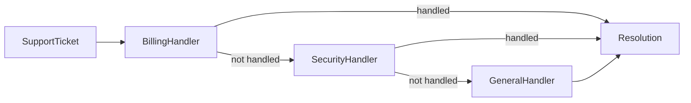

# Module 11 — Foundation: Chain of Responsibility

## Vì sao bài này tồn tại?

**Phân loại ticket hỗ trợ** là tình huống độc lập được xây dựng riêng cho Chain of Responsibility. Bài không lấy từ một source ẩn: bạn tự tạo phiên bản `before` tối thiểu dựa trên mô tả dưới đây, sau đó dùng test để chứng minh refactor không đổi behavior. Bài Foundation tập trung vào việc nhận diện đúng lực thay đổi và refactor tối thiểu. Không thêm queue, cache hoặc framework nếu chúng không cần để chứng minh pattern.

## Câu chuyện nghiệp vụ

Hệ thống cần xử lý **Phân loại ticket hỗ trợ**. `SupportPipeline` đang dùng chuỗi `if/elseif` dài và không thể thay đổi thứ tự rule mà không sửa dispatcher.

Invariant trung tâm của bài **Chain of Responsibility** là:

> **mỗi ticket được xử lý hoặc escalated rõ ràng.**

Ở cấp Foundation, **Chain of Responsibility** chỉ đạt mục tiêu khi người học giải thích được change axis, giữ nguyên observable behavior và chứng minh baseline trực tiếp bắt đầu khó mở rộng hoặc khó test ở điểm nào.

Failure bắt buộc phải được mô hình hóa:

> **không handler nào nhận hoặc handler nuốt lỗi.**

## Trạng thái code ban đầu

```php
final class SupportPipeline
{
    public function handle(array $input): mixed
    {
        // validation chung, lựa chọn biến thể và side effect
        // đang bị trộn trong một method.
        throw new RuntimeException('Hãy dựng phiên bản before phù hợp đề bài.');
    }
}
```

Đây là skeleton định hướng, không phải lời giải. Hãy thêm dữ liệu và behavior nhỏ nhất đủ tái hiện pain point của **Phân loại ticket hỗ trợ**.

## Mô hình thiết kế cần hướng tới



Mỗi handler hoặc xử lý ticket hoặc chuyển tiếp. Thứ tự chain là một phần của behavior; hãy test short-circuit và trường hợp không handler nào nhận.

## Nhiệm vụ

1. Dựng code `before` nhỏ tái hiện **Phân loại ticket hỗ trợ** và ít nhất một nhánh lỗi.
2. Viết characterization test khóa invariant **mỗi ticket được xử lý hoặc escalated rõ ràng**.
3. Vẽ dependency trước/sau và đặt `SupportHandler` tại đúng trục thay đổi.
4. Refactor một biến thể đầu tiên, giữ API của `SupportPipeline` ổn định.
5. Thêm biến thể chứng minh: **thêm FraudHandler ở đúng vị trí** mà client không phải sửa logic cũ.
6. Mô phỏng **không handler nào nhận hoặc handler nuốt lỗi** và trả lỗi bằng ngôn ngữ application/domain.

## Dữ liệu thử tối thiểu

- Hai scenario hợp lệ đại diện cho hai biến thể khác nhau.
- Một boundary value liên quan trực tiếp tới **mỗi ticket được xử lý hoặc escalated rõ ràng**.
- Một scenario tạo ra **không handler nào nhận hoặc handler nuốt lỗi**.
- Một biến thể mới để chứng minh extension point.

## Gợi ý triển khai

- Bắt đầu bằng behavior và invariant; chỉ tạo abstraction sau khi xác định đúng trục thay đổi.
- Đặt tên method theo domain của **Phân loại ticket hỗ trợ**, tránh `execute(mixed $data)` hoặc `handleAnything()`.
- Tách selection/wiring khỏi business calculation; composition root có thể biết concrete class nhưng use case không nên biết.
- Đừng nuốt exception. Map lỗi kỹ thuật thành error có ý nghĩa và giữ nguyên cause để điều tra.
- Nếu **if/elseif rõ ràng khi chuỗi ngắn cố định** vẫn rõ ràng hơn và thay đổi chưa có thật, hãy ghi kết luận “chưa cần pattern” trong ADR.

## Test bắt buộc

- Happy path và boundary value của **mỗi ticket được xử lý hoặc escalated rõ ràng**.
- Failure test cho **không handler nào nhận hoặc handler nuốt lỗi**.
- Contract test dùng chung cho mọi implementation của `SupportHandler`.
- Extension test chứng minh **thêm FraudHandler ở đúng vị trí** không sửa client.

## Deliverable

```text
solution/
├── before.php
├── after.php
├── tests/
│   ├── CharacterizationTest.php
│   ├── ContractOrBehaviorTest.php
│   └── FailurePathTest.php
└── ADR.md
```

Ghi một decision note ngắn cho **Chain of Responsibility**: baseline trực tiếp, change axis quan sát được, trade-off mới và điều kiện inline/xóa abstraction nếu biến thể không còn tăng.

## Tiêu chí tự chấm

- [ ] Tên class/method phản ánh đúng **Phân loại ticket hỗ trợ**.
- [ ] Invariant **mỗi ticket được xử lý hoặc escalated rõ ràng** có test tự động.
- [ ] Failure **không handler nào nhận hoặc handler nuốt lỗi** có outcome xác định.
- [ ] Client biết ít concrete detail hơn sau refactor.
- [ ] Diagram, code và test mô tả cùng một boundary.
- [ ] Có giải thích khi nào **if/elseif rõ ràng khi chuỗi ngắn cố định** tốt hơn.
- [ ] Biến thể mới được thêm mà không sửa logic client.

## Câu hỏi design review

1. Trục thay đổi thật sự của **Phân loại ticket hỗ trợ** là gì, và `SupportHandler` cô lập nó ở đâu?
2. Invariant **mỗi ticket được xử lý hoặc escalated rõ ràng** được enforce ở layer nào? Có đường đi nào bypass không?
3. Khi **không handler nào nhận hoặc handler nuốt lỗi** xảy ra, client nhận error gì và operator nhìn thấy evidence nào?
4. Pattern này làm dependency graph tốt hơn ở điểm nào, và tạo thêm chi phí gì?
5. Dấu hiệu nào cho biết nên quay lại phương án **if/elseif rõ ràng khi chuỗi ngắn cố định**?

## Lời giải tham khảo

Với **Phân loại ticket hỗ trợ**, hãy hoàn thành test và tự vẽ dependency trước/sau rồi mới mở [`SOLUTION.md`](SOLUTION.md). Khi đối chiếu, ưu tiên invariant, failure semantics và khả năng mở rộng của Chain of Responsibility thay vì đếm class.
