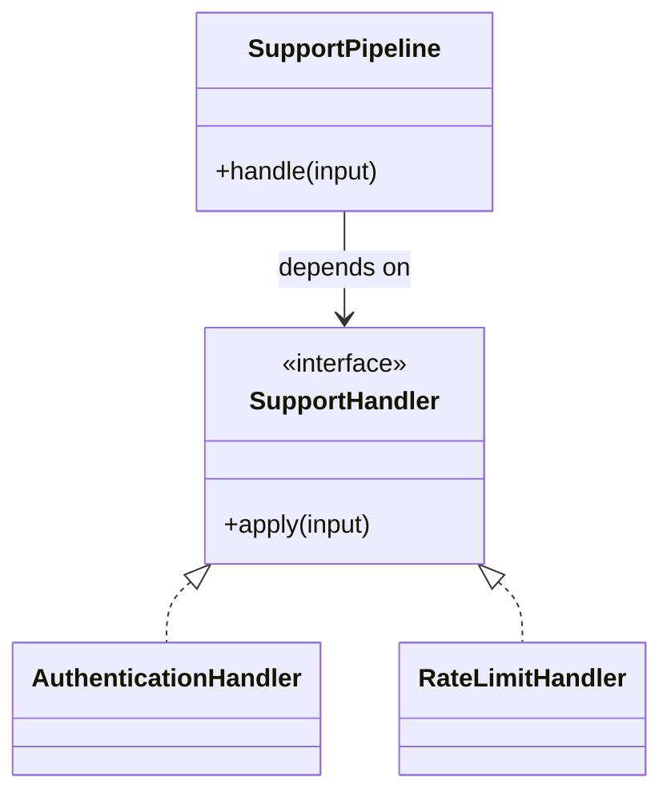

# Lời giải tham khảo — Chain of Responsibility (Foundation)

## Kết luận thiết kế

Lời giải chọn `SupportHandler` làm boundary vì nó bao quanh phần thay đổi của **Phân loại ticket hỗ trợ** nhưng không kéo validation, transaction hoặc orchestration ổn định vào abstraction. Mục tiêu là bảo vệ **mỗi ticket được xử lý hoặc escalated rõ ràng**, không phải chứng minh rằng mọi bài toán đều cần Chain of Responsibility.

## Sơ đồ lời giải



## Các bước refactor

1. Viết test cho `SupportPipeline` trước khi tách; test mô tả outcome chứ không khóa internal call.
2. Tách phần thay đổi thành `SupportHandler` với input/output cụ thể của **Phân loại ticket hỗ trợ**.
3. Di chuyển một nhánh sang implementation đầu tiên; giữ validation dùng chung tại nơi ổn định.
4. Thay branch selection bằng dependency injection/composition root nhỏ.
5. Thêm biến thể **thêm FraudHandler ở đúng vị trí** và chạy cùng contract test.
6. So sánh với phương án đơn giản hơn: **if/elseif rõ ràng khi chuỗi ngắn cố định**; ghi khi nào nên xóa abstraction.

## Phác thảo contract

```php
interface SupportHandler
{
    /** Trả về kết quả domain hoặc ném lỗi application có nghĩa. */
    public function apply(array $input): mixed;
}
```

Trong implementation hoàn chỉnh của **Phân loại ticket hỗ trợ**, thay `array`/`mixed` bằng input và result có tên theo domain. Contract của Chain of Responsibility phải làm rõ precondition, postcondition và lỗi có thể quan sát; đoạn trên chỉ minh họa hướng dependency.

## Test suite tối thiểu

- `PhanLoaiTicketHoTroBehaviorTest`: dựng fixture nhỏ nhất và assert trực tiếp invariant **mỗi ticket được xử lý hoặc escalated rõ ràng.** trên output/state, không assert tên concrete class.
- `PhanLoaiTicketHoTroFailureTest`: tạo **không handler nào nhận hoặc handler nuốt lỗi.**, kiểm tra error taxonomy và xác nhận state/side effect không ở trạng thái nửa vời.
- `Foundation:ChainofResponsibilityContractTest`: chạy cùng bộ contract cho mọi implementation hoặc variant được bài yêu cầu.
- `ExtensionTest`: thêm một biến thể hợp lệ của Foundation: Chain of Responsibility mà không sửa client/use case; nếu phải sửa, boundary chưa cô lập đúng change axis.
- Một test phản chứng cho phương án đơn giản hơn để chứng minh pattern mang giá trị, không chỉ tăng số type.
## Failure walkthrough

Khi **không handler nào nhận hoặc handler nuốt lỗi**, implementation không được trả `null`/`false` mơ hồ. Nó phải tạo error có taxonomy rõ, giữ correlation/operation data cần thiết và không phá invariant **mỗi ticket được xử lý hoặc escalated rõ ràng**. Client test error theo semantics, không phụ thuộc message của SDK hoặc exception hạ tầng.

## Trade-off và phương án thay thế

Foundation: Chain of Responsibility làm change axis của **Phân loại ticket hỗ trợ** rõ hơn, đổi lại người học phải hiểu thêm contract, wiring và cách chọn implementation. Giá trị phải được chứng minh bằng việc thêm biến thể hoặc test failure mà client không đổi.

Hãy ưu tiên **if/elseif rõ ràng khi chuỗi ngắn cố định** nếu bài toán chỉ có một behavior ổn định, chưa có boundary ngoài hoặc test trực tiếp đã đủ rõ. Pattern không phải mục tiêu; mục tiêu là giữ invariant **mỗi ticket được xử lý hoặc escalated rõ ràng.** với thiết kế dễ đọc nhất.
## Dấu hiệu lời giải chưa đạt

- Boundary của Chain of Responsibility không dùng ngôn ngữ **Phân loại ticket hỗ trợ**, khiến người đọc vẫn phải biết concrete detail.
- Test không chứng minh invariant **mỗi ticket được xử lý hoặc escalated rõ ràng** hoặc chỉ xác nhận method được gọi.
- Selection, transaction hay error mapping vẫn nằm rải rác ở client nên blast radius không giảm.
- Diagram không khớp dependency thực trong code hoặc bỏ qua failure path quan trọng.
- Thêm biến thể mới vẫn phải sửa logic trung tâm, chứng tỏ extension point đặt sai.

## Câu hỏi mở rộng

- Với **Phân loại ticket hỗ trợ**, metric nào chứng minh Chain of Responsibility giảm rủi ro thay đổi thay vì chỉ tăng số type?
- Khi số biến thể tăng, ai sở hữu selection, versioning và compatibility của boundary?
- Failure nào buộc thiết kế phải đổi, và failure nào nên được xử lý bên ngoài pattern?
- Điều kiện cleanup nào cho phép hợp nhất implementation hoặc xóa abstraction này?

## Ghi chú triển khai chuyên biệt cho Chain of Responsibility

Ở **Lời giải tham khảo — Chain of Responsibility (Foundation)** cấp Foundation, mỗi handler phải công khai điều kiện xử lý, kết quả handled/continue và thứ tự; audit/explanation là bắt buộc khi chain ảnh hưởng quyết định nghiệp vụ.

### Test focus

Ở cấp **Foundation**, test no-handler, first-match, conflict, order và reason trail. Giữ test tại process boundary nhỏ nhất và ưu tiên semantics dễ đọc.

### Bằng chứng nên lưu

Với **Phân loại ticket hỗ trợ**, lưu sơ đồ dependency trước/sau, fixture tái hiện lỗi, test chứng minh invariant, commit chuyển đổi và ADR của Chain of Responsibility. Reviewer cần nhìn được bằng chứng rằng boundary mới giảm blast radius hoặc làm failure dễ kiểm soát hơn, không chỉ thấy nhiều class hơn.
