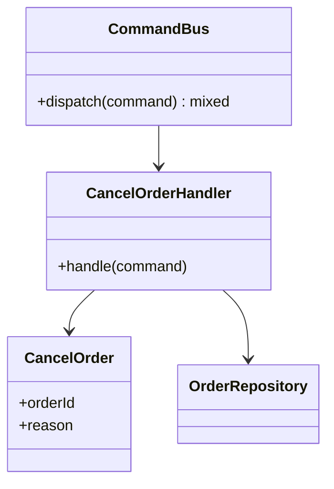

# Module 12 — Foundation: Command

## Vì sao bài này tồn tại?

**Hoàn tác thao tác đơn hàng** là tình huống độc lập được xây dựng riêng cho Command. Bài không lấy từ một source ẩn: bạn tự tạo phiên bản `before` tối thiểu dựa trên mô tả dưới đây, sau đó dùng test để chứng minh refactor không đổi behavior. Bài Foundation tập trung vào việc nhận diện đúng lực thay đổi và refactor tối thiểu. Không thêm queue, cache hoặc framework nếu chúng không cần để chứng minh pattern.

## Câu chuyện nghiệp vụ

Hệ thống cần xử lý **Hoàn tác thao tác đơn hàng**. `OrderController` đang biểu diễn hành động bằng callback rời rạc, không có command id, audit hoặc handler riêng.

Invariant trung tâm của bài **Command** là:

> **command diễn đạt intent và validate trước side effect.**

Ở cấp Foundation, **Command** chỉ đạt mục tiêu khi người học giải thích được change axis, giữ nguyên observable behavior và chứng minh baseline trực tiếp bắt đầu khó mở rộng hoặc khó test ở điểm nào.

Failure bắt buộc phải được mô hình hóa:

> **handler chạy lặp hoặc thiếu authorization.**

## Trạng thái code ban đầu

```php
final class OrderController
{
    public function handle(array $input): mixed
    {
        // validation chung, lựa chọn biến thể và side effect
        // đang bị trộn trong một method.
        throw new RuntimeException('Hãy dựng phiên bản before phù hợp đề bài.');
    }
}
```

Đây là skeleton định hướng, không phải lời giải. Hãy thêm dữ liệu và behavior nhỏ nhất đủ tái hiện pain point của **Hoàn tác thao tác đơn hàng**.

## Mô hình thiết kế cần hướng tới



Command biểu diễn yêu cầu có chủ đích; handler sở hữu transaction/use case. Undo chỉ hợp lệ khi domain có operation bù rõ ràng, không nên giả định mọi command đều đảo ngược được.

## Nhiệm vụ

1. Dựng code `before` nhỏ tái hiện **Hoàn tác thao tác đơn hàng** và ít nhất một nhánh lỗi.
2. Viết characterization test khóa invariant **command diễn đạt intent và validate trước side effect**.
3. Vẽ dependency trước/sau và đặt `Command` tại đúng trục thay đổi.
4. Refactor một biến thể đầu tiên, giữ API của `OrderController` ổn định.
5. Thêm biến thể chứng minh: **thêm CancelOrderCommand** mà client không phải sửa logic cũ.
6. Mô phỏng **handler chạy lặp hoặc thiếu authorization** và trả lỗi bằng ngôn ngữ application/domain.

## Dữ liệu thử tối thiểu

- Hai scenario hợp lệ đại diện cho hai biến thể khác nhau.
- Một boundary value liên quan trực tiếp tới **command diễn đạt intent và validate trước side effect**.
- Một scenario tạo ra **handler chạy lặp hoặc thiếu authorization**.
- Một biến thể mới để chứng minh extension point.

## Gợi ý triển khai

- Bắt đầu bằng behavior và invariant; chỉ tạo abstraction sau khi xác định đúng trục thay đổi.
- Đặt tên method theo domain của **Hoàn tác thao tác đơn hàng**, tránh `execute(mixed $data)` hoặc `handleAnything()`.
- Tách selection/wiring khỏi business calculation; composition root có thể biết concrete class nhưng use case không nên biết.
- Đừng nuốt exception. Map lỗi kỹ thuật thành error có ý nghĩa và giữ nguyên cause để điều tra.
- Nếu **method call trực tiếp khi không cần queue/history** vẫn rõ ràng hơn và thay đổi chưa có thật, hãy ghi kết luận “chưa cần pattern” trong ADR.

## Test bắt buộc

- Happy path và boundary value của **command diễn đạt intent và validate trước side effect**.
- Failure test cho **handler chạy lặp hoặc thiếu authorization**.
- Contract test dùng chung cho mọi implementation của `Command`.
- Extension test chứng minh **thêm CancelOrderCommand** không sửa client.

## Deliverable

```text
solution/
├── before.php
├── after.php
├── tests/
│   ├── CharacterizationTest.php
│   ├── ContractOrBehaviorTest.php
│   └── FailurePathTest.php
└── ADR.md
```

Ghi một decision note ngắn cho **Command**: baseline trực tiếp, change axis quan sát được, trade-off mới và điều kiện inline/xóa abstraction nếu biến thể không còn tăng.

## Tiêu chí tự chấm

- [ ] Tên class/method phản ánh đúng **Hoàn tác thao tác đơn hàng**.
- [ ] Invariant **command diễn đạt intent và validate trước side effect** có test tự động.
- [ ] Failure **handler chạy lặp hoặc thiếu authorization** có outcome xác định.
- [ ] Client biết ít concrete detail hơn sau refactor.
- [ ] Diagram, code và test mô tả cùng một boundary.
- [ ] Có giải thích khi nào **method call trực tiếp khi không cần queue/history** tốt hơn.
- [ ] Biến thể mới được thêm mà không sửa logic client.

## Câu hỏi design review

1. Trục thay đổi thật sự của **Hoàn tác thao tác đơn hàng** là gì, và `Command` cô lập nó ở đâu?
2. Invariant **command diễn đạt intent và validate trước side effect** được enforce ở layer nào? Có đường đi nào bypass không?
3. Khi **handler chạy lặp hoặc thiếu authorization** xảy ra, client nhận error gì và operator nhìn thấy evidence nào?
4. Pattern này làm dependency graph tốt hơn ở điểm nào, và tạo thêm chi phí gì?
5. Dấu hiệu nào cho biết nên quay lại phương án **method call trực tiếp khi không cần queue/history**?

## Lời giải tham khảo

Với **Hoàn tác thao tác đơn hàng**, hãy hoàn thành test và tự vẽ dependency trước/sau rồi mới mở [`SOLUTION.md`](SOLUTION.md). Khi đối chiếu, ưu tiên invariant, failure semantics và khả năng mở rộng của Command thay vì đếm class.
