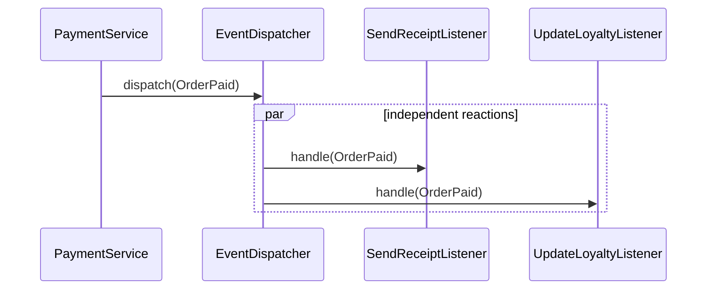

# Module 13 — Foundation: Observer

## Vì sao bài này tồn tại?

**Phản ứng khi đơn đã thanh toán** là tình huống độc lập được xây dựng riêng cho Observer. Bài không lấy từ một source ẩn: bạn tự tạo phiên bản `before` tối thiểu dựa trên mô tả dưới đây, sau đó dùng test để chứng minh refactor không đổi behavior. Bài Foundation tập trung vào việc nhận diện đúng lực thay đổi và refactor tối thiểu. Không thêm queue, cache hoặc framework nếu chúng không cần để chứng minh pattern.

## Câu chuyện nghiệp vụ

Hệ thống cần xử lý **Phản ứng khi đơn đã thanh toán**. `PaymentService` đang gọi trực tiếp email, loyalty và analytics sau thanh toán, làm payment transaction phụ thuộc mọi side effect.

Invariant trung tâm của bài **Observer** là:

> **event là fact bất biến; subscriber không làm hỏng transaction gốc.**

Ở cấp Foundation, **Observer** chỉ đạt mục tiêu khi người học giải thích được change axis, giữ nguyên observable behavior và chứng minh baseline trực tiếp bắt đầu khó mở rộng hoặc khó test ở điểm nào.

Failure bắt buộc phải được mô hình hóa:

> **subscriber lỗi hoặc xử lý trùng.**

## Trạng thái code ban đầu

```php
final class PaymentService
{
    public function handle(array $input): mixed
    {
        // validation chung, lựa chọn biến thể và side effect
        // đang bị trộn trong một method.
        throw new RuntimeException('Hãy dựng phiên bản before phù hợp đề bài.');
    }
}
```

Đây là skeleton định hướng, không phải lời giải. Hãy thêm dữ liệu và behavior nhỏ nhất đủ tái hiện pain point của **Phản ứng khi đơn đã thanh toán**.

## Mô hình thiết kế cần hướng tới



Publisher chỉ phát fact `OrderPaid`; subscriber phản ứng độc lập. Cần quyết định rõ synchronous/asynchronous, ordering, retry và duplicate delivery thay vì xem Observer chỉ là “gọi nhiều callback”.

## Nhiệm vụ

1. Dựng code `before` nhỏ tái hiện **Phản ứng khi đơn đã thanh toán** và ít nhất một nhánh lỗi.
2. Viết characterization test khóa invariant **event là fact bất biến; subscriber không làm hỏng transaction gốc**.
3. Vẽ dependency trước/sau và đặt `DomainEventSubscriber` tại đúng trục thay đổi.
4. Refactor một biến thể đầu tiên, giữ API của `PaymentService` ổn định.
5. Thêm biến thể chứng minh: **thêm LoyaltyPointsSubscriber** mà client không phải sửa logic cũ.
6. Mô phỏng **subscriber lỗi hoặc xử lý trùng** và trả lỗi bằng ngôn ngữ application/domain.

## Dữ liệu thử tối thiểu

- Hai scenario hợp lệ đại diện cho hai biến thể khác nhau.
- Một boundary value liên quan trực tiếp tới **event là fact bất biến; subscriber không làm hỏng transaction gốc**.
- Một scenario tạo ra **subscriber lỗi hoặc xử lý trùng**.
- Một biến thể mới để chứng minh extension point.

## Gợi ý triển khai

- Bắt đầu bằng behavior và invariant; chỉ tạo abstraction sau khi xác định đúng trục thay đổi.
- Đặt tên method theo domain của **Phản ứng khi đơn đã thanh toán**, tránh `execute(mixed $data)` hoặc `handleAnything()`.
- Tách selection/wiring khỏi business calculation; composition root có thể biết concrete class nhưng use case không nên biết.
- Đừng nuốt exception. Map lỗi kỹ thuật thành error có ý nghĩa và giữ nguyên cause để điều tra.
- Nếu **gọi trực tiếp khi side effect bắt buộc đồng bộ** vẫn rõ ràng hơn và thay đổi chưa có thật, hãy ghi kết luận “chưa cần pattern” trong ADR.

## Test bắt buộc

- Happy path và boundary value của **event là fact bất biến; subscriber không làm hỏng transaction gốc**.
- Failure test cho **subscriber lỗi hoặc xử lý trùng**.
- Contract test dùng chung cho mọi implementation của `DomainEventSubscriber`.
- Extension test chứng minh **thêm LoyaltyPointsSubscriber** không sửa client.

## Deliverable

```text
solution/
├── before.php
├── after.php
├── tests/
│   ├── CharacterizationTest.php
│   ├── ContractOrBehaviorTest.php
│   └── FailurePathTest.php
└── ADR.md
```

Ghi một decision note ngắn cho **Observer**: baseline trực tiếp, change axis quan sát được, trade-off mới và điều kiện inline/xóa abstraction nếu biến thể không còn tăng.

## Tiêu chí tự chấm

- [ ] Tên class/method phản ánh đúng **Phản ứng khi đơn đã thanh toán**.
- [ ] Invariant **event là fact bất biến; subscriber không làm hỏng transaction gốc** có test tự động.
- [ ] Failure **subscriber lỗi hoặc xử lý trùng** có outcome xác định.
- [ ] Client biết ít concrete detail hơn sau refactor.
- [ ] Diagram, code và test mô tả cùng một boundary.
- [ ] Có giải thích khi nào **gọi trực tiếp khi side effect bắt buộc đồng bộ** tốt hơn.
- [ ] Biến thể mới được thêm mà không sửa logic client.

## Câu hỏi design review

1. Trục thay đổi thật sự của **Phản ứng khi đơn đã thanh toán** là gì, và `DomainEventSubscriber` cô lập nó ở đâu?
2. Invariant **event là fact bất biến; subscriber không làm hỏng transaction gốc** được enforce ở layer nào? Có đường đi nào bypass không?
3. Khi **subscriber lỗi hoặc xử lý trùng** xảy ra, client nhận error gì và operator nhìn thấy evidence nào?
4. Pattern này làm dependency graph tốt hơn ở điểm nào, và tạo thêm chi phí gì?
5. Dấu hiệu nào cho biết nên quay lại phương án **gọi trực tiếp khi side effect bắt buộc đồng bộ**?

## Lời giải tham khảo

Với **Phản ứng khi đơn đã thanh toán**, hãy hoàn thành test và tự vẽ dependency trước/sau rồi mới mở [`SOLUTION.md`](SOLUTION.md). Khi đối chiếu, ưu tiên invariant, failure semantics và khả năng mở rộng của Observer thay vì đếm class.
