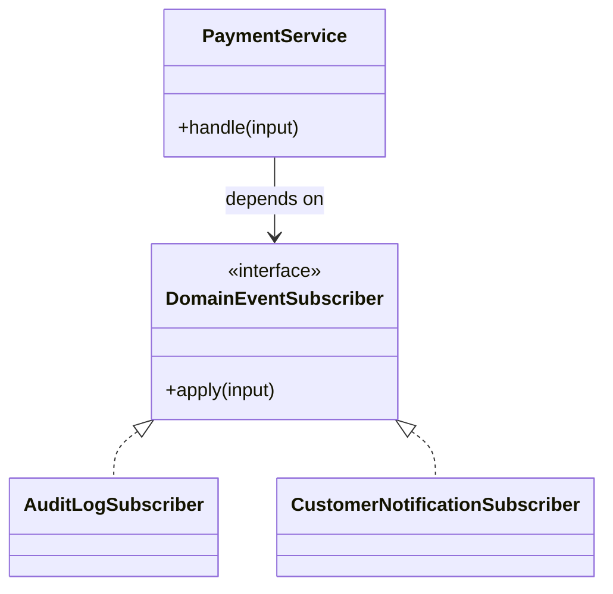

# Lời giải tham khảo — Observer (Foundation)

## Kết luận thiết kế

Lời giải chọn `DomainEventSubscriber` làm boundary vì nó bao quanh phần thay đổi của **Phản ứng khi đơn đã thanh toán** nhưng không kéo validation, transaction hoặc orchestration ổn định vào abstraction. Mục tiêu là bảo vệ **event là fact bất biến; subscriber không làm hỏng transaction gốc**, không phải chứng minh rằng mọi bài toán đều cần Observer.

## Sơ đồ lời giải



## Các bước refactor

1. Viết test cho `PaymentService` trước khi tách; test mô tả outcome chứ không khóa internal call.
2. Tách phần thay đổi thành `DomainEventSubscriber` với input/output cụ thể của **Phản ứng khi đơn đã thanh toán**.
3. Di chuyển một nhánh sang implementation đầu tiên; giữ validation dùng chung tại nơi ổn định.
4. Thay branch selection bằng dependency injection/composition root nhỏ.
5. Thêm biến thể **thêm LoyaltyPointsSubscriber** và chạy cùng contract test.
6. So sánh với phương án đơn giản hơn: **gọi trực tiếp khi side effect bắt buộc đồng bộ**; ghi khi nào nên xóa abstraction.

## Phác thảo contract

```php
interface DomainEventSubscriber
{
    /** Trả về kết quả domain hoặc ném lỗi application có nghĩa. */
    public function apply(array $input): mixed;
}
```

Trong implementation hoàn chỉnh của **Phản ứng khi đơn đã thanh toán**, thay `array`/`mixed` bằng input và result có tên theo domain. Contract của Observer phải làm rõ precondition, postcondition và lỗi có thể quan sát; đoạn trên chỉ minh họa hướng dependency.

## Test suite tối thiểu

- `PhanUngKhiOnAThanhToanBehaviorTest`: dựng fixture nhỏ nhất và assert trực tiếp invariant **event là fact bất biến; subscriber không làm hỏng transaction gốc.** trên output/state, không assert tên concrete class.
- `PhanUngKhiOnAThanhToanFailureTest`: tạo **subscriber lỗi hoặc xử lý trùng.**, kiểm tra error taxonomy và xác nhận state/side effect không ở trạng thái nửa vời.
- `Foundation:ObserverContractTest`: chạy cùng bộ contract cho mọi implementation hoặc variant được bài yêu cầu.
- `ExtensionTest`: thêm một biến thể hợp lệ của Foundation: Observer mà không sửa client/use case; nếu phải sửa, boundary chưa cô lập đúng change axis.
- Một test phản chứng cho phương án đơn giản hơn để chứng minh pattern mang giá trị, không chỉ tăng số type.
## Failure walkthrough

Khi **subscriber lỗi hoặc xử lý trùng**, implementation không được trả `null`/`false` mơ hồ. Nó phải tạo error có taxonomy rõ, giữ correlation/operation data cần thiết và không phá invariant **event là fact bất biến; subscriber không làm hỏng transaction gốc**. Client test error theo semantics, không phụ thuộc message của SDK hoặc exception hạ tầng.

## Trade-off và phương án thay thế

Foundation: Observer làm change axis của **Phản ứng khi đơn đã thanh toán** rõ hơn, đổi lại người học phải hiểu thêm contract, wiring và cách chọn implementation. Giá trị phải được chứng minh bằng việc thêm biến thể hoặc test failure mà client không đổi.

Hãy ưu tiên **gọi trực tiếp khi side effect bắt buộc đồng bộ** nếu bài toán chỉ có một behavior ổn định, chưa có boundary ngoài hoặc test trực tiếp đã đủ rõ. Pattern không phải mục tiêu; mục tiêu là giữ invariant **event là fact bất biến; subscriber không làm hỏng transaction gốc.** với thiết kế dễ đọc nhất.
## Dấu hiệu lời giải chưa đạt

- Boundary của Observer không dùng ngôn ngữ **Phản ứng khi đơn đã thanh toán**, khiến người đọc vẫn phải biết concrete detail.
- Test không chứng minh invariant **event là fact bất biến; subscriber không làm hỏng transaction gốc** hoặc chỉ xác nhận method được gọi.
- Selection, transaction hay error mapping vẫn nằm rải rác ở client nên blast radius không giảm.
- Diagram không khớp dependency thực trong code hoặc bỏ qua failure path quan trọng.
- Thêm biến thể mới vẫn phải sửa logic trung tâm, chứng tỏ extension point đặt sai.

## Câu hỏi mở rộng

- Với **Phản ứng khi đơn đã thanh toán**, metric nào chứng minh Observer giảm rủi ro thay đổi thay vì chỉ tăng số type?
- Khi số biến thể tăng, ai sở hữu selection, versioning và compatibility của boundary?
- Failure nào buộc thiết kế phải đổi, và failure nào nên được xử lý bên ngoài pattern?
- Điều kiện cleanup nào cho phép hợp nhất implementation hoặc xóa abstraction này?

## Ghi chú triển khai chuyên biệt cho Observer

Trong **Lời giải tham khảo — Observer (Foundation)** cấp Foundation, event mô tả fact đã xảy ra; subscriber async không được âm thầm thay đổi outcome transaction gốc và phải xử lý duplicate/out-of-order theo delivery contract.

### Test focus

Ở cấp **Foundation**, test duplicate delivery, subscriber isolation, ordering assumption và replay. Giữ test tại process boundary nhỏ nhất và ưu tiên semantics dễ đọc.

### Bằng chứng nên lưu

Với **Phản ứng khi đơn đã thanh toán**, lưu sơ đồ dependency trước/sau, fixture tái hiện lỗi, test chứng minh invariant, commit chuyển đổi và ADR của Observer. Reviewer cần nhìn được bằng chứng rằng boundary mới giảm blast radius hoặc làm failure dễ kiểm soát hơn, không chỉ thấy nhiều class hơn.
