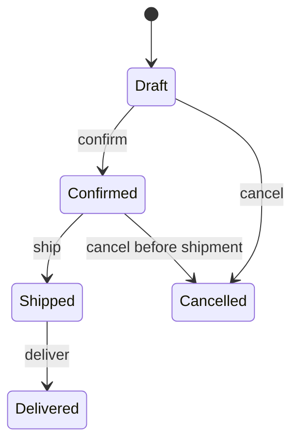

# Module 14 — Foundation: State

## Vì sao bài này tồn tại?

**Vòng đời đơn hàng** là tình huống độc lập được xây dựng riêng cho State. Bài không lấy từ một source ẩn: bạn tự tạo phiên bản `before` tối thiểu dựa trên mô tả dưới đây, sau đó dùng test để chứng minh refactor không đổi behavior. Bài Foundation tập trung vào việc nhận diện đúng lực thay đổi và refactor tối thiểu. Không thêm queue, cache hoặc framework nếu chúng không cần để chứng minh pattern.

## Câu chuyện nghiệp vụ

Hệ thống cần xử lý **Vòng đời đơn hàng**. `Order` đang kiểm tra status bằng chuỗi ở nhiều method, nên illegal transition có thể lọt qua.

Invariant trung tâm của bài **State** là:

> **chỉ transition hợp lệ mới thay đổi trạng thái.**

Ở cấp Foundation, **State** chỉ đạt mục tiêu khi người học giải thích được change axis, giữ nguyên observable behavior và chứng minh baseline trực tiếp bắt đầu khó mở rộng hoặc khó test ở điểm nào.

Failure bắt buộc phải được mô hình hóa:

> **cancel sau shipped hoặc transition bỏ qua guard.**

## Trạng thái code ban đầu

```php
final class Order
{
    public function handle(array $input): mixed
    {
        // validation chung, lựa chọn biến thể và side effect
        // đang bị trộn trong một method.
        throw new RuntimeException('Hãy dựng phiên bản before phù hợp đề bài.');
    }
}
```

Đây là skeleton định hướng, không phải lời giải. Hãy thêm dữ liệu và behavior nhỏ nhất đủ tái hiện pain point của **Vòng đời đơn hàng**.

## Mô hình thiết kế cần hướng tới



State machine là nguồn sự thật cho transition hợp lệ. Mỗi state hoặc transition guard phải ngăn đường đi bất hợp lệ thay vì để controller tự so sánh chuỗi trạng thái.

## Nhiệm vụ

1. Dựng code `before` nhỏ tái hiện **Vòng đời đơn hàng** và ít nhất một nhánh lỗi.
2. Viết characterization test khóa invariant **chỉ transition hợp lệ mới thay đổi trạng thái**.
3. Vẽ dependency trước/sau và đặt `OrderState` tại đúng trục thay đổi.
4. Refactor một biến thể đầu tiên, giữ API của `Order` ổn định.
5. Thêm biến thể chứng minh: **thêm Returned state** mà client không phải sửa logic cũ.
6. Mô phỏng **cancel sau shipped hoặc transition bỏ qua guard** và trả lỗi bằng ngôn ngữ application/domain.

## Dữ liệu thử tối thiểu

- Hai scenario hợp lệ đại diện cho hai biến thể khác nhau.
- Một boundary value liên quan trực tiếp tới **chỉ transition hợp lệ mới thay đổi trạng thái**.
- Một scenario tạo ra **cancel sau shipped hoặc transition bỏ qua guard**.
- Một biến thể mới để chứng minh extension point.

## Gợi ý triển khai

- Bắt đầu bằng behavior và invariant; chỉ tạo abstraction sau khi xác định đúng trục thay đổi.
- Đặt tên method theo domain của **Vòng đời đơn hàng**, tránh `execute(mixed $data)` hoặc `handleAnything()`.
- Tách selection/wiring khỏi business calculation; composition root có thể biết concrete class nhưng use case không nên biết.
- Đừng nuốt exception. Map lỗi kỹ thuật thành error có ý nghĩa và giữ nguyên cause để điều tra.
- Nếu **enum + switch khi transition ít và ổn định** vẫn rõ ràng hơn và thay đổi chưa có thật, hãy ghi kết luận “chưa cần pattern” trong ADR.

## Test bắt buộc

- Happy path và boundary value của **chỉ transition hợp lệ mới thay đổi trạng thái**.
- Failure test cho **cancel sau shipped hoặc transition bỏ qua guard**.
- Contract test dùng chung cho mọi implementation của `OrderState`.
- Extension test chứng minh **thêm Returned state** không sửa client.

## Deliverable

```text
solution/
├── before.php
├── after.php
├── tests/
│   ├── CharacterizationTest.php
│   ├── ContractOrBehaviorTest.php
│   └── FailurePathTest.php
└── ADR.md
```

Ghi một decision note ngắn cho **State**: baseline trực tiếp, change axis quan sát được, trade-off mới và điều kiện inline/xóa abstraction nếu biến thể không còn tăng.

## Tiêu chí tự chấm

- [ ] Tên class/method phản ánh đúng **Vòng đời đơn hàng**.
- [ ] Invariant **chỉ transition hợp lệ mới thay đổi trạng thái** có test tự động.
- [ ] Failure **cancel sau shipped hoặc transition bỏ qua guard** có outcome xác định.
- [ ] Client biết ít concrete detail hơn sau refactor.
- [ ] Diagram, code và test mô tả cùng một boundary.
- [ ] Có giải thích khi nào **enum + switch khi transition ít và ổn định** tốt hơn.
- [ ] Biến thể mới được thêm mà không sửa logic client.

## Câu hỏi design review

1. Trục thay đổi thật sự của **Vòng đời đơn hàng** là gì, và `OrderState` cô lập nó ở đâu?
2. Invariant **chỉ transition hợp lệ mới thay đổi trạng thái** được enforce ở layer nào? Có đường đi nào bypass không?
3. Khi **cancel sau shipped hoặc transition bỏ qua guard** xảy ra, client nhận error gì và operator nhìn thấy evidence nào?
4. Pattern này làm dependency graph tốt hơn ở điểm nào, và tạo thêm chi phí gì?
5. Dấu hiệu nào cho biết nên quay lại phương án **enum + switch khi transition ít và ổn định**?

## Lời giải tham khảo

Với **Vòng đời đơn hàng**, hãy hoàn thành test và tự vẽ dependency trước/sau rồi mới mở [`SOLUTION.md`](SOLUTION.md). Khi đối chiếu, ưu tiên invariant, failure semantics và khả năng mở rộng của State thay vì đếm class.
