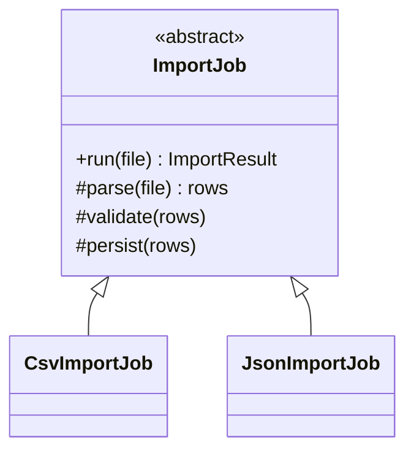

# Module 15 — Foundation: Template Method

## Vì sao bài này tồn tại?

**Quy trình import nhiều định dạng** là tình huống độc lập được xây dựng riêng cho Template Method. Bài không lấy từ một source ẩn: bạn tự tạo phiên bản `before` tối thiểu dựa trên mô tả dưới đây, sau đó dùng test để chứng minh refactor không đổi behavior. Bài Foundation tập trung vào việc nhận diện đúng lực thay đổi và refactor tối thiểu. Không thêm queue, cache hoặc framework nếu chúng không cần để chứng minh pattern.

## Câu chuyện nghiệp vụ

Hệ thống cần xử lý **Quy trình import nhiều định dạng**. `ImportJob` đang copy workflow parse–validate–persist cho CSV và JSON, nhưng thứ tự invariant không được đảm bảo.

Invariant trung tâm của bài **Template Method** là:

> **thứ tự parse-validate-persist cố định.**

Ở cấp Foundation, **Template Method** chỉ đạt mục tiêu khi người học giải thích được change axis, giữ nguyên observable behavior và chứng minh baseline trực tiếp bắt đầu khó mở rộng hoặc khó test ở điểm nào.

Failure bắt buộc phải được mô hình hóa:

> **subclass bỏ qua bước bắt buộc.**

## Trạng thái code ban đầu

```php
final class ImportJob
{
    public function handle(array $input): mixed
    {
        // validation chung, lựa chọn biến thể và side effect
        // đang bị trộn trong một method.
        throw new RuntimeException('Hãy dựng phiên bản before phù hợp đề bài.');
    }
}
```

Đây là skeleton định hướng, không phải lời giải. Hãy thêm dữ liệu và behavior nhỏ nhất đủ tái hiện pain point của **Quy trình import nhiều định dạng**.

## Mô hình thiết kế cần hướng tới



Template Method giữ skeleton `run()` và chỉ mở các hook cần biến đổi. Invariant chung như transaction, validation order và metrics không được copy sang subclass.

## Nhiệm vụ

1. Dựng code `before` nhỏ tái hiện **Quy trình import nhiều định dạng** và ít nhất một nhánh lỗi.
2. Viết characterization test khóa invariant **thứ tự parse-validate-persist cố định**.
3. Vẽ dependency trước/sau và đặt `ImportTemplate` tại đúng trục thay đổi.
4. Refactor một biến thể đầu tiên, giữ API của `ImportJob` ổn định.
5. Thêm biến thể chứng minh: **thêm XML importer override hook hợp lệ** mà client không phải sửa logic cũ.
6. Mô phỏng **subclass bỏ qua bước bắt buộc** và trả lỗi bằng ngôn ngữ application/domain.

## Dữ liệu thử tối thiểu

- Hai scenario hợp lệ đại diện cho hai biến thể khác nhau.
- Một boundary value liên quan trực tiếp tới **thứ tự parse-validate-persist cố định**.
- Một scenario tạo ra **subclass bỏ qua bước bắt buộc**.
- Một biến thể mới để chứng minh extension point.

## Gợi ý triển khai

- Bắt đầu bằng behavior và invariant; chỉ tạo abstraction sau khi xác định đúng trục thay đổi.
- Đặt tên method theo domain của **Quy trình import nhiều định dạng**, tránh `execute(mixed $data)` hoặc `handleAnything()`.
- Tách selection/wiring khỏi business calculation; composition root có thể biết concrete class nhưng use case không nên biết.
- Đừng nuốt exception. Map lỗi kỹ thuật thành error có ý nghĩa và giữ nguyên cause để điều tra.
- Nếu **composition khi các bước cần hoán đổi tự do** vẫn rõ ràng hơn và thay đổi chưa có thật, hãy ghi kết luận “chưa cần pattern” trong ADR.

## Test bắt buộc

- Happy path và boundary value của **thứ tự parse-validate-persist cố định**.
- Failure test cho **subclass bỏ qua bước bắt buộc**.
- Contract test dùng chung cho mọi implementation của `ImportTemplate`.
- Extension test chứng minh **thêm XML importer override hook hợp lệ** không sửa client.

## Deliverable

```text
solution/
├── before.php
├── after.php
├── tests/
│   ├── CharacterizationTest.php
│   ├── ContractOrBehaviorTest.php
│   └── FailurePathTest.php
└── ADR.md
```

Ghi một decision note ngắn cho **Template Method**: baseline trực tiếp, change axis quan sát được, trade-off mới và điều kiện inline/xóa abstraction nếu biến thể không còn tăng.

## Tiêu chí tự chấm

- [ ] Tên class/method phản ánh đúng **Quy trình import nhiều định dạng**.
- [ ] Invariant **thứ tự parse-validate-persist cố định** có test tự động.
- [ ] Failure **subclass bỏ qua bước bắt buộc** có outcome xác định.
- [ ] Client biết ít concrete detail hơn sau refactor.
- [ ] Diagram, code và test mô tả cùng một boundary.
- [ ] Có giải thích khi nào **composition khi các bước cần hoán đổi tự do** tốt hơn.
- [ ] Biến thể mới được thêm mà không sửa logic client.

## Câu hỏi design review

1. Trục thay đổi thật sự của **Quy trình import nhiều định dạng** là gì, và `ImportTemplate` cô lập nó ở đâu?
2. Invariant **thứ tự parse-validate-persist cố định** được enforce ở layer nào? Có đường đi nào bypass không?
3. Khi **subclass bỏ qua bước bắt buộc** xảy ra, client nhận error gì và operator nhìn thấy evidence nào?
4. Pattern này làm dependency graph tốt hơn ở điểm nào, và tạo thêm chi phí gì?
5. Dấu hiệu nào cho biết nên quay lại phương án **composition khi các bước cần hoán đổi tự do**?

## Lời giải tham khảo

Với **Quy trình import nhiều định dạng**, hãy hoàn thành test và tự vẽ dependency trước/sau rồi mới mở [`SOLUTION.md`](SOLUTION.md). Khi đối chiếu, ưu tiên invariant, failure semantics và khả năng mở rộng của Template Method thay vì đếm class.
