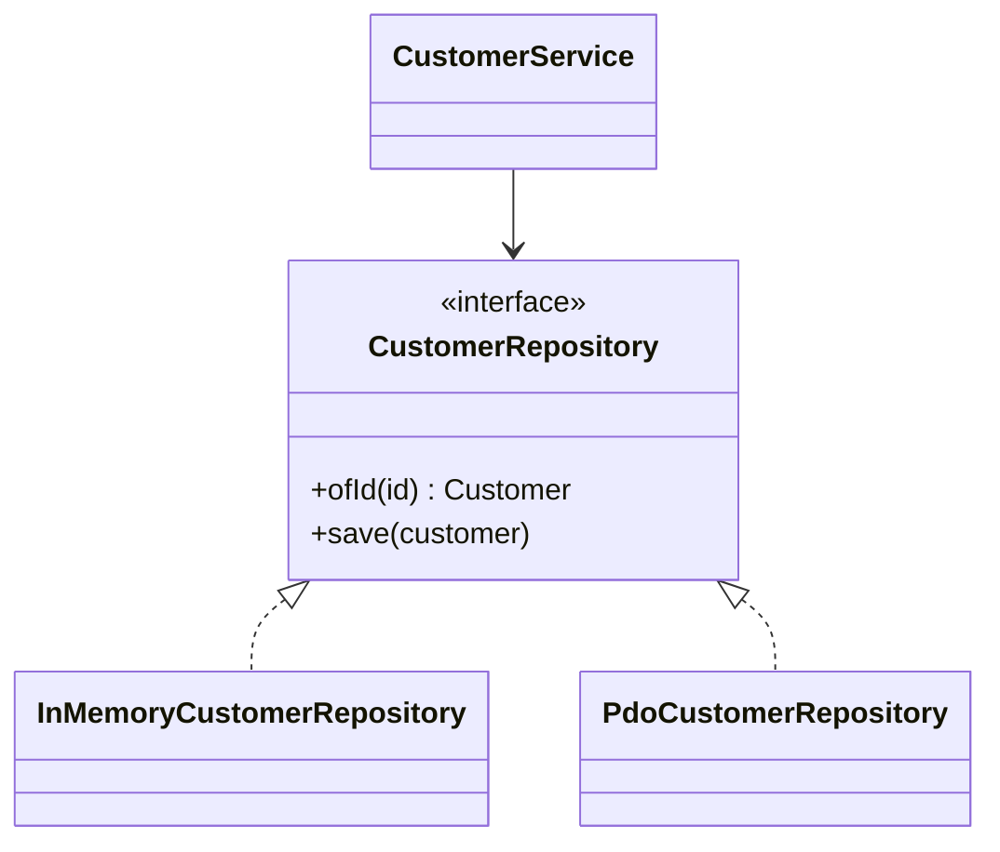

# Module 16 — Foundation: Repository

## Vì sao bài này tồn tại?

**Quản lý khách hàng theo domain** là tình huống độc lập được xây dựng riêng cho Repository. Bài không lấy từ một source ẩn: bạn tự tạo phiên bản `before` tối thiểu dựa trên mô tả dưới đây, sau đó dùng test để chứng minh refactor không đổi behavior. Bài Foundation tập trung vào việc nhận diện đúng lực thay đổi và refactor tối thiểu. Không thêm queue, cache hoặc framework nếu chúng không cần để chứng minh pattern.

## Câu chuyện nghiệp vụ

Hệ thống cần xử lý **Quản lý khách hàng theo domain**. `CustomerService` đang query ORM trực tiếp và để persistence detail chảy vào use case.

Invariant trung tâm của bài **Repository** là:

> **save/find giữ identity và domain semantics.**

Ở cấp Foundation, **Repository** chỉ đạt mục tiêu khi người học giải thích được change axis, giữ nguyên observable behavior và chứng minh baseline trực tiếp bắt đầu khó mở rộng hoặc khó test ở điểm nào.

Failure bắt buộc phải được mô hình hóa:

> **repository trả object sai tenant hoặc duplicate identity.**

## Trạng thái code ban đầu

```php
final class CustomerService
{
    public function handle(array $input): mixed
    {
        // validation chung, lựa chọn biến thể và side effect
        // đang bị trộn trong một method.
        throw new RuntimeException('Hãy dựng phiên bản before phù hợp đề bài.');
    }
}
```

Đây là skeleton định hướng, không phải lời giải. Hãy thêm dữ liệu và behavior nhỏ nhất đủ tái hiện pain point của **Quản lý khách hàng theo domain**.

## Mô hình thiết kế cần hướng tới



Repository nói bằng ngôn ngữ domain và mô phỏng collection aggregate. Tránh generic CRUD API làm lộ persistence hoặc biến repository thành nơi chứa mọi query báo cáo.

## Nhiệm vụ

1. Dựng code `before` nhỏ tái hiện **Quản lý khách hàng theo domain** và ít nhất một nhánh lỗi.
2. Viết characterization test khóa invariant **save/find giữ identity và domain semantics**.
3. Vẽ dependency trước/sau và đặt `CustomerRepository` tại đúng trục thay đổi.
4. Refactor một biến thể đầu tiên, giữ API của `CustomerService` ổn định.
5. Thêm biến thể chứng minh: **thêm in-memory implementation cho test** mà client không phải sửa logic cũ.
6. Mô phỏng **repository trả object sai tenant hoặc duplicate identity** và trả lỗi bằng ngôn ngữ application/domain.

## Dữ liệu thử tối thiểu

- Hai scenario hợp lệ đại diện cho hai biến thể khác nhau.
- Một boundary value liên quan trực tiếp tới **save/find giữ identity và domain semantics**.
- Một scenario tạo ra **repository trả object sai tenant hoặc duplicate identity**.
- Một biến thể mới để chứng minh extension point.

## Gợi ý triển khai

- Bắt đầu bằng behavior và invariant; chỉ tạo abstraction sau khi xác định đúng trục thay đổi.
- Đặt tên method theo domain của **Quản lý khách hàng theo domain**, tránh `execute(mixed $data)` hoặc `handleAnything()`.
- Tách selection/wiring khỏi business calculation; composition root có thể biết concrete class nhưng use case không nên biết.
- Đừng nuốt exception. Map lỗi kỹ thuật thành error có ý nghĩa và giữ nguyên cause để điều tra.
- Nếu **Eloquent trực tiếp cho CRUD đơn giản** vẫn rõ ràng hơn và thay đổi chưa có thật, hãy ghi kết luận “chưa cần pattern” trong ADR.

## Test bắt buộc

- Happy path và boundary value của **save/find giữ identity và domain semantics**.
- Failure test cho **repository trả object sai tenant hoặc duplicate identity**.
- Contract test dùng chung cho mọi implementation của `CustomerRepository`.
- Extension test chứng minh **thêm in-memory implementation cho test** không sửa client.

## Deliverable

```text
solution/
├── before.php
├── after.php
├── tests/
│   ├── CharacterizationTest.php
│   ├── ContractOrBehaviorTest.php
│   └── FailurePathTest.php
└── ADR.md
```

Ghi một decision note ngắn cho **Repository**: baseline trực tiếp, change axis quan sát được, trade-off mới và điều kiện inline/xóa abstraction nếu biến thể không còn tăng.

## Tiêu chí tự chấm

- [ ] Tên class/method phản ánh đúng **Quản lý khách hàng theo domain**.
- [ ] Invariant **save/find giữ identity và domain semantics** có test tự động.
- [ ] Failure **repository trả object sai tenant hoặc duplicate identity** có outcome xác định.
- [ ] Client biết ít concrete detail hơn sau refactor.
- [ ] Diagram, code và test mô tả cùng một boundary.
- [ ] Có giải thích khi nào **Eloquent trực tiếp cho CRUD đơn giản** tốt hơn.
- [ ] Biến thể mới được thêm mà không sửa logic client.

## Câu hỏi design review

1. Trục thay đổi thật sự của **Quản lý khách hàng theo domain** là gì, và `CustomerRepository` cô lập nó ở đâu?
2. Invariant **save/find giữ identity và domain semantics** được enforce ở layer nào? Có đường đi nào bypass không?
3. Khi **repository trả object sai tenant hoặc duplicate identity** xảy ra, client nhận error gì và operator nhìn thấy evidence nào?
4. Pattern này làm dependency graph tốt hơn ở điểm nào, và tạo thêm chi phí gì?
5. Dấu hiệu nào cho biết nên quay lại phương án **Eloquent trực tiếp cho CRUD đơn giản**?

## Lời giải tham khảo

Với **Quản lý khách hàng theo domain**, hãy hoàn thành test và tự vẽ dependency trước/sau rồi mới mở [`SOLUTION.md`](SOLUTION.md). Khi đối chiếu, ưu tiên invariant, failure semantics và khả năng mở rộng của Repository thay vì đếm class.
