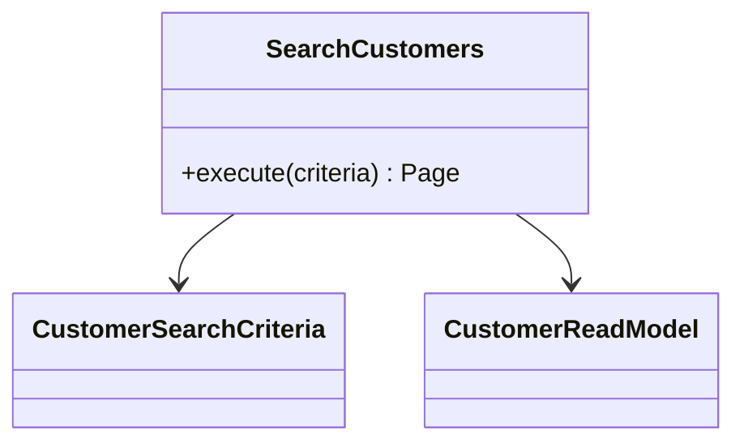

# Module 17 — Foundation: Query Object

## Vì sao bài này tồn tại?

**Tìm khách hàng theo bộ lọc** là tình huống độc lập được xây dựng riêng cho Query Object. Bài không lấy từ một source ẩn: bạn tự tạo phiên bản `before` tối thiểu dựa trên mô tả dưới đây, sau đó dùng test để chứng minh refactor không đổi behavior. Bài Foundation tập trung vào việc nhận diện đúng lực thay đổi và refactor tối thiểu. Không thêm queue, cache hoặc framework nếu chúng không cần để chứng minh pattern.

## Câu chuyện nghiệp vụ

Hệ thống cần xử lý **Tìm khách hàng theo bộ lọc**. `CustomerController` đang xây query động trong controller, trộn filter semantics, projection và pagination.

Invariant trung tâm của bài **Query Object** là:

> **filter/sort/page có semantics rõ và ổn định.**

Ở cấp Foundation, **Query Object** chỉ đạt mục tiêu khi người học giải thích được change axis, giữ nguyên observable behavior và chứng minh baseline trực tiếp bắt đầu khó mở rộng hoặc khó test ở điểm nào.

Failure bắt buộc phải được mô hình hóa:

> **filter combination sai hoặc pagination lệch.**

## Trạng thái code ban đầu

```php
final class CustomerController
{
    public function handle(array $input): mixed
    {
        // validation chung, lựa chọn biến thể và side effect
        // đang bị trộn trong một method.
        throw new RuntimeException('Hãy dựng phiên bản before phù hợp đề bài.');
    }
}
```

Đây là skeleton định hướng, không phải lời giải. Hãy thêm dữ liệu và behavior nhỏ nhất đủ tái hiện pain point của **Tìm khách hàng theo bộ lọc**.

## Mô hình thiết kế cần hướng tới



Query Object đóng gói một nhu cầu đọc cụ thể, bao gồm filter, sort, projection và pagination. Nó không nên trả aggregate chỉ để render bảng báo cáo.

## Nhiệm vụ

1. Dựng code `before` nhỏ tái hiện **Tìm khách hàng theo bộ lọc** và ít nhất một nhánh lỗi.
2. Viết characterization test khóa invariant **filter/sort/page có semantics rõ và ổn định**.
3. Vẽ dependency trước/sau và đặt `CustomerSearch` tại đúng trục thay đổi.
4. Refactor một biến thể đầu tiên, giữ API của `CustomerController` ổn định.
5. Thêm biến thể chứng minh: **thêm filter lastPurchaseAt** mà client không phải sửa logic cũ.
6. Mô phỏng **filter combination sai hoặc pagination lệch** và trả lỗi bằng ngôn ngữ application/domain.

## Dữ liệu thử tối thiểu

- Hai scenario hợp lệ đại diện cho hai biến thể khác nhau.
- Một boundary value liên quan trực tiếp tới **filter/sort/page có semantics rõ và ổn định**.
- Một scenario tạo ra **filter combination sai hoặc pagination lệch**.
- Một biến thể mới để chứng minh extension point.

## Gợi ý triển khai

- Bắt đầu bằng behavior và invariant; chỉ tạo abstraction sau khi xác định đúng trục thay đổi.
- Đặt tên method theo domain của **Tìm khách hàng theo bộ lọc**, tránh `execute(mixed $data)` hoặc `handleAnything()`.
- Tách selection/wiring khỏi business calculation; composition root có thể biết concrete class nhưng use case không nên biết.
- Đừng nuốt exception. Map lỗi kỹ thuật thành error có ý nghĩa và giữ nguyên cause để điều tra.
- Nếu **query inline ngắn, chỉ dùng một nơi** vẫn rõ ràng hơn và thay đổi chưa có thật, hãy ghi kết luận “chưa cần pattern” trong ADR.

## Test bắt buộc

- Happy path và boundary value của **filter/sort/page có semantics rõ và ổn định**.
- Failure test cho **filter combination sai hoặc pagination lệch**.
- Contract test dùng chung cho mọi implementation của `CustomerSearch`.
- Extension test chứng minh **thêm filter lastPurchaseAt** không sửa client.

## Deliverable

```text
solution/
├── before.php
├── after.php
├── tests/
│   ├── CharacterizationTest.php
│   ├── ContractOrBehaviorTest.php
│   └── FailurePathTest.php
└── ADR.md
```

Ghi một decision note ngắn cho **Query Object**: baseline trực tiếp, change axis quan sát được, trade-off mới và điều kiện inline/xóa abstraction nếu biến thể không còn tăng.

## Tiêu chí tự chấm

- [ ] Tên class/method phản ánh đúng **Tìm khách hàng theo bộ lọc**.
- [ ] Invariant **filter/sort/page có semantics rõ và ổn định** có test tự động.
- [ ] Failure **filter combination sai hoặc pagination lệch** có outcome xác định.
- [ ] Client biết ít concrete detail hơn sau refactor.
- [ ] Diagram, code và test mô tả cùng một boundary.
- [ ] Có giải thích khi nào **query inline ngắn, chỉ dùng một nơi** tốt hơn.
- [ ] Biến thể mới được thêm mà không sửa logic client.

## Câu hỏi design review

1. Trục thay đổi thật sự của **Tìm khách hàng theo bộ lọc** là gì, và `CustomerSearch` cô lập nó ở đâu?
2. Invariant **filter/sort/page có semantics rõ và ổn định** được enforce ở layer nào? Có đường đi nào bypass không?
3. Khi **filter combination sai hoặc pagination lệch** xảy ra, client nhận error gì và operator nhìn thấy evidence nào?
4. Pattern này làm dependency graph tốt hơn ở điểm nào, và tạo thêm chi phí gì?
5. Dấu hiệu nào cho biết nên quay lại phương án **query inline ngắn, chỉ dùng một nơi**?

## Lời giải tham khảo

Với **Tìm khách hàng theo bộ lọc**, hãy hoàn thành test và tự vẽ dependency trước/sau rồi mới mở [`SOLUTION.md`](SOLUTION.md). Khi đối chiếu, ưu tiên invariant, failure semantics và khả năng mở rộng của Query Object thay vì đếm class.
