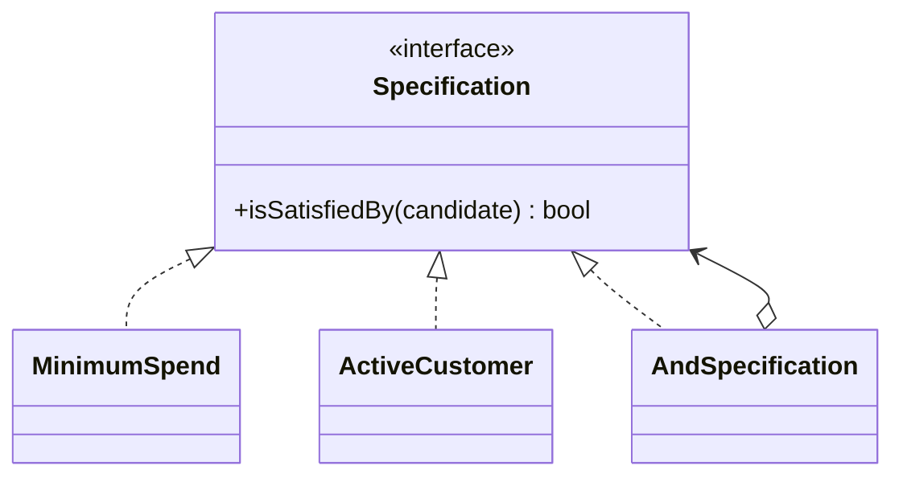

# Module 18 — Foundation: Specification

## Vì sao bài này tồn tại?

**Điều kiện nhận ưu đãi** là tình huống độc lập được xây dựng riêng cho Specification. Bài không lấy từ một source ẩn: bạn tự tạo phiên bản `before` tối thiểu dựa trên mô tả dưới đây, sau đó dùng test để chứng minh refactor không đổi behavior. Bài Foundation tập trung vào việc nhận diện đúng lực thay đổi và refactor tối thiểu. Không thêm queue, cache hoặc framework nếu chúng không cần để chứng minh pattern.

## Câu chuyện nghiệp vụ

Hệ thống cần xử lý **Điều kiện nhận ưu đãi**. `DiscountService` đang lặp các biểu thức điều kiện dài ở checkout, campaign preview và batch job.

Invariant trung tâm của bài **Specification** là:

> **rule tổ hợp trả reason nhất quán.**

Ở cấp Foundation, **Specification** chỉ đạt mục tiêu khi người học giải thích được change axis, giữ nguyên observable behavior và chứng minh baseline trực tiếp bắt đầu khó mở rộng hoặc khó test ở điểm nào.

Failure bắt buộc phải được mô hình hóa:

> **rule mâu thuẫn hoặc null semantics.**

## Trạng thái code ban đầu

```php
final class DiscountService
{
    public function handle(array $input): mixed
    {
        // validation chung, lựa chọn biến thể và side effect
        // đang bị trộn trong một method.
        throw new RuntimeException('Hãy dựng phiên bản before phù hợp đề bài.');
    }
}
```

Đây là skeleton định hướng, không phải lời giải. Hãy thêm dữ liệu và behavior nhỏ nhất đủ tái hiện pain point của **Điều kiện nhận ưu đãi**.

## Mô hình thiết kế cần hướng tới



Specification biểu diễn rule có thể đặt tên và kết hợp. Hãy giữ nó thuần khi có thể; query translation là capability riêng và cần test parity với in-memory evaluation.

## Nhiệm vụ

1. Dựng code `before` nhỏ tái hiện **Điều kiện nhận ưu đãi** và ít nhất một nhánh lỗi.
2. Viết characterization test khóa invariant **rule tổ hợp trả reason nhất quán**.
3. Vẽ dependency trước/sau và đặt `Specification` tại đúng trục thay đổi.
4. Refactor một biến thể đầu tiên, giữ API của `DiscountService` ổn định.
5. Thêm biến thể chứng minh: **thêm VIP AND Active AND NotBlocked** mà client không phải sửa logic cũ.
6. Mô phỏng **rule mâu thuẫn hoặc null semantics** và trả lỗi bằng ngôn ngữ application/domain.

## Dữ liệu thử tối thiểu

- Hai scenario hợp lệ đại diện cho hai biến thể khác nhau.
- Một boundary value liên quan trực tiếp tới **rule tổ hợp trả reason nhất quán**.
- Một scenario tạo ra **rule mâu thuẫn hoặc null semantics**.
- Một biến thể mới để chứng minh extension point.

## Gợi ý triển khai

- Bắt đầu bằng behavior và invariant; chỉ tạo abstraction sau khi xác định đúng trục thay đổi.
- Đặt tên method theo domain của **Điều kiện nhận ưu đãi**, tránh `execute(mixed $data)` hoặc `handleAnything()`.
- Tách selection/wiring khỏi business calculation; composition root có thể biết concrete class nhưng use case không nên biết.
- Đừng nuốt exception. Map lỗi kỹ thuật thành error có ý nghĩa và giữ nguyên cause để điều tra.
- Nếu **predicate inline khi rule không tái sử dụng** vẫn rõ ràng hơn và thay đổi chưa có thật, hãy ghi kết luận “chưa cần pattern” trong ADR.

## Test bắt buộc

- Happy path và boundary value của **rule tổ hợp trả reason nhất quán**.
- Failure test cho **rule mâu thuẫn hoặc null semantics**.
- Contract test dùng chung cho mọi implementation của `Specification`.
- Extension test chứng minh **thêm VIP AND Active AND NotBlocked** không sửa client.

## Deliverable

```text
solution/
├── before.php
├── after.php
├── tests/
│   ├── CharacterizationTest.php
│   ├── ContractOrBehaviorTest.php
│   └── FailurePathTest.php
└── ADR.md
```

Ghi một decision note ngắn cho **Specification**: baseline trực tiếp, change axis quan sát được, trade-off mới và điều kiện inline/xóa abstraction nếu biến thể không còn tăng.

## Tiêu chí tự chấm

- [ ] Tên class/method phản ánh đúng **Điều kiện nhận ưu đãi**.
- [ ] Invariant **rule tổ hợp trả reason nhất quán** có test tự động.
- [ ] Failure **rule mâu thuẫn hoặc null semantics** có outcome xác định.
- [ ] Client biết ít concrete detail hơn sau refactor.
- [ ] Diagram, code và test mô tả cùng một boundary.
- [ ] Có giải thích khi nào **predicate inline khi rule không tái sử dụng** tốt hơn.
- [ ] Biến thể mới được thêm mà không sửa logic client.

## Câu hỏi design review

1. Trục thay đổi thật sự của **Điều kiện nhận ưu đãi** là gì, và `Specification` cô lập nó ở đâu?
2. Invariant **rule tổ hợp trả reason nhất quán** được enforce ở layer nào? Có đường đi nào bypass không?
3. Khi **rule mâu thuẫn hoặc null semantics** xảy ra, client nhận error gì và operator nhìn thấy evidence nào?
4. Pattern này làm dependency graph tốt hơn ở điểm nào, và tạo thêm chi phí gì?
5. Dấu hiệu nào cho biết nên quay lại phương án **predicate inline khi rule không tái sử dụng**?

## Lời giải tham khảo

Với **Điều kiện nhận ưu đãi**, hãy hoàn thành test và tự vẽ dependency trước/sau rồi mới mở [`SOLUTION.md`](SOLUTION.md). Khi đối chiếu, ưu tiên invariant, failure semantics và khả năng mở rộng của Specification thay vì đếm class.
