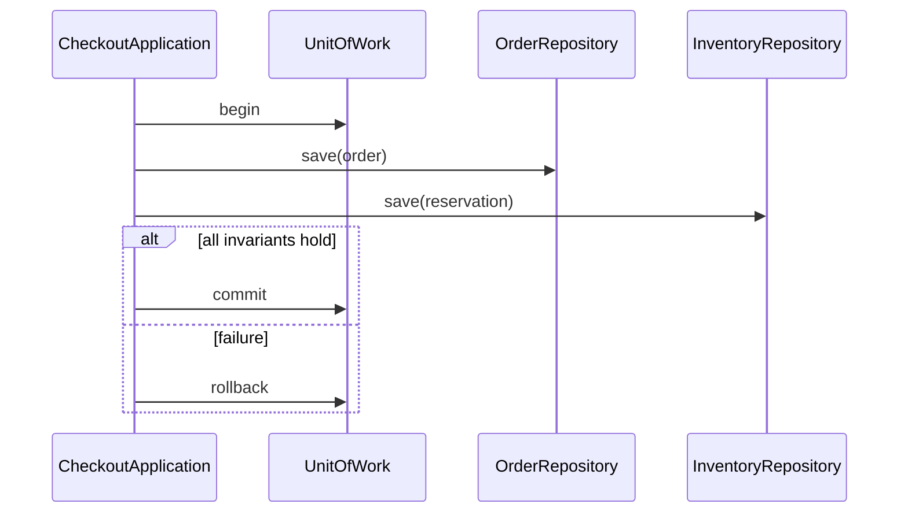

# Module 19 — Foundation: Unit of Work

## Vì sao bài này tồn tại?

**Lưu nhiều thay đổi domain** là tình huống độc lập được xây dựng riêng cho Unit of Work. Bài không lấy từ một source ẩn: bạn tự tạo phiên bản `before` tối thiểu dựa trên mô tả dưới đây, sau đó dùng test để chứng minh refactor không đổi behavior. Bài Foundation tập trung vào việc nhận diện đúng lực thay đổi và refactor tối thiểu. Không thêm queue, cache hoặc framework nếu chúng không cần để chứng minh pattern.

## Câu chuyện nghiệp vụ

Hệ thống cần xử lý **Lưu nhiều thay đổi domain**. `CheckoutApplication` đang commit order và reservation tách rời, có thể để hệ thống ở trạng thái nửa thành công.

Invariant trung tâm của bài **Unit of Work** là:

> **commit tất cả hoặc rollback tất cả.**

Ở cấp Foundation, **Unit of Work** chỉ đạt mục tiêu khi người học giải thích được change axis, giữ nguyên observable behavior và chứng minh baseline trực tiếp bắt đầu khó mở rộng hoặc khó test ở điểm nào.

Failure bắt buộc phải được mô hình hóa:

> **partial commit giữa order và inventory.**

## Trạng thái code ban đầu

```php
final class CheckoutApplication
{
    public function handle(array $input): mixed
    {
        // validation chung, lựa chọn biến thể và side effect
        // đang bị trộn trong một method.
        throw new RuntimeException('Hãy dựng phiên bản before phù hợp đề bài.');
    }
}
```

Đây là skeleton định hướng, không phải lời giải. Hãy thêm dữ liệu và behavior nhỏ nhất đủ tái hiện pain point của **Lưu nhiều thay đổi domain**.

## Mô hình thiết kế cần hướng tới



Unit of Work xác định transaction boundary cho nhiều thay đổi cùng consistency boundary. Nó không biến remote API thành transaction ACID và không thay thế saga khi vượt process/database boundary.

## Nhiệm vụ

1. Dựng code `before` nhỏ tái hiện **Lưu nhiều thay đổi domain** và ít nhất một nhánh lỗi.
2. Viết characterization test khóa invariant **commit tất cả hoặc rollback tất cả**.
3. Vẽ dependency trước/sau và đặt `UnitOfWork` tại đúng trục thay đổi.
4. Refactor một biến thể đầu tiên, giữ API của `CheckoutApplication` ổn định.
5. Thêm biến thể chứng minh: **thêm after-commit event collection** mà client không phải sửa logic cũ.
6. Mô phỏng **partial commit giữa order và inventory** và trả lỗi bằng ngôn ngữ application/domain.

## Dữ liệu thử tối thiểu

- Hai scenario hợp lệ đại diện cho hai biến thể khác nhau.
- Một boundary value liên quan trực tiếp tới **commit tất cả hoặc rollback tất cả**.
- Một scenario tạo ra **partial commit giữa order và inventory**.
- Một biến thể mới để chứng minh extension point.

## Gợi ý triển khai

- Bắt đầu bằng behavior và invariant; chỉ tạo abstraction sau khi xác định đúng trục thay đổi.
- Đặt tên method theo domain của **Lưu nhiều thay đổi domain**, tránh `execute(mixed $data)` hoặc `handleAnything()`.
- Tách selection/wiring khỏi business calculation; composition root có thể biết concrete class nhưng use case không nên biết.
- Đừng nuốt exception. Map lỗi kỹ thuật thành error có ý nghĩa và giữ nguyên cause để điều tra.
- Nếu **transaction script trực tiếp khi scope nhỏ** vẫn rõ ràng hơn và thay đổi chưa có thật, hãy ghi kết luận “chưa cần pattern” trong ADR.

## Test bắt buộc

- Happy path và boundary value của **commit tất cả hoặc rollback tất cả**.
- Failure test cho **partial commit giữa order và inventory**.
- Contract test dùng chung cho mọi implementation của `UnitOfWork`.
- Extension test chứng minh **thêm after-commit event collection** không sửa client.

## Deliverable

```text
solution/
├── before.php
├── after.php
├── tests/
│   ├── CharacterizationTest.php
│   ├── ContractOrBehaviorTest.php
│   └── FailurePathTest.php
└── ADR.md
```

Ghi một decision note ngắn cho **Unit of Work**: baseline trực tiếp, change axis quan sát được, trade-off mới và điều kiện inline/xóa abstraction nếu biến thể không còn tăng.

## Tiêu chí tự chấm

- [ ] Tên class/method phản ánh đúng **Lưu nhiều thay đổi domain**.
- [ ] Invariant **commit tất cả hoặc rollback tất cả** có test tự động.
- [ ] Failure **partial commit giữa order và inventory** có outcome xác định.
- [ ] Client biết ít concrete detail hơn sau refactor.
- [ ] Diagram, code và test mô tả cùng một boundary.
- [ ] Có giải thích khi nào **transaction script trực tiếp khi scope nhỏ** tốt hơn.
- [ ] Biến thể mới được thêm mà không sửa logic client.

## Câu hỏi design review

1. Trục thay đổi thật sự của **Lưu nhiều thay đổi domain** là gì, và `UnitOfWork` cô lập nó ở đâu?
2. Invariant **commit tất cả hoặc rollback tất cả** được enforce ở layer nào? Có đường đi nào bypass không?
3. Khi **partial commit giữa order và inventory** xảy ra, client nhận error gì và operator nhìn thấy evidence nào?
4. Pattern này làm dependency graph tốt hơn ở điểm nào, và tạo thêm chi phí gì?
5. Dấu hiệu nào cho biết nên quay lại phương án **transaction script trực tiếp khi scope nhỏ**?

## Lời giải tham khảo

Với **Lưu nhiều thay đổi domain**, hãy hoàn thành test và tự vẽ dependency trước/sau rồi mới mở [`SOLUTION.md`](SOLUTION.md). Khi đối chiếu, ưu tiên invariant, failure semantics và khả năng mở rộng của Unit of Work thay vì đếm class.
