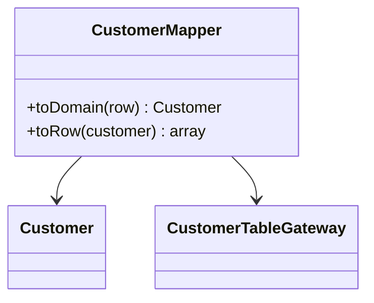

# Module 20 — Foundation: Data Mapper

## Vì sao bài này tồn tại?

**Tách domain khỏi bảng dữ liệu** là tình huống độc lập được xây dựng riêng cho Data Mapper. Bài không lấy từ một source ẩn: bạn tự tạo phiên bản `before` tối thiểu dựa trên mô tả dưới đây, sau đó dùng test để chứng minh refactor không đổi behavior. Bài Foundation tập trung vào việc nhận diện đúng lực thay đổi và refactor tối thiểu. Không thêm queue, cache hoặc framework nếu chúng không cần để chứng minh pattern.

## Câu chuyện nghiệp vụ

Hệ thống cần xử lý **Tách domain khỏi bảng dữ liệu**. `CustomerMapper` đang để entity domain biết tên cột, null/default và conversion của schema.

Invariant trung tâm của bài **Data Mapper** là:

> **domain object không phụ thuộc schema persistence.**

Ở cấp Foundation, **Data Mapper** chỉ đạt mục tiêu khi người học giải thích được change axis, giữ nguyên observable behavior và chứng minh baseline trực tiếp bắt đầu khó mở rộng hoặc khó test ở điểm nào.

Failure bắt buộc phải được mô hình hóa:

> **mapping thiếu field hoặc hydration bypass invariant.**

## Trạng thái code ban đầu

```php
final class CustomerMapper
{
    public function handle(array $input): mixed
    {
        // validation chung, lựa chọn biến thể và side effect
        // đang bị trộn trong một method.
        throw new RuntimeException('Hãy dựng phiên bản before phù hợp đề bài.');
    }
}
```

Đây là skeleton định hướng, không phải lời giải. Hãy thêm dữ liệu và behavior nhỏ nhất đủ tái hiện pain point của **Tách domain khỏi bảng dữ liệu**.

## Mô hình thiết kế cần hướng tới



Data Mapper giữ entity domain không phụ thuộc schema. Mapping phải test nullability, type conversion, identity và round-trip; tránh nhét business rule vào mapper.

## Nhiệm vụ

1. Dựng code `before` nhỏ tái hiện **Tách domain khỏi bảng dữ liệu** và ít nhất một nhánh lỗi.
2. Viết characterization test khóa invariant **domain object không phụ thuộc schema persistence**.
3. Vẽ dependency trước/sau và đặt `DataMapper` tại đúng trục thay đổi.
4. Refactor một biến thể đầu tiên, giữ API của `CustomerMapper` ổn định.
5. Thêm biến thể chứng minh: **thêm schema version 2** mà client không phải sửa logic cũ.
6. Mô phỏng **mapping thiếu field hoặc hydration bypass invariant** và trả lỗi bằng ngôn ngữ application/domain.

## Dữ liệu thử tối thiểu

- Hai scenario hợp lệ đại diện cho hai biến thể khác nhau.
- Một boundary value liên quan trực tiếp tới **domain object không phụ thuộc schema persistence**.
- Một scenario tạo ra **mapping thiếu field hoặc hydration bypass invariant**.
- Một biến thể mới để chứng minh extension point.

## Gợi ý triển khai

- Bắt đầu bằng behavior và invariant; chỉ tạo abstraction sau khi xác định đúng trục thay đổi.
- Đặt tên method theo domain của **Tách domain khỏi bảng dữ liệu**, tránh `execute(mixed $data)` hoặc `handleAnything()`.
- Tách selection/wiring khỏi business calculation; composition root có thể biết concrete class nhưng use case không nên biết.
- Đừng nuốt exception. Map lỗi kỹ thuật thành error có ý nghĩa và giữ nguyên cause để điều tra.
- Nếu **Active Record cho ứng dụng CRUD nhỏ** vẫn rõ ràng hơn và thay đổi chưa có thật, hãy ghi kết luận “chưa cần pattern” trong ADR.

## Test bắt buộc

- Happy path và boundary value của **domain object không phụ thuộc schema persistence**.
- Failure test cho **mapping thiếu field hoặc hydration bypass invariant**.
- Contract test dùng chung cho mọi implementation của `DataMapper`.
- Extension test chứng minh **thêm schema version 2** không sửa client.

## Deliverable

```text
solution/
├── before.php
├── after.php
├── tests/
│   ├── CharacterizationTest.php
│   ├── ContractOrBehaviorTest.php
│   └── FailurePathTest.php
└── ADR.md
```

Ghi một decision note ngắn cho **Data Mapper**: baseline trực tiếp, change axis quan sát được, trade-off mới và điều kiện inline/xóa abstraction nếu biến thể không còn tăng.

## Tiêu chí tự chấm

- [ ] Tên class/method phản ánh đúng **Tách domain khỏi bảng dữ liệu**.
- [ ] Invariant **domain object không phụ thuộc schema persistence** có test tự động.
- [ ] Failure **mapping thiếu field hoặc hydration bypass invariant** có outcome xác định.
- [ ] Client biết ít concrete detail hơn sau refactor.
- [ ] Diagram, code và test mô tả cùng một boundary.
- [ ] Có giải thích khi nào **Active Record cho ứng dụng CRUD nhỏ** tốt hơn.
- [ ] Biến thể mới được thêm mà không sửa logic client.

## Câu hỏi design review

1. Trục thay đổi thật sự của **Tách domain khỏi bảng dữ liệu** là gì, và `DataMapper` cô lập nó ở đâu?
2. Invariant **domain object không phụ thuộc schema persistence** được enforce ở layer nào? Có đường đi nào bypass không?
3. Khi **mapping thiếu field hoặc hydration bypass invariant** xảy ra, client nhận error gì và operator nhìn thấy evidence nào?
4. Pattern này làm dependency graph tốt hơn ở điểm nào, và tạo thêm chi phí gì?
5. Dấu hiệu nào cho biết nên quay lại phương án **Active Record cho ứng dụng CRUD nhỏ**?

## Lời giải tham khảo

Với **Tách domain khỏi bảng dữ liệu**, hãy hoàn thành test và tự vẽ dependency trước/sau rồi mới mở [`SOLUTION.md`](SOLUTION.md). Khi đối chiếu, ưu tiên invariant, failure semantics và khả năng mở rộng của Data Mapper thay vì đếm class.
