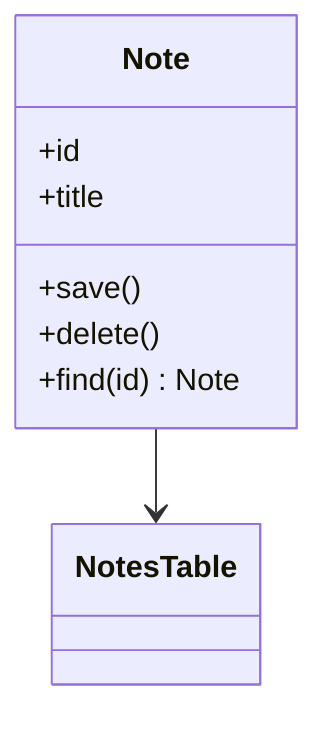

# Module 21 — Foundation: Active Record

## Vì sao bài này tồn tại?

**CRUD quản lý ghi chú** là tình huống độc lập được xây dựng riêng cho Active Record. Bài không lấy từ một source ẩn: bạn tự tạo phiên bản `before` tối thiểu dựa trên mô tả dưới đây, sau đó dùng test để chứng minh refactor không đổi behavior. Bài Foundation tập trung vào việc nhận diện đúng lực thay đổi và refactor tối thiểu. Không thêm queue, cache hoặc framework nếu chúng không cần để chứng minh pattern.

## Câu chuyện nghiệp vụ

Hệ thống cần xử lý **CRUD quản lý ghi chú**. `Note` đang có use case CRUD nhỏ nhưng code truy cập dữ liệu bị phân tán; bài yêu cầu đánh giá Active Record như baseline đơn giản.

Invariant trung tâm của bài **Active Record** là:

> **save/delete giữ validation cơ bản.**

Ở cấp Foundation, **Active Record** chỉ đạt mục tiêu khi người học giải thích được change axis, giữ nguyên observable behavior và chứng minh baseline trực tiếp bắt đầu khó mở rộng hoặc khó test ở điểm nào.

Failure bắt buộc phải được mô hình hóa:

> **model phình to vì workflow nghiệp vụ.**

## Trạng thái code ban đầu

```php
final class Note
{
    public function handle(array $input): mixed
    {
        // validation chung, lựa chọn biến thể và side effect
        // đang bị trộn trong một method.
        throw new RuntimeException('Hãy dựng phiên bản before phù hợp đề bài.');
    }
}
```

Đây là skeleton định hướng, không phải lời giải. Hãy thêm dữ liệu và behavior nhỏ nhất đủ tái hiện pain point của **CRUD quản lý ghi chú**.

## Mô hình thiết kế cần hướng tới



Active Record phù hợp CRUD đơn giản khi model và row gần tương ứng. Bài tập cần chỉ rõ giới hạn: khi invariant hoặc aggregate lớn lên, persistence method trên entity sẽ tăng coupling.

## Nhiệm vụ

1. Dựng code `before` nhỏ tái hiện **CRUD quản lý ghi chú** và ít nhất một nhánh lỗi.
2. Viết characterization test khóa invariant **save/delete giữ validation cơ bản**.
3. Vẽ dependency trước/sau và đặt `ActiveRecord` tại đúng trục thay đổi.
4. Refactor một biến thể đầu tiên, giữ API của `Note` ổn định.
5. Thêm biến thể chứng minh: **thêm scope archived** mà client không phải sửa logic cũ.
6. Mô phỏng **model phình to vì workflow nghiệp vụ** và trả lỗi bằng ngôn ngữ application/domain.

## Dữ liệu thử tối thiểu

- Hai scenario hợp lệ đại diện cho hai biến thể khác nhau.
- Một boundary value liên quan trực tiếp tới **save/delete giữ validation cơ bản**.
- Một scenario tạo ra **model phình to vì workflow nghiệp vụ**.
- Một biến thể mới để chứng minh extension point.

## Gợi ý triển khai

- Bắt đầu bằng behavior và invariant; chỉ tạo abstraction sau khi xác định đúng trục thay đổi.
- Đặt tên method theo domain của **CRUD quản lý ghi chú**, tránh `execute(mixed $data)` hoặc `handleAnything()`.
- Tách selection/wiring khỏi business calculation; composition root có thể biết concrete class nhưng use case không nên biết.
- Đừng nuốt exception. Map lỗi kỹ thuật thành error có ý nghĩa và giữ nguyên cause để điều tra.
- Nếu **Data Mapper khi domain phức tạp** vẫn rõ ràng hơn và thay đổi chưa có thật, hãy ghi kết luận “chưa cần pattern” trong ADR.

## Test bắt buộc

- Happy path và boundary value của **save/delete giữ validation cơ bản**.
- Failure test cho **model phình to vì workflow nghiệp vụ**.
- Contract test dùng chung cho mọi implementation của `ActiveRecord`.
- Extension test chứng minh **thêm scope archived** không sửa client.

## Deliverable

```text
solution/
├── before.php
├── after.php
├── tests/
│   ├── CharacterizationTest.php
│   ├── ContractOrBehaviorTest.php
│   └── FailurePathTest.php
└── ADR.md
```

Ghi một decision note ngắn cho **Active Record**: baseline trực tiếp, change axis quan sát được, trade-off mới và điều kiện inline/xóa abstraction nếu biến thể không còn tăng.

## Tiêu chí tự chấm

- [ ] Tên class/method phản ánh đúng **CRUD quản lý ghi chú**.
- [ ] Invariant **save/delete giữ validation cơ bản** có test tự động.
- [ ] Failure **model phình to vì workflow nghiệp vụ** có outcome xác định.
- [ ] Client biết ít concrete detail hơn sau refactor.
- [ ] Diagram, code và test mô tả cùng một boundary.
- [ ] Có giải thích khi nào **Data Mapper khi domain phức tạp** tốt hơn.
- [ ] Biến thể mới được thêm mà không sửa logic client.

## Câu hỏi design review

1. Trục thay đổi thật sự của **CRUD quản lý ghi chú** là gì, và `ActiveRecord` cô lập nó ở đâu?
2. Invariant **save/delete giữ validation cơ bản** được enforce ở layer nào? Có đường đi nào bypass không?
3. Khi **model phình to vì workflow nghiệp vụ** xảy ra, client nhận error gì và operator nhìn thấy evidence nào?
4. Pattern này làm dependency graph tốt hơn ở điểm nào, và tạo thêm chi phí gì?
5. Dấu hiệu nào cho biết nên quay lại phương án **Data Mapper khi domain phức tạp**?

## Lời giải tham khảo

Với **CRUD quản lý ghi chú**, hãy hoàn thành test và tự vẽ dependency trước/sau rồi mới mở [`SOLUTION.md`](SOLUTION.md). Khi đối chiếu, ưu tiên invariant, failure semantics và khả năng mở rộng của Active Record thay vì đếm class.
