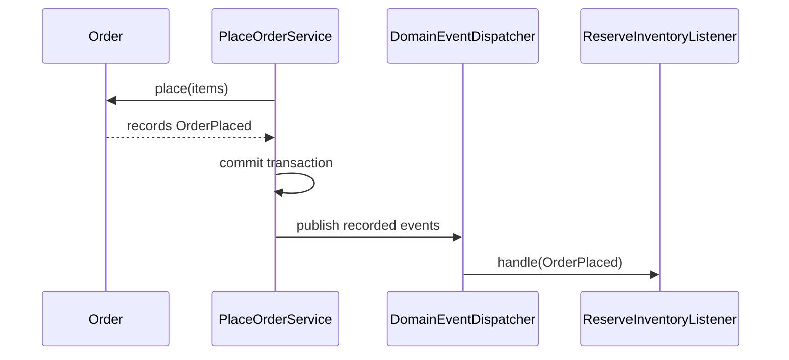

# Module 23 — Foundation: Domain Event

## Vì sao bài này tồn tại?

**Phát sự kiện nghiệp vụ** là tình huống độc lập được xây dựng riêng cho Domain Event. Bài không lấy từ một source ẩn: bạn tự tạo phiên bản `before` tối thiểu dựa trên mô tả dưới đây, sau đó dùng test để chứng minh refactor không đổi behavior. Bài Foundation tập trung vào việc nhận diện đúng lực thay đổi và refactor tối thiểu. Không thêm queue, cache hoặc framework nếu chúng không cần để chứng minh pattern.

## Câu chuyện nghiệp vụ

Hệ thống cần xử lý **Phát sự kiện nghiệp vụ**. `Order` đang gọi listener trước khi transaction hoàn tất và chưa phân biệt domain fact với command.

Invariant trung tâm của bài **Domain Event** là:

> **event dùng past tense và chứa dữ liệu tối thiểu đủ hiểu fact.**

Ở cấp Foundation, **Domain Event** chỉ đạt mục tiêu khi người học giải thích được change axis, giữ nguyên observable behavior và chứng minh baseline trực tiếp bắt đầu khó mở rộng hoặc khó test ở điểm nào.

Failure bắt buộc phải được mô hình hóa:

> **event bị dùng như command hoặc thay đổi schema phá consumer.**

## Trạng thái code ban đầu

```php
final class Order
{
    public function handle(array $input): mixed
    {
        // validation chung, lựa chọn biến thể và side effect
        // đang bị trộn trong một method.
        throw new RuntimeException('Hãy dựng phiên bản before phù hợp đề bài.');
    }
}
```

Đây là skeleton định hướng, không phải lời giải. Hãy thêm dữ liệu và behavior nhỏ nhất đủ tái hiện pain point của **Phát sự kiện nghiệp vụ**.

## Mô hình thiết kế cần hướng tới



Domain Event là fact đã xảy ra, không phải command trá hình. Thời điểm publish phải rõ: thường sau khi state đã được commit hoặc thông qua outbox khi cần durability.

## Nhiệm vụ

1. Dựng code `before` nhỏ tái hiện **Phát sự kiện nghiệp vụ** và ít nhất một nhánh lỗi.
2. Viết characterization test khóa invariant **event dùng past tense và chứa dữ liệu tối thiểu đủ hiểu fact**.
3. Vẽ dependency trước/sau và đặt `DomainEvent` tại đúng trục thay đổi.
4. Refactor một biến thể đầu tiên, giữ API của `Order` ổn định.
5. Thêm biến thể chứng minh: **thêm OrderCancelled event** mà client không phải sửa logic cũ.
6. Mô phỏng **event bị dùng như command hoặc thay đổi schema phá consumer** và trả lỗi bằng ngôn ngữ application/domain.

## Dữ liệu thử tối thiểu

- Hai scenario hợp lệ đại diện cho hai biến thể khác nhau.
- Một boundary value liên quan trực tiếp tới **event dùng past tense và chứa dữ liệu tối thiểu đủ hiểu fact**.
- Một scenario tạo ra **event bị dùng như command hoặc thay đổi schema phá consumer**.
- Một biến thể mới để chứng minh extension point.

## Gợi ý triển khai

- Bắt đầu bằng behavior và invariant; chỉ tạo abstraction sau khi xác định đúng trục thay đổi.
- Đặt tên method theo domain của **Phát sự kiện nghiệp vụ**, tránh `execute(mixed $data)` hoặc `handleAnything()`.
- Tách selection/wiring khỏi business calculation; composition root có thể biết concrete class nhưng use case không nên biết.
- Đừng nuốt exception. Map lỗi kỹ thuật thành error có ý nghĩa và giữ nguyên cause để điều tra.
- Nếu **gọi method trực tiếp cho collaboration nội bộ đồng bộ** vẫn rõ ràng hơn và thay đổi chưa có thật, hãy ghi kết luận “chưa cần pattern” trong ADR.

## Test bắt buộc

- Happy path và boundary value của **event dùng past tense và chứa dữ liệu tối thiểu đủ hiểu fact**.
- Failure test cho **event bị dùng như command hoặc thay đổi schema phá consumer**.
- Contract test dùng chung cho mọi implementation của `DomainEvent`.
- Extension test chứng minh **thêm OrderCancelled event** không sửa client.

## Deliverable

```text
solution/
├── before.php
├── after.php
├── tests/
│   ├── CharacterizationTest.php
│   ├── ContractOrBehaviorTest.php
│   └── FailurePathTest.php
└── ADR.md
```

Ghi một decision note ngắn cho **Domain Event**: baseline trực tiếp, change axis quan sát được, trade-off mới và điều kiện inline/xóa abstraction nếu biến thể không còn tăng.

## Tiêu chí tự chấm

- [ ] Tên class/method phản ánh đúng **Phát sự kiện nghiệp vụ**.
- [ ] Invariant **event dùng past tense và chứa dữ liệu tối thiểu đủ hiểu fact** có test tự động.
- [ ] Failure **event bị dùng như command hoặc thay đổi schema phá consumer** có outcome xác định.
- [ ] Client biết ít concrete detail hơn sau refactor.
- [ ] Diagram, code và test mô tả cùng một boundary.
- [ ] Có giải thích khi nào **gọi method trực tiếp cho collaboration nội bộ đồng bộ** tốt hơn.
- [ ] Biến thể mới được thêm mà không sửa logic client.

## Câu hỏi design review

1. Trục thay đổi thật sự của **Phát sự kiện nghiệp vụ** là gì, và `DomainEvent` cô lập nó ở đâu?
2. Invariant **event dùng past tense và chứa dữ liệu tối thiểu đủ hiểu fact** được enforce ở layer nào? Có đường đi nào bypass không?
3. Khi **event bị dùng như command hoặc thay đổi schema phá consumer** xảy ra, client nhận error gì và operator nhìn thấy evidence nào?
4. Pattern này làm dependency graph tốt hơn ở điểm nào, và tạo thêm chi phí gì?
5. Dấu hiệu nào cho biết nên quay lại phương án **gọi method trực tiếp cho collaboration nội bộ đồng bộ**?

## Lời giải tham khảo

Với **Phát sự kiện nghiệp vụ**, hãy hoàn thành test và tự vẽ dependency trước/sau rồi mới mở [`SOLUTION.md`](SOLUTION.md). Khi đối chiếu, ưu tiên invariant, failure semantics và khả năng mở rộng của Domain Event thay vì đếm class.
