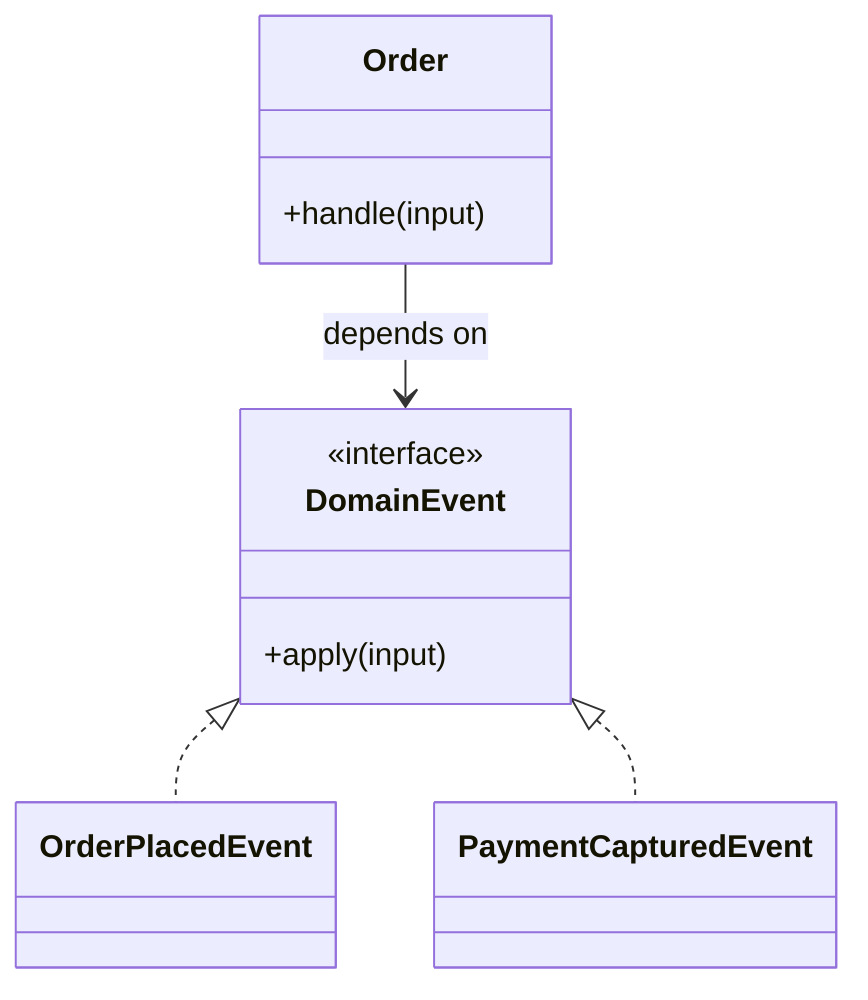

# Lời giải tham khảo — Domain Event (Foundation)

## Kết luận thiết kế

Lời giải chọn `DomainEvent` làm boundary vì nó bao quanh phần thay đổi của **Phát sự kiện nghiệp vụ** nhưng không kéo validation, transaction hoặc orchestration ổn định vào abstraction. Mục tiêu là bảo vệ **event dùng past tense và chứa dữ liệu tối thiểu đủ hiểu fact**, không phải chứng minh rằng mọi bài toán đều cần Domain Event.

## Sơ đồ lời giải



## Các bước refactor

1. Viết test cho `Order` trước khi tách; test mô tả outcome chứ không khóa internal call.
2. Tách phần thay đổi thành `DomainEvent` với input/output cụ thể của **Phát sự kiện nghiệp vụ**.
3. Di chuyển một nhánh sang implementation đầu tiên; giữ validation dùng chung tại nơi ổn định.
4. Thay branch selection bằng dependency injection/composition root nhỏ.
5. Thêm biến thể **thêm OrderCancelled event** và chạy cùng contract test.
6. So sánh với phương án đơn giản hơn: **gọi method trực tiếp cho collaboration nội bộ đồng bộ**; ghi khi nào nên xóa abstraction.

## Phác thảo contract

```php
interface DomainEvent
{
    /** Trả về kết quả domain hoặc ném lỗi application có nghĩa. */
    public function apply(array $input): mixed;
}
```

Trong implementation hoàn chỉnh của **Phát sự kiện nghiệp vụ**, thay `array`/`mixed` bằng input và result có tên theo domain. Contract của Domain Event phải làm rõ precondition, postcondition và lỗi có thể quan sát; đoạn trên chỉ minh họa hướng dependency.

## Test suite tối thiểu

- `PhatSuKienNghiepVuBehaviorTest`: dựng fixture nhỏ nhất và assert trực tiếp invariant **event dùng past tense và chứa dữ liệu tối thiểu đủ hiểu fact.** trên output/state, không assert tên concrete class.
- `PhatSuKienNghiepVuFailureTest`: tạo **event bị dùng như command hoặc thay đổi schema phá consumer.**, kiểm tra error taxonomy và xác nhận state/side effect không ở trạng thái nửa vời.
- `Foundation:DomainEventContractTest`: chạy cùng bộ contract cho mọi implementation hoặc variant được bài yêu cầu.
- `ExtensionTest`: thêm một biến thể hợp lệ của Foundation: Domain Event mà không sửa client/use case; nếu phải sửa, boundary chưa cô lập đúng change axis.
- Một test phản chứng cho phương án đơn giản hơn để chứng minh pattern mang giá trị, không chỉ tăng số type.
## Failure walkthrough

Khi **event bị dùng như command hoặc thay đổi schema phá consumer**, implementation không được trả `null`/`false` mơ hồ. Nó phải tạo error có taxonomy rõ, giữ correlation/operation data cần thiết và không phá invariant **event dùng past tense và chứa dữ liệu tối thiểu đủ hiểu fact**. Client test error theo semantics, không phụ thuộc message của SDK hoặc exception hạ tầng.

## Trade-off và phương án thay thế

Foundation: Domain Event làm change axis của **Phát sự kiện nghiệp vụ** rõ hơn, đổi lại người học phải hiểu thêm contract, wiring và cách chọn implementation. Giá trị phải được chứng minh bằng việc thêm biến thể hoặc test failure mà client không đổi.

Hãy ưu tiên **gọi method trực tiếp cho collaboration nội bộ đồng bộ** nếu bài toán chỉ có một behavior ổn định, chưa có boundary ngoài hoặc test trực tiếp đã đủ rõ. Pattern không phải mục tiêu; mục tiêu là giữ invariant **event dùng past tense và chứa dữ liệu tối thiểu đủ hiểu fact.** với thiết kế dễ đọc nhất.
## Dấu hiệu lời giải chưa đạt

- Boundary của Domain Event không dùng ngôn ngữ **Phát sự kiện nghiệp vụ**, khiến người đọc vẫn phải biết concrete detail.
- Test không chứng minh invariant **event dùng past tense và chứa dữ liệu tối thiểu đủ hiểu fact** hoặc chỉ xác nhận method được gọi.
- Selection, transaction hay error mapping vẫn nằm rải rác ở client nên blast radius không giảm.
- Diagram không khớp dependency thực trong code hoặc bỏ qua failure path quan trọng.
- Thêm biến thể mới vẫn phải sửa logic trung tâm, chứng tỏ extension point đặt sai.

## Câu hỏi mở rộng

- Với **Phát sự kiện nghiệp vụ**, metric nào chứng minh Domain Event giảm rủi ro thay đổi thay vì chỉ tăng số type?
- Khi số biến thể tăng, ai sở hữu selection, versioning và compatibility của boundary?
- Failure nào buộc thiết kế phải đổi, và failure nào nên được xử lý bên ngoài pattern?
- Điều kiện cleanup nào cho phép hợp nhất implementation hoặc xóa abstraction này?

## Ghi chú triển khai chuyên biệt cho Domain Event

Trong **Lời giải tham khảo — Domain Event (Foundation)** (Foundation), domain event ở past tense, immutable và chỉ mô tả fact cần thiết; integration event ra ngoài bounded context cần schema/version cùng compatibility policy riêng.

### Test focus

Ở cấp **Foundation**, test event creation, after-commit publish, schema compatibility và consumer dedup. Giữ test tại process boundary nhỏ nhất và ưu tiên semantics dễ đọc.

### Bằng chứng nên lưu

Với **Phát sự kiện nghiệp vụ**, lưu sơ đồ dependency trước/sau, fixture tái hiện lỗi, test chứng minh invariant, commit chuyển đổi và ADR của Domain Event. Reviewer cần nhìn được bằng chứng rằng boundary mới giảm blast radius hoặc làm failure dễ kiểm soát hơn, không chỉ thấy nhiều class hơn.
