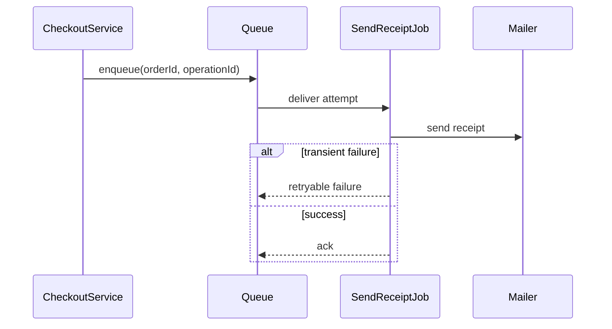

# Module 24 — Foundation: Job

## Vì sao bài này tồn tại?

**Gửi email nền** là tình huống độc lập được xây dựng riêng cho Job. Bài không lấy từ một source ẩn: bạn tự tạo phiên bản `before` tối thiểu dựa trên mô tả dưới đây, sau đó dùng test để chứng minh refactor không đổi behavior. Bài Foundation tập trung vào việc nhận diện đúng lực thay đổi và refactor tối thiểu. Không thêm queue, cache hoặc framework nếu chúng không cần để chứng minh pattern.

## Câu chuyện nghiệp vụ

Hệ thống cần xử lý **Gửi email nền**. `SendReceiptJob` đang serialize object lớn và retry mọi exception, có nguy cơ gửi trùng.

Invariant trung tâm của bài **Job** là:

> **job retry không gửi trùng receipt.**

Ở cấp Foundation, **Job** chỉ đạt mục tiêu khi người học giải thích được change axis, giữ nguyên observable behavior và chứng minh baseline trực tiếp bắt đầu khó mở rộng hoặc khó test ở điểm nào.

Failure bắt buộc phải được mô hình hóa:

> **worker crash sau side effect trước ack.**

## Trạng thái code ban đầu

```php
final class SendReceiptJob
{
    public function handle(array $input): mixed
    {
        // validation chung, lựa chọn biến thể và side effect
        // đang bị trộn trong một method.
        throw new RuntimeException('Hãy dựng phiên bản before phù hợp đề bài.');
    }
}
```

Đây là skeleton định hướng, không phải lời giải. Hãy thêm dữ liệu và behavior nhỏ nhất đủ tái hiện pain point của **Gửi email nền**.

## Mô hình thiết kế cần hướng tới



Job phải mang payload đủ nhỏ, versionable và idempotent. Retry chỉ dành cho lỗi tạm thời; lỗi permanent cần failure transport/dead-letter và runbook.

## Nhiệm vụ

1. Dựng code `before` nhỏ tái hiện **Gửi email nền** và ít nhất một nhánh lỗi.
2. Viết characterization test khóa invariant **job retry không gửi trùng receipt**.
3. Vẽ dependency trước/sau và đặt `Job` tại đúng trục thay đổi.
4. Refactor một biến thể đầu tiên, giữ API của `SendReceiptJob` ổn định.
5. Thêm biến thể chứng minh: **thêm backoff theo lỗi** mà client không phải sửa logic cũ.
6. Mô phỏng **worker crash sau side effect trước ack** và trả lỗi bằng ngôn ngữ application/domain.

## Dữ liệu thử tối thiểu

- Hai scenario hợp lệ đại diện cho hai biến thể khác nhau.
- Một boundary value liên quan trực tiếp tới **job retry không gửi trùng receipt**.
- Một scenario tạo ra **worker crash sau side effect trước ack**.
- Một biến thể mới để chứng minh extension point.

## Gợi ý triển khai

- Bắt đầu bằng behavior và invariant; chỉ tạo abstraction sau khi xác định đúng trục thay đổi.
- Đặt tên method theo domain của **Gửi email nền**, tránh `execute(mixed $data)` hoặc `handleAnything()`.
- Tách selection/wiring khỏi business calculation; composition root có thể biết concrete class nhưng use case không nên biết.
- Đừng nuốt exception. Map lỗi kỹ thuật thành error có ý nghĩa và giữ nguyên cause để điều tra.
- Nếu **gọi đồng bộ khi latency nhỏ và cần kết quả ngay** vẫn rõ ràng hơn và thay đổi chưa có thật, hãy ghi kết luận “chưa cần pattern” trong ADR.

## Test bắt buộc

- Happy path và boundary value của **job retry không gửi trùng receipt**.
- Failure test cho **worker crash sau side effect trước ack**.
- Contract test dùng chung cho mọi implementation của `Job`.
- Extension test chứng minh **thêm backoff theo lỗi** không sửa client.

## Deliverable

```text
solution/
├── before.php
├── after.php
├── tests/
│   ├── CharacterizationTest.php
│   ├── ContractOrBehaviorTest.php
│   └── FailurePathTest.php
└── ADR.md
```

Ghi một decision note ngắn cho **Job**: baseline trực tiếp, change axis quan sát được, trade-off mới và điều kiện inline/xóa abstraction nếu biến thể không còn tăng.

## Tiêu chí tự chấm

- [ ] Tên class/method phản ánh đúng **Gửi email nền**.
- [ ] Invariant **job retry không gửi trùng receipt** có test tự động.
- [ ] Failure **worker crash sau side effect trước ack** có outcome xác định.
- [ ] Client biết ít concrete detail hơn sau refactor.
- [ ] Diagram, code và test mô tả cùng một boundary.
- [ ] Có giải thích khi nào **gọi đồng bộ khi latency nhỏ và cần kết quả ngay** tốt hơn.
- [ ] Biến thể mới được thêm mà không sửa logic client.

## Câu hỏi design review

1. Trục thay đổi thật sự của **Gửi email nền** là gì, và `Job` cô lập nó ở đâu?
2. Invariant **job retry không gửi trùng receipt** được enforce ở layer nào? Có đường đi nào bypass không?
3. Khi **worker crash sau side effect trước ack** xảy ra, client nhận error gì và operator nhìn thấy evidence nào?
4. Pattern này làm dependency graph tốt hơn ở điểm nào, và tạo thêm chi phí gì?
5. Dấu hiệu nào cho biết nên quay lại phương án **gọi đồng bộ khi latency nhỏ và cần kết quả ngay**?

## Lời giải tham khảo

Với **Gửi email nền**, hãy hoàn thành test và tự vẽ dependency trước/sau rồi mới mở [`SOLUTION.md`](SOLUTION.md). Khi đối chiếu, ưu tiên invariant, failure semantics và khả năng mở rộng của Job thay vì đếm class.
