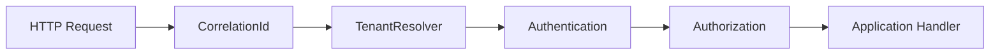

# Module 25 — Foundation: Middleware

## Vì sao bài này tồn tại?

**Xác thực request API** là tình huống độc lập được xây dựng riêng cho Middleware. Bài không lấy từ một source ẩn: bạn tự tạo phiên bản `before` tối thiểu dựa trên mô tả dưới đây, sau đó dùng test để chứng minh refactor không đổi behavior. Bài Foundation tập trung vào việc nhận diện đúng lực thay đổi và refactor tối thiểu. Không thêm queue, cache hoặc framework nếu chúng không cần để chứng minh pattern.

## Câu chuyện nghiệp vụ

Hệ thống cần xử lý **Xác thực request API**. `ApiKernel` đang trộn correlation, tenant, auth và authorization trong controller.

Invariant trung tâm của bài **Middleware** là:

> **ordering bảo đảm auth trước authorization.**

Ở cấp Foundation, **Middleware** chỉ đạt mục tiêu khi người học giải thích được change axis, giữ nguyên observable behavior và chứng minh baseline trực tiếp bắt đầu khó mở rộng hoặc khó test ở điểm nào.

Failure bắt buộc phải được mô hình hóa:

> **middleware giữ state qua request hoặc tenant leak.**

## Trạng thái code ban đầu

```php
final class ApiKernel
{
    public function handle(array $input): mixed
    {
        // validation chung, lựa chọn biến thể và side effect
        // đang bị trộn trong một method.
        throw new RuntimeException('Hãy dựng phiên bản before phù hợp đề bài.');
    }
}
```

Đây là skeleton định hướng, không phải lời giải. Hãy thêm dữ liệu và behavior nhỏ nhất đủ tái hiện pain point của **Xác thực request API**.

## Mô hình thiết kế cần hướng tới



Middleware xử lý cross-cutting request concern theo thứ tự. Business rule không nên bị giấu trong middleware; tenant/auth context phải request-scoped và không rò giữa worker requests.

## Nhiệm vụ

1. Dựng code `before` nhỏ tái hiện **Xác thực request API** và ít nhất một nhánh lỗi.
2. Viết characterization test khóa invariant **ordering bảo đảm auth trước authorization**.
3. Vẽ dependency trước/sau và đặt `Middleware` tại đúng trục thay đổi.
4. Refactor một biến thể đầu tiên, giữ API của `ApiKernel` ổn định.
5. Thêm biến thể chứng minh: **thêm CorrelationIdMiddleware** mà client không phải sửa logic cũ.
6. Mô phỏng **middleware giữ state qua request hoặc tenant leak** và trả lỗi bằng ngôn ngữ application/domain.

## Dữ liệu thử tối thiểu

- Hai scenario hợp lệ đại diện cho hai biến thể khác nhau.
- Một boundary value liên quan trực tiếp tới **ordering bảo đảm auth trước authorization**.
- Một scenario tạo ra **middleware giữ state qua request hoặc tenant leak**.
- Một biến thể mới để chứng minh extension point.

## Gợi ý triển khai

- Bắt đầu bằng behavior và invariant; chỉ tạo abstraction sau khi xác định đúng trục thay đổi.
- Đặt tên method theo domain của **Xác thực request API**, tránh `execute(mixed $data)` hoặc `handleAnything()`.
- Tách selection/wiring khỏi business calculation; composition root có thể biết concrete class nhưng use case không nên biết.
- Đừng nuốt exception. Map lỗi kỹ thuật thành error có ý nghĩa và giữ nguyên cause để điều tra.
- Nếu **controller check trực tiếp cho endpoint nhỏ** vẫn rõ ràng hơn và thay đổi chưa có thật, hãy ghi kết luận “chưa cần pattern” trong ADR.

## Test bắt buộc

- Happy path và boundary value của **ordering bảo đảm auth trước authorization**.
- Failure test cho **middleware giữ state qua request hoặc tenant leak**.
- Contract test dùng chung cho mọi implementation của `Middleware`.
- Extension test chứng minh **thêm CorrelationIdMiddleware** không sửa client.

## Deliverable

```text
solution/
├── before.php
├── after.php
├── tests/
│   ├── CharacterizationTest.php
│   ├── ContractOrBehaviorTest.php
│   └── FailurePathTest.php
└── ADR.md
```

Ghi một decision note ngắn cho **Middleware**: baseline trực tiếp, change axis quan sát được, trade-off mới và điều kiện inline/xóa abstraction nếu biến thể không còn tăng.

## Tiêu chí tự chấm

- [ ] Tên class/method phản ánh đúng **Xác thực request API**.
- [ ] Invariant **ordering bảo đảm auth trước authorization** có test tự động.
- [ ] Failure **middleware giữ state qua request hoặc tenant leak** có outcome xác định.
- [ ] Client biết ít concrete detail hơn sau refactor.
- [ ] Diagram, code và test mô tả cùng một boundary.
- [ ] Có giải thích khi nào **controller check trực tiếp cho endpoint nhỏ** tốt hơn.
- [ ] Biến thể mới được thêm mà không sửa logic client.

## Câu hỏi design review

1. Trục thay đổi thật sự của **Xác thực request API** là gì, và `Middleware` cô lập nó ở đâu?
2. Invariant **ordering bảo đảm auth trước authorization** được enforce ở layer nào? Có đường đi nào bypass không?
3. Khi **middleware giữ state qua request hoặc tenant leak** xảy ra, client nhận error gì và operator nhìn thấy evidence nào?
4. Pattern này làm dependency graph tốt hơn ở điểm nào, và tạo thêm chi phí gì?
5. Dấu hiệu nào cho biết nên quay lại phương án **controller check trực tiếp cho endpoint nhỏ**?

## Lời giải tham khảo

Với **Xác thực request API**, hãy hoàn thành test và tự vẽ dependency trước/sau rồi mới mở [`SOLUTION.md`](SOLUTION.md). Khi đối chiếu, ưu tiên invariant, failure semantics và khả năng mở rộng của Middleware thay vì đếm class.
