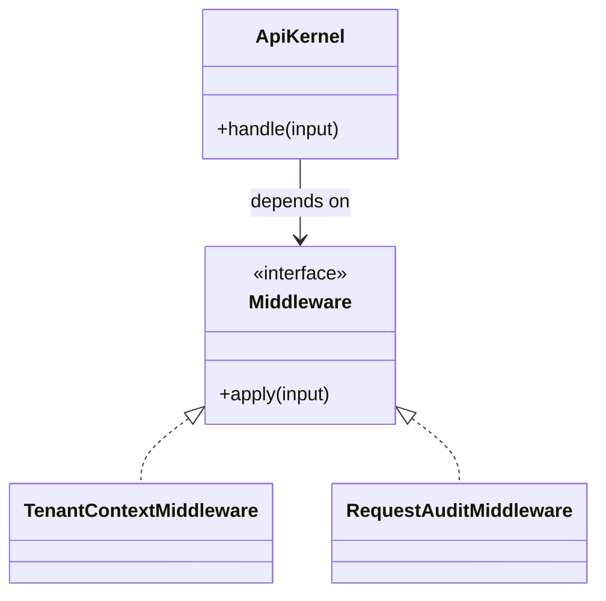

# Lời giải tham khảo — Middleware (Foundation)

## Kết luận thiết kế

Lời giải chọn `Middleware` làm boundary vì nó bao quanh phần thay đổi của **Xác thực request API** nhưng không kéo validation, transaction hoặc orchestration ổn định vào abstraction. Mục tiêu là bảo vệ **ordering bảo đảm auth trước authorization**, không phải chứng minh rằng mọi bài toán đều cần Middleware.

## Sơ đồ lời giải



## Các bước refactor

1. Viết test cho `ApiKernel` trước khi tách; test mô tả outcome chứ không khóa internal call.
2. Tách phần thay đổi thành `Middleware` với input/output cụ thể của **Xác thực request API**.
3. Di chuyển một nhánh sang implementation đầu tiên; giữ validation dùng chung tại nơi ổn định.
4. Thay branch selection bằng dependency injection/composition root nhỏ.
5. Thêm biến thể **thêm CorrelationIdMiddleware** và chạy cùng contract test.
6. So sánh với phương án đơn giản hơn: **controller check trực tiếp cho endpoint nhỏ**; ghi khi nào nên xóa abstraction.

## Phác thảo contract

```php
interface Middleware
{
    /** Trả về kết quả domain hoặc ném lỗi application có nghĩa. */
    public function apply(array $input): mixed;
}
```

Trong implementation hoàn chỉnh của **Xác thực request API**, thay `array`/`mixed` bằng input và result có tên theo domain. Contract của Middleware phải làm rõ precondition, postcondition và lỗi có thể quan sát; đoạn trên chỉ minh họa hướng dependency.

## Test suite tối thiểu

- `XacThucRequestApiBehaviorTest`: dựng fixture nhỏ nhất và assert trực tiếp invariant **ordering bảo đảm auth trước authorization.** trên output/state, không assert tên concrete class.
- `XacThucRequestApiFailureTest`: tạo **middleware giữ state qua request hoặc tenant leak.**, kiểm tra error taxonomy và xác nhận state/side effect không ở trạng thái nửa vời.
- `Foundation:MiddlewareContractTest`: chạy cùng bộ contract cho mọi implementation hoặc variant được bài yêu cầu.
- `ExtensionTest`: thêm một biến thể hợp lệ của Foundation: Middleware mà không sửa client/use case; nếu phải sửa, boundary chưa cô lập đúng change axis.
- Một test phản chứng cho phương án đơn giản hơn để chứng minh pattern mang giá trị, không chỉ tăng số type.
## Failure walkthrough

Khi **middleware giữ state qua request hoặc tenant leak**, implementation không được trả `null`/`false` mơ hồ. Nó phải tạo error có taxonomy rõ, giữ correlation/operation data cần thiết và không phá invariant **ordering bảo đảm auth trước authorization**. Client test error theo semantics, không phụ thuộc message của SDK hoặc exception hạ tầng.

## Trade-off và phương án thay thế

Foundation: Middleware làm change axis của **Xác thực request API** rõ hơn, đổi lại người học phải hiểu thêm contract, wiring và cách chọn implementation. Giá trị phải được chứng minh bằng việc thêm biến thể hoặc test failure mà client không đổi.

Hãy ưu tiên **controller check trực tiếp cho endpoint nhỏ** nếu bài toán chỉ có một behavior ổn định, chưa có boundary ngoài hoặc test trực tiếp đã đủ rõ. Pattern không phải mục tiêu; mục tiêu là giữ invariant **ordering bảo đảm auth trước authorization.** với thiết kế dễ đọc nhất.
## Dấu hiệu lời giải chưa đạt

- Boundary của Middleware không dùng ngôn ngữ **Xác thực request API**, khiến người đọc vẫn phải biết concrete detail.
- Test không chứng minh invariant **ordering bảo đảm auth trước authorization** hoặc chỉ xác nhận method được gọi.
- Selection, transaction hay error mapping vẫn nằm rải rác ở client nên blast radius không giảm.
- Diagram không khớp dependency thực trong code hoặc bỏ qua failure path quan trọng.
- Thêm biến thể mới vẫn phải sửa logic trung tâm, chứng tỏ extension point đặt sai.

## Câu hỏi mở rộng

- Với **Xác thực request API**, metric nào chứng minh Middleware giảm rủi ro thay đổi thay vì chỉ tăng số type?
- Khi số biến thể tăng, ai sở hữu selection, versioning và compatibility của boundary?
- Failure nào buộc thiết kế phải đổi, và failure nào nên được xử lý bên ngoài pattern?
- Điều kiện cleanup nào cho phép hợp nhất implementation hoặc xóa abstraction này?

## Ghi chú triển khai chuyên biệt cho Middleware

Middleware xử lý cross-cutting request concern; ordering và cleanup request scope là contract.

### Test focus

Ở cấp **Foundation**, test chain order, short-circuit, finally cleanup, tenant isolation và exception path. Giữ test tại process boundary nhỏ nhất và ưu tiên semantics dễ đọc.

### Bằng chứng nên lưu

Với **Xác thực request API**, lưu sơ đồ dependency trước/sau, fixture tái hiện lỗi, test chứng minh invariant, commit chuyển đổi và ADR của Middleware. Reviewer cần nhìn được bằng chứng rằng boundary mới giảm blast radius hoặc làm failure dễ kiểm soát hơn, không chỉ thấy nhiều class hơn.
