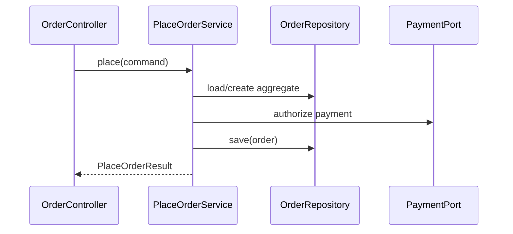

# Module 26 — Foundation: Service Layer

## Vì sao bài này tồn tại?

**Đặt hàng qua use case** là tình huống độc lập được xây dựng riêng cho Service Layer. Bài không lấy từ một source ẩn: bạn tự tạo phiên bản `before` tối thiểu dựa trên mô tả dưới đây, sau đó dùng test để chứng minh refactor không đổi behavior. Bài Foundation tập trung vào việc nhận diện đúng lực thay đổi và refactor tối thiểu. Không thêm queue, cache hoặc framework nếu chúng không cần để chứng minh pattern.

## Câu chuyện nghiệp vụ

Hệ thống cần xử lý **Đặt hàng qua use case**. `OrderController` đang giữ transaction, domain orchestration và external call ngay trong HTTP layer.

Invariant trung tâm của bài **Service Layer** là:

> **application service điều phối nhưng không chứa policy chi tiết.**

Ở cấp Foundation, **Service Layer** chỉ đạt mục tiêu khi người học giải thích được change axis, giữ nguyên observable behavior và chứng minh baseline trực tiếp bắt đầu khó mở rộng hoặc khó test ở điểm nào.

Failure bắt buộc phải được mô hình hóa:

> **transaction/network boundary trộn lẫn.**

## Trạng thái code ban đầu

```php
final class OrderController
{
    public function handle(array $input): mixed
    {
        // validation chung, lựa chọn biến thể và side effect
        // đang bị trộn trong một method.
        throw new RuntimeException('Hãy dựng phiên bản before phù hợp đề bài.');
    }
}
```

Đây là skeleton định hướng, không phải lời giải. Hãy thêm dữ liệu và behavior nhỏ nhất đủ tái hiện pain point của **Đặt hàng qua use case**.

## Mô hình thiết kế cần hướng tới



Service Layer biểu diễn use case và transaction boundary, không trở thành nơi chứa mọi logic domain. Entity/value object vẫn bảo vệ invariant; controller chỉ chuyển đổi protocol.

## Nhiệm vụ

1. Dựng code `before` nhỏ tái hiện **Đặt hàng qua use case** và ít nhất một nhánh lỗi.
2. Viết characterization test khóa invariant **application service điều phối nhưng không chứa policy chi tiết**.
3. Vẽ dependency trước/sau và đặt `PlaceOrderService` tại đúng trục thay đổi.
4. Refactor một biến thể đầu tiên, giữ API của `OrderController` ổn định.
5. Thêm biến thể chứng minh: **thêm use case CancelOrder** mà client không phải sửa logic cũ.
6. Mô phỏng **transaction/network boundary trộn lẫn** và trả lỗi bằng ngôn ngữ application/domain.

## Dữ liệu thử tối thiểu

- Hai scenario hợp lệ đại diện cho hai biến thể khác nhau.
- Một boundary value liên quan trực tiếp tới **application service điều phối nhưng không chứa policy chi tiết**.
- Một scenario tạo ra **transaction/network boundary trộn lẫn**.
- Một biến thể mới để chứng minh extension point.

## Gợi ý triển khai

- Bắt đầu bằng behavior và invariant; chỉ tạo abstraction sau khi xác định đúng trục thay đổi.
- Đặt tên method theo domain của **Đặt hàng qua use case**, tránh `execute(mixed $data)` hoặc `handleAnything()`.
- Tách selection/wiring khỏi business calculation; composition root có thể biết concrete class nhưng use case không nên biết.
- Đừng nuốt exception. Map lỗi kỹ thuật thành error có ý nghĩa và giữ nguyên cause để điều tra.
- Nếu **controller trực tiếp cho thao tác CRUD đơn giản** vẫn rõ ràng hơn và thay đổi chưa có thật, hãy ghi kết luận “chưa cần pattern” trong ADR.

## Test bắt buộc

- Happy path và boundary value của **application service điều phối nhưng không chứa policy chi tiết**.
- Failure test cho **transaction/network boundary trộn lẫn**.
- Contract test dùng chung cho mọi implementation của `PlaceOrderService`.
- Extension test chứng minh **thêm use case CancelOrder** không sửa client.

## Deliverable

```text
solution/
├── before.php
├── after.php
├── tests/
│   ├── CharacterizationTest.php
│   ├── ContractOrBehaviorTest.php
│   └── FailurePathTest.php
└── ADR.md
```

Ghi một decision note ngắn cho **Service Layer**: baseline trực tiếp, change axis quan sát được, trade-off mới và điều kiện inline/xóa abstraction nếu biến thể không còn tăng.

## Tiêu chí tự chấm

- [ ] Tên class/method phản ánh đúng **Đặt hàng qua use case**.
- [ ] Invariant **application service điều phối nhưng không chứa policy chi tiết** có test tự động.
- [ ] Failure **transaction/network boundary trộn lẫn** có outcome xác định.
- [ ] Client biết ít concrete detail hơn sau refactor.
- [ ] Diagram, code và test mô tả cùng một boundary.
- [ ] Có giải thích khi nào **controller trực tiếp cho thao tác CRUD đơn giản** tốt hơn.
- [ ] Biến thể mới được thêm mà không sửa logic client.

## Câu hỏi design review

1. Trục thay đổi thật sự của **Đặt hàng qua use case** là gì, và `PlaceOrderService` cô lập nó ở đâu?
2. Invariant **application service điều phối nhưng không chứa policy chi tiết** được enforce ở layer nào? Có đường đi nào bypass không?
3. Khi **transaction/network boundary trộn lẫn** xảy ra, client nhận error gì và operator nhìn thấy evidence nào?
4. Pattern này làm dependency graph tốt hơn ở điểm nào, và tạo thêm chi phí gì?
5. Dấu hiệu nào cho biết nên quay lại phương án **controller trực tiếp cho thao tác CRUD đơn giản**?

## Lời giải tham khảo

Với **Đặt hàng qua use case**, hãy hoàn thành test và tự vẽ dependency trước/sau rồi mới mở [`SOLUTION.md`](SOLUTION.md). Khi đối chiếu, ưu tiên invariant, failure semantics và khả năng mở rộng của Service Layer thay vì đếm class.
