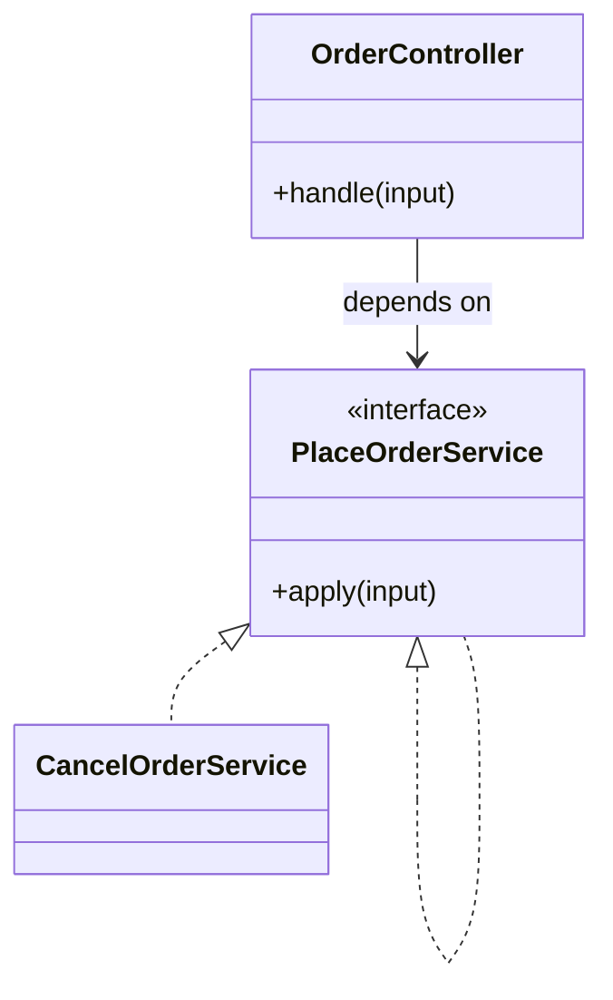

# Lời giải tham khảo — Service Layer (Foundation)

## Kết luận thiết kế

Lời giải chọn `PlaceOrderService` làm boundary vì nó bao quanh phần thay đổi của **Đặt hàng qua use case** nhưng không kéo validation, transaction hoặc orchestration ổn định vào abstraction. Mục tiêu là bảo vệ **application service điều phối nhưng không chứa policy chi tiết**, không phải chứng minh rằng mọi bài toán đều cần Service Layer.

## Sơ đồ lời giải



## Các bước refactor

1. Viết test cho `OrderController` trước khi tách; test mô tả outcome chứ không khóa internal call.
2. Tách phần thay đổi thành `PlaceOrderService` với input/output cụ thể của **Đặt hàng qua use case**.
3. Di chuyển một nhánh sang implementation đầu tiên; giữ validation dùng chung tại nơi ổn định.
4. Thay branch selection bằng dependency injection/composition root nhỏ.
5. Thêm biến thể **thêm use case CancelOrder** và chạy cùng contract test.
6. So sánh với phương án đơn giản hơn: **controller trực tiếp cho thao tác CRUD đơn giản**; ghi khi nào nên xóa abstraction.

## Phác thảo contract

```php
interface PlaceOrderService
{
    /** Trả về kết quả domain hoặc ném lỗi application có nghĩa. */
    public function apply(array $input): mixed;
}
```

Trong implementation hoàn chỉnh của **Đặt hàng qua use case**, thay `array`/`mixed` bằng input và result có tên theo domain. Contract của Service Layer phải làm rõ precondition, postcondition và lỗi có thể quan sát; đoạn trên chỉ minh họa hướng dependency.

## Test suite tối thiểu

- `AtHangQuaUseCaseBehaviorTest`: dựng fixture nhỏ nhất và assert trực tiếp invariant **application service điều phối nhưng không chứa policy chi tiết.** trên output/state, không assert tên concrete class.
- `AtHangQuaUseCaseFailureTest`: tạo **transaction/network boundary trộn lẫn.**, kiểm tra error taxonomy và xác nhận state/side effect không ở trạng thái nửa vời.
- `Foundation:ServiceLayerContractTest`: chạy cùng bộ contract cho mọi implementation hoặc variant được bài yêu cầu.
- `ExtensionTest`: thêm một biến thể hợp lệ của Foundation: Service Layer mà không sửa client/use case; nếu phải sửa, boundary chưa cô lập đúng change axis.
- Một test phản chứng cho phương án đơn giản hơn để chứng minh pattern mang giá trị, không chỉ tăng số type.
## Failure walkthrough

Khi **transaction/network boundary trộn lẫn**, implementation không được trả `null`/`false` mơ hồ. Nó phải tạo error có taxonomy rõ, giữ correlation/operation data cần thiết và không phá invariant **application service điều phối nhưng không chứa policy chi tiết**. Client test error theo semantics, không phụ thuộc message của SDK hoặc exception hạ tầng.

## Trade-off và phương án thay thế

Foundation: Service Layer làm change axis của **Đặt hàng qua use case** rõ hơn, đổi lại người học phải hiểu thêm contract, wiring và cách chọn implementation. Giá trị phải được chứng minh bằng việc thêm biến thể hoặc test failure mà client không đổi.

Hãy ưu tiên **controller trực tiếp cho thao tác CRUD đơn giản** nếu bài toán chỉ có một behavior ổn định, chưa có boundary ngoài hoặc test trực tiếp đã đủ rõ. Pattern không phải mục tiêu; mục tiêu là giữ invariant **application service điều phối nhưng không chứa policy chi tiết.** với thiết kế dễ đọc nhất.
## Dấu hiệu lời giải chưa đạt

- Boundary của Service Layer không dùng ngôn ngữ **Đặt hàng qua use case**, khiến người đọc vẫn phải biết concrete detail.
- Test không chứng minh invariant **application service điều phối nhưng không chứa policy chi tiết** hoặc chỉ xác nhận method được gọi.
- Selection, transaction hay error mapping vẫn nằm rải rác ở client nên blast radius không giảm.
- Diagram không khớp dependency thực trong code hoặc bỏ qua failure path quan trọng.
- Thêm biến thể mới vẫn phải sửa logic trung tâm, chứng tỏ extension point đặt sai.

## Câu hỏi mở rộng

- Với **Đặt hàng qua use case**, metric nào chứng minh Service Layer giảm rủi ro thay đổi thay vì chỉ tăng số type?
- Khi số biến thể tăng, ai sở hữu selection, versioning và compatibility của boundary?
- Failure nào buộc thiết kế phải đổi, và failure nào nên được xử lý bên ngoài pattern?
- Điều kiện cleanup nào cho phép hợp nhất implementation hoặc xóa abstraction này?

## Ghi chú triển khai chuyên biệt cho Service Layer

Bài **Lời giải tham khảo — Service Layer (Foundation)** cấp Foundation đặt orchestration và transaction boundary trong Service Layer; domain policy phải ở entity, domain service hoặc specification để service không thành procedural God Object.

### Test focus

Ở cấp **Foundation**, test orchestration outcome, transaction rollback, external port interaction và retry safety. Giữ test tại process boundary nhỏ nhất và ưu tiên semantics dễ đọc.

### Bằng chứng nên lưu

Với **Đặt hàng qua use case**, lưu sơ đồ dependency trước/sau, fixture tái hiện lỗi, test chứng minh invariant, commit chuyển đổi và ADR của Service Layer. Reviewer cần nhìn được bằng chứng rằng boundary mới giảm blast radius hoặc làm failure dễ kiểm soát hơn, không chỉ thấy nhiều class hơn.
